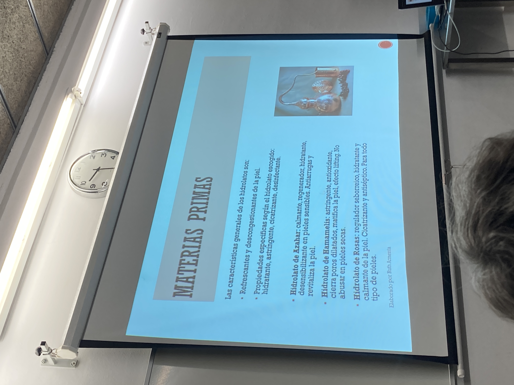
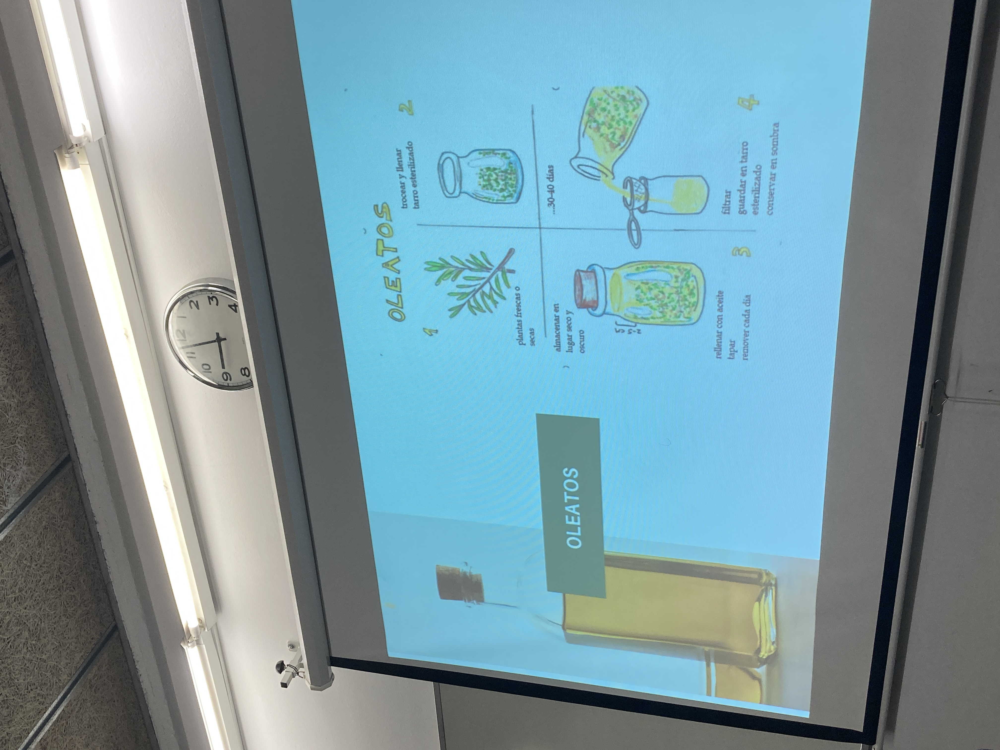

# COSMETICA NATURAL 1

la profe es quimica
naturopatia / cosmetica natural

miscibles = soluble

divulgar para que exista un conocimiento

cosmetica natural es aquella que no tiene productos sinteticos

cosas eco es que viene de cultivos ecologicos (95% de los ingredientes como minimo han de venir de cultivos eco)

producto cosmetico: toda aquella sust que va destinada a see puesta en contacto con la superficie de la piel (incluso dientes) pero todo uso externo con el fin de limpiar, perfumar o modificar su aspecto

## MATERIAS PRIMAS

aceite vegetal vs aceite esencial

### vegetal: se obtiene de la presion en frio de un fruto (almendras, coco, argan, sesamo, oliva, girasol,... generalmente de los frutos grasos)

es la primera presion porque de exprimir el fruto se genera calor y se oxida el aceite. el mas noble de todos los aceites es la primera presion

el aceite en contacto con la luz o el calor se oxida y pierde propiedades

hay otra amnera de sacar el aceite de por ejemplo una flor, que no es un fruto graso

**macerado**: metes en un recipiente de cristal con la flor y cubres como 2 dedos por encima de la planta, y todos los días lo mueves para que los principios activos de la planta psen al aceite duranrw el proceso de, por ejemplo, una luna

asi pues el aceite obtenido tendra las propiedades del aceite original y el de la planta macerada

((echarle romero al minoxidil para que sea mas fuerte??))

//para activar cosas se usan plantas tonicas
//calendula es bueno para la piel
//romero es crecepelo
//lavanda es calmante
//el aceite de hiperico (o hierba de san jusn) se hace en la oscuridad y el sol lo torna rojizo y sirve para los golpes (moratones)
//manzanilla es calmante 

los aceites que vienen de fruto tiene  propiedades emolientes, hidratantes. el aceite dependera de la piel para ver si se absorbe o no. jojoba, avisinia, de pepita de uva es intermedio. para pieles secas necesitaremos aceites mas grasos como el de coco, rosa mosqueta, oliva, almendras seria un poco menos graso (necesitamos que corran la manos para los masajes por eso se usan almendras) avellanas, aguacate, sesamo

//marruecos la zona del argan como se hace el aceite alli?

//aceite de coco se separa el caprilico que es el que se usa mejor para el pelo. 

la peofe dice que para el pelo el mejor es **jojoba que es regulador seborreico**

el coco segun la medicina ayurvedica enfria?? y el sesamo y la jojoba calienta??

la profe pone siempre planta seca (se puede poner fresca pero claro como esta fresca tiene agua y pueden crecer microorganismos)) ((la gente que lo hace fresco es porque dicen que los nutrientes estan vivos))

para secar las plantas o las dejas colgando de la cocina o las metes en papel de periodico hasta que se sequen

ENTONCES hay dos aceites los **macerados** y los de **frutos grasos**

## aceites esenciales
un aceite esencial se obtiene mayoritariamente por **destilacion**
un alambique por ejemplo de cobre, se pone plantas con agua (rosas lavanda romero jazmin) y con el calor empieza a hervir. el agua pasa por la planta y extrae los principios solubles en agua y los arrastra, en el tubo el vapor se condensa y se forma el hidrolato. 

si sigues hirviendo lo que conseguiremos seran tambien los compuestos aromaticos que es como el concentrado. en la splantas hay unas bolsitas donde se conservan las propiedades aromaticas, y esa parte final es el a eite esencial. 

o sea si hierves hasta wl final la planta consigues un poquito de aceite esencial y de hidrolato

el aceite esencial es lo que llamaban los antiguos alquimistas el **alma de la planta**

//el limon por ejemplo o la naranja tiene el aceite esencial en bolsitas de la piel. la naranja podemos aprovechar el azahar tambien (su flor) o el petit grain que es la hoja del naranja

hay aceites esenciales de resina, de flores, de frutos, de hojas, de raices, de todo

los aceites que vienen del petroleo son oclusivos, tapan el poro. emolientes es hidratantes. el aceite esencial es muy buen antioxidante, cicatrizante, antiedad etc. pero tienen tambien la propiedad olfativa (aromaterapia)

//la memoria olfativa es la mas potente que tenemos?

//las siliconas para el pelo son toxicas swgun la profe 

//hay distintos eucaliptos?? lobulos y radiata y el mejor es el radiata

//el aloe vera es astringente y calmante y refrescante

//el propolis es antibichitos porque es lo que usan las abejas para proteger el panal

**fitoterapia**: plantas y sus propiedades

//para 1 kg de aceite de rosa damascena se han de destilar 4toneladas de petalos, para el de lavanda son solo 150kg, por eso los aceites cuesfan mas o menos

aceite esencial vs esencia
aceite esencial partes de la planta y la esencia es sintetico!!!

y lo peor es que la mayoria de esencias son disruptoras endocrinas 

!!! los aceites esenciales son alergenos y pueden producir irritaciones para pieles sensibles

//pasta de dientes con arcilla??

//el aceite de ricino para que crezca el pelo 

tonico: que activa la circulacion

todo lo que tenga el sol si le da la luz se mancha porque es fotosensible

los citricos son fotosensibles

MARCAS QUE REOCMIENDA LA PROFE //son marxas muy clasicas y reocmienda: perpenic? pranaron?

//hay quien dice que el patchouli atrae a las mujeres

//la version femenina de esto es el aceite de ylang ylang

//como hacer colonias?? ruth dice que es facil 

## hidrolato

tiene sobretodo propiedadws tonicas astringentes, el de hammamelis es para pieles grasas el de azahar es calmante

se hacen por destilacion!! no puedes juntar agua y aceite esencial

--------------------------------------

# DIA 2

ESThER VALERO
@cosmeticadetrincheras
extractos vegetales: una maceracion o expresion de una planta o semilla en un solvente
es la manera de extraer el PRINCIPIO ACTIVO de la planta

el primcipio activo es la DROGA de la planta es lonque necesitamos para tratar la afeccion

no es lo mismo extraerpor ejemplo un mucílago en un aceite que en un agua

ademas de la maceracion podemos sacar por expresion qye es con un zumo. lo importante seria saber que queremos extraer y si es liposoluble o hidrosoluble

com el google lens con el plant net la profe se empieza a interesar por la splantas 

!!! no todo lo natural es inocuo. ante la duda es siempre mejor dejar

un truxo para saber que plantas tienen propiedades medicinales o cosas cosmeticas es cuando tiene la palabra officinalis en su nombre latino, como melissa oficinalis, rosmarinus officinalis etc. es asi porque se guardaban en la oficina de los monjes que las cultivaban en la edad media

los principios axtivos pueden esta ren todas partes de la planta, bien en el fruto como en el escaramujo del que sale la rosa mosqueta, la malva que es esa flor que crece al lado de los caminos y es muy rica en mucilagos, unas moleculas super hidratantes y capaces de absorber su peso en agua y generan en la cara un efecto filmogeno
el romero y la lavanda  podemos aprovechar practixamente todo: el tallo, la flor, la hoja. la ortiga aprovechamos la raiz

nos interesa no solo la parte de la planta sino tambien el disolvente

aceites minerales = parafina = petrolatos. son superbaratos y generan un efecto filmogeno que si nbien protege la piel no termina de dejar a la piel respirar. es un efecto que no es nutritivo, mientras que el aceite vegetal si es muy afin al manto lipodilico de la piel

el hiperico que se usa es el hiperico perforatum, es la hierba de san juan, y son puntitos que a trasluz seven perforados. los otros jipericos que no estan perforados no tienen tanta hipericina, el principio activo del hiperico

la profe recomienda ir dinujando las plantas, porque al dibujar veremos la sutilezas de la planta y van muy bien

PLANTNET - totalemnte gratuita y mejor que google lens
PLANTSNAP
PICTURETHIS
FLORA INCOGNITA
NATUREID
LEAFsnap
FINDPLANT

nunca arrancar sino mejor siempre cortar!! intentar no danyar la planta mas denlo necesario. 

la malva por ejemplo cuidado proque suele tener hongos, por eso es bueno por ejemplo si llueve esperar unos dias jasta que la planta sanee y este seca

cuando recolectar? las flores en plena floracion es cuando tendran mas principio activo
las hojas justo anres de la floracion
las raices cuando termina el verano o durante el otoño, a primera hora de la mañana y sin humedad, sin que haya llovido hace poco

el hiperico es de las pocas plantas que es mejor hacerla fresca!!! antes de que se seque, en general todo es mejor seco

las contaminaciones de cosmetica casera nunca son tan obvias

frutos como pepino o tomate se pueden utilizar para hacer extractos!!! y senusan frescos porque la vitamina c se oxida mucho

para secar cosas aiempre fuera del sol que se oxida

los antioxidantes estan ahi para protegernos de los radicales libres!! que nos oxidan, producen estres oxidativo en las celulas. los antioxidantes se oxidan antes y asi nos protegen de los rsdicales libres.

fotosensible vs fotosensibilizante
fotosensible: se oxida con el sol
fotosensibilizante: al aplicarlo sobre la piel y tocar el sol dañan la piel (como el retinol)

los aceites esenciales citricos como el de bergamota, tienen cumarinas que son super fotosensibilizantes

el aceite de rosa mosqueta tiene mucja vitamina c entonces es super fotosensible pero tambien tiene un poco de cumarinas asi que te puede manchar un poco la piel

çara decar plantas: colgadas d eramilletes, en desbidratadora o en rejilla (como tipica de oficina para papeles)

las plantas frescas SE PUEDNE CONGELAR 

metodos exteaxtivos:
expresion, un zumo
incisiones, extraer gomas resinas y mieles (benjui, (la leche virginal) incienso, mirra, ...)
destilacion, para dacar aceitts esenciales e hidrolatos
cons olventes: maceracion infusuon decoccion percolacion o digestion

la raiz de regaliz se saca con decoccion y va bien para el acne

TIPOS DE DISOLVENTES
alcohol o etanol con los que tenemos tinturas. podemos utilizar vodka (alcohol al 40% es ço minimo que necesitamos para que sea autoconservante, y ya es de uso oral). oraldine casero se puede hacer con vodka macerando farigola(desinfectante) y ortiga (antiflamatoria) y con algunos clavos ya lo flipas porque tiene una molecula antiseptica y va de la ostia para las llagas

fun fact el aceite esencial de clavo era lo que usaban los dentistas antes!!! si lo masticas un rato se te duerme la muela

!!la ortiga solo pica si la acaricias a contrapelo

glicerina vegetal: extractos que pueden ser hidroglicerinados o hidroalcoglicerinsfos en distintas proporciones

es lo que se extrae del proceso de saponificacion. es glicerol. todo lo que acaba en -OL es un tipo de alcohol

al maceral algo podemos por ekemplo el listerine casero de areiba dejarlo 7 dias y agitarlo cada dia y luego echamos un dedit en un vaso de cjupitony el resto con agua

!!no hay nada mas amargo que el bittrex? 

el vinagte va bien para las picsduras de mosquitos porque es astringente y cierra
puedes ponerle igual como romero y todo?? lol

plantas frescas siempre solo plantas con poca agua (romero o lavanda)

regalo de navidad: aceitende almendra, lavanda. maceracion de labanda en aceite de almendra va para masajes y bebes y desinflamatorios.

lavavajillas o baño maria como much a 50 grados puede ser 

HIGIENe
el alcohol de 70 tiene mas agua que el de 96, y al tener mas cantidad de agua se volatiliza mas poco a poco y le da tiempo mas tranqui a que el protoplasma (el material vivo de la celula) muera

se puede obtener de alcojol de 96 y agua

!!!el alcohol de desinfectar es alcohol isopropilico que NO es etanol que es el que si queremos

es mejor que siempre tengamos este alcohol siempre por ahi y pulverizamos rodo!!

el aceite de girasol es de tacto seco
el de avellana es muy seco!!:

el aceite de coco es muy comedogenico: tapona el poro.

los aceitew tienen todos un graod de comedogeneidad

aceites que van bien siempre: coco fracxionado, aceite de jojoba, (hay gente que solo usa aceite de jojoba) 

aceites locales: argan es de marruecos, girasol avellanas, el de germen de trigo es MUY grado

el aceite de colza va superbien se ve y tiene muy mala fama

//buscar españa aceite de colza

libro de victoria moradell??

TRAER PARA LA CLASE QUE VIENE LOS LIBROS

jabonarium.com
esther-10

