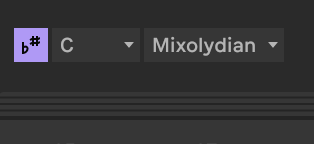

# ableton clase 010425

ccuando trabajas con samples aprece mas un collage

faltan transiciones y otras capas y otros elementos que enriquezccan estos collages de sonidos ya pre-hechos

y que lo haga un poco propio

ideas para hacerlo más musical:
- [ ] utilizar el sampleador (simpler)
- [ ] doblar el bombo del sample
- [ ] meterle una caja extra
- [ ] afinación de los samples: el **tuner** te dice en qué tono está más o menos lo que estás haciendo (se mueve mucho la aguja porque va agarrando todos los tonos), al menso puedes ver que es la nota que más va a sonar en esa canción
- [ ] tener en cuenta los acordes, ver cómo funcionan grupos de notas sonando al mismo tiempo

recuerda que para que suene el clip midi la pianola tienes que activar el boton de vista previa de midi

mejor instrumento para trabajar con harmonias el grand piano

ejericcio: hacer 4 acordes a partir de cualquier nota

luego doblar la nota fundamental o la más baja en una línea de bajo y ahí modificarlo ccomo queramos, o arpegiar los acordes

incluso cambiar el grand piano por otro instrumento!!!

los bajos de ableton son muy nasales se puede poner un autofilter

importante el bajo es una melodía no es con acordes

el efecto midi de scale puede linkarse con la escala del proyecto que sale como despues de todos los botones del tempo y tal, **puedes automatizarlo**

con toda esta info:
el curso 1 era mas rollo beats y tal
luego vimos el simpler y los samples
y ahora vimos los accordes y las notas y tal

objetivo: el track que estabamos haciendo con samples, para la siguiente clase en 32 compases trabajaremos lo que sampleamos (entender qué tempos tienen lso samples y gestionarlo con el **tuner**)
meter el simpler
meter acordes para el tema 
y acompañar los acordes con el bajo
y si queremos añadir a eso un redrum pues tal

