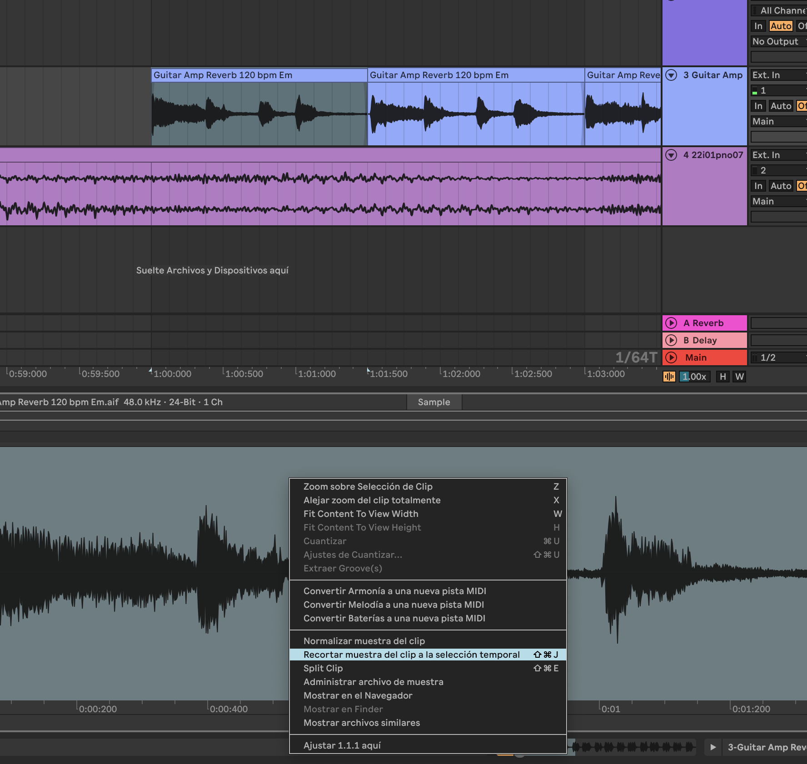

# notas curso ableton parte 2 25 03 2025

canales de envio: 
sumar efectos en un macroefecto que lo puedes poner gradualmente

**trabajar con comandos!!!**

**para grabar automatizaciones**
recuerda que tienes que tener activado el boton el boton de 
- [ ] armar automatización
- [ ] boton grabar arrangement
paneo: a la hora de panear voces y darles espacio o incluso la misma voz duplicada y tal

retrasar un poquyito la voz y que cada repeticion este un poco hacia cada ladito

bajo voz y bombo se graba siempre en mono

el bajo ocupa muchisimo recurso de audio

guitarras y pianos se puede grabar como estéreo

**para que se entienda el paneo cada paneo tiene que ser ligeramente distinto!!!**

todo lo que hagas termina en el master

una buena mezcla saca un sonido que no pete el master porque cuando se masteriza (primero produces luego mezclas luego masterizas) generalmente se suben volumenes y tal!!!

truco para ahorrar recursos:
cuando tengas un audio del que solo uses un trozo

puedes hacer esto:

rodaja es slice en castellano mola mucho mas rrodaja!!!

**configuracion:**
latencia:
cuadnov as a producir y tal lo mejor es dejarlo al máximo porque da igual la latencia y la latencia no te permite fluir tranquilo

pero si vas a grabar instrumentos externos y tal lo mejor es que 128-512 para reducir la latencia

pinchar un audio:

seleccionas el trocito y le das a los botones d epinch entrad ay pinch salida y quitas el del loop

y asi le das a grabar y en ese momento cuando llegue a esa zona se graba y cuando salga de esa zona seleccionada deja de grabar

**recopilar todo y guardar** para tener todo en la misma carpeta!!!

recuerda la opocion de grabar midi que es el cuadradito que es arriba 

**proxima clase:** armar un minuto de audio de puros temas que nos gusten, hacerle efectos de delay y reverb, 

no es sacar un minuto sino sacar varias cosas que entre ellas sean un minuto

**minimo 4 recortes de sample**

que quede sonando lo mas hermoso que puedan que suenen lo mas harmoniosamente posible

# TAREA:
coger mejores samples (igual de la banda sonora de magi que molaria que flipas)

trabajar el simpler y toquetear las coasa que sale cuando le das al triangulito al lado del boton de encender y apagar

contar una historia cone l track