# clase 3 direccion del arte

CHICOS, PARA EL PROXIMO MARTES, TENER MUY BIEN VISTO ESTE VIDEO DE LANA DEL REY. ES LA PRIMERA PARTE DE UN CORTO MAS COMPLETO LLAMADO TRÓPICO. QUIERO LO VEAN VARIAS VECES PARA EMPEZAR LA CLASE DESGLOZÁNDOLO: [https://www.youtube.com/watch?v=ZngPwqkibcU](https://www.youtube.com/watch?v=ZngPwqkibcU)

el paraiso el lugar con los arquetipos
termina cuando ella cae
este es el 1er episodio
en el 2o baila pole dance y le pagan y guarrea

el paraiso es tiene una estetica de plastico 
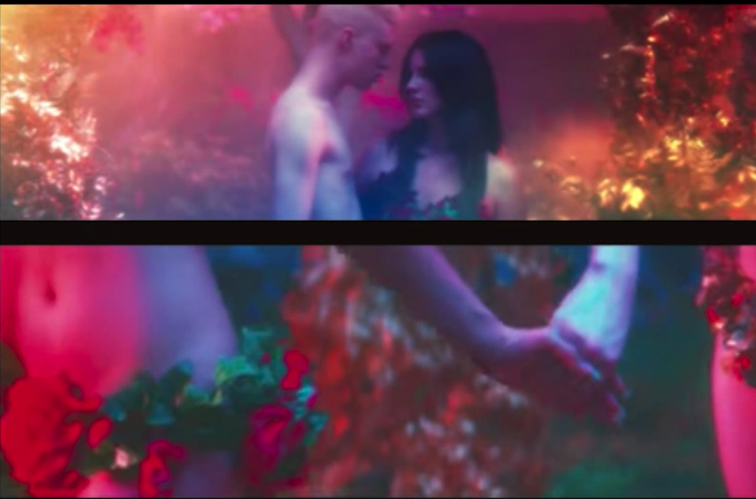

el color es literalmente una percepción
el color en sí no existe es una percepción
y el color tiene que ver con la luz
que hace que diferenciemos el aspecto de las cosas
y tiene que ver con la luz
que itneractua con obejtos de maneras distintas
y eso llega por loos ojos y al cerebro

los personajes se vrn azulados hay luces a arillas pero tambiçén se ven como luces negra
son luces que dan una sensacióon diferente

la trilogia de padre hijo y espiritu santo
la rperesntacion de lo que se adora en eeuu
todo lo que representa el western

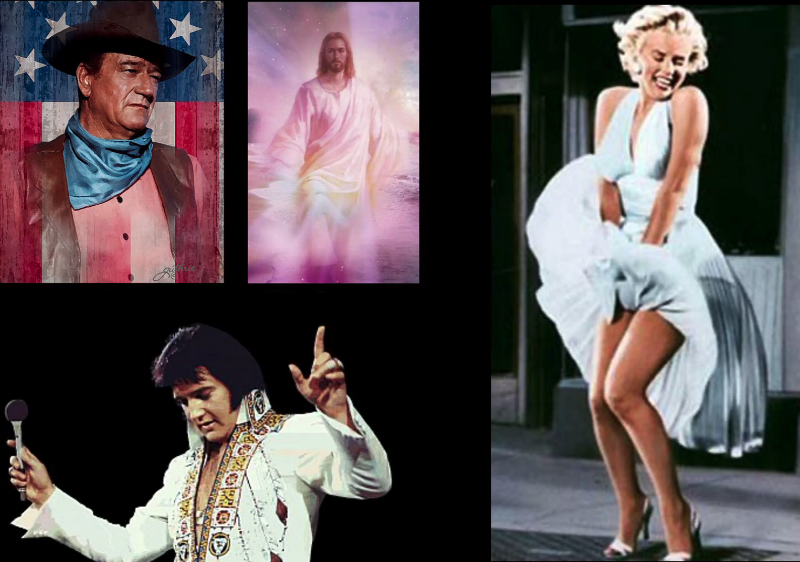

eeuu no se muestra como indios
se muestran como cowboy

y el sexo
y el rock and roll

 
     **el color**
 
el color en si no existe
es uan propiedad de la materia

tal vez lo primero que se eprcibio fue el verde
hay coloores que se perciben mas y menos en  nuestra retina
y se producen cosas

y luego con la cultura y civilizacion
el hombre fue creanddo colores

*las cosas para qye existan necesitas darles un nombrey un concepto*

en grecia, en homero, no hay color azul
y describen el cielo y el mar como transparente

no todos estamos en la misma cultura
ni en el mismo espacio ni tiempo
tenemos otras gamsa de colores

por eso dice que no es fanatica de la psicologia del color
porque es una mirada sobretodo occidental
en occidente el negro se ve con la oscuridad y se ve con la tradicion catolica romana, lo siniestro lo oscuro
en cambio en oriente el luto no se relaciona con el negro sino con el blanco

mientras que el rojo lo relacionamos con la pasion, el azul, en egipto, era muy valioso
y como estaba hecho con lapislazuli eera muy intenso
y lo vinculaban a lo sagrado
a lo valioso
muchos maquillajes
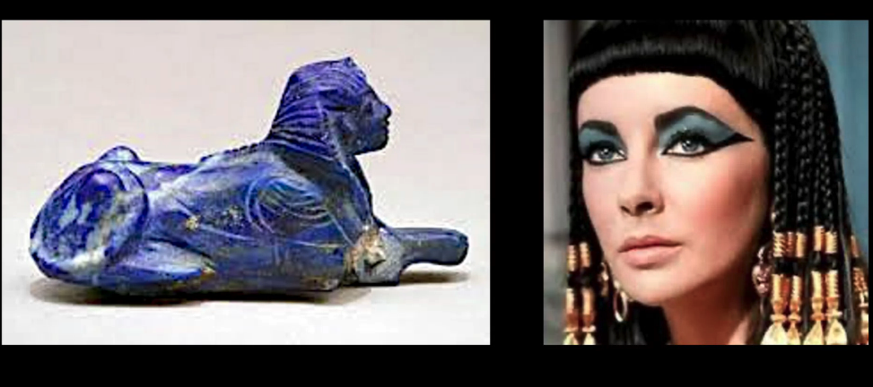

no sabemos si en azul tenia un nombre
pero era muy valioso
y sí era percibido
y tiene que ver con el cerebro y ondas 
pero tambieen hay una **percepción cultural**

pero si es cierto que hay sensaciones orgánicas o inconscientes
muchos animales repelen el rojo 

el rojo es uno de lso primeros coloores que empiea a percibir el hombre
y se encuentra en piedras y en tierras, y el roojo organicamente suben las palpitaciones

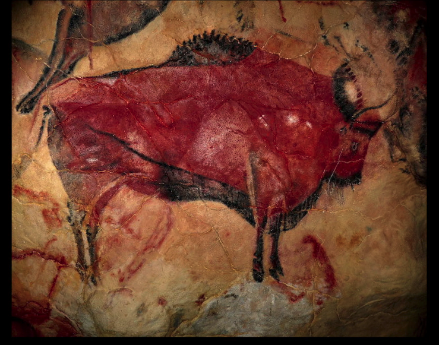

si una mujer de rojo pasa nos genera algo

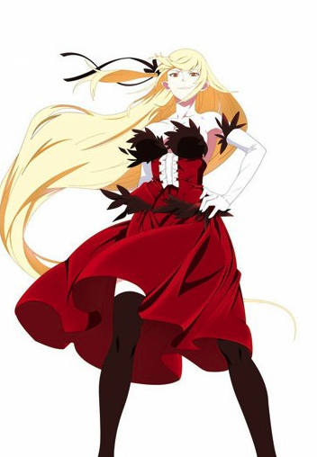

por eso es de los primeros en usarse en marcas (cocacola, mcdonalds)

el rosa ahora es lo femenino, pero antes el rosado era vinculado con la virilidad y lo masculino
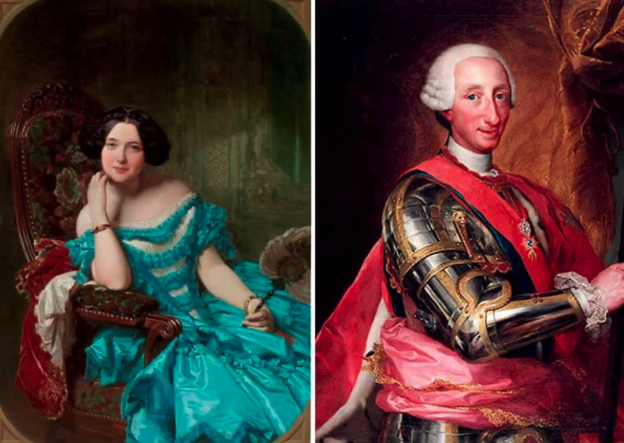

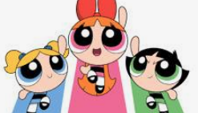
la femenina es azul la lider es roosa y la puntiaguda es verde

 
     **los modelos de color**
 
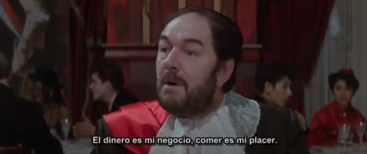

mucho rojo con acentos verdes
y en la siguiente escena todo es rojo

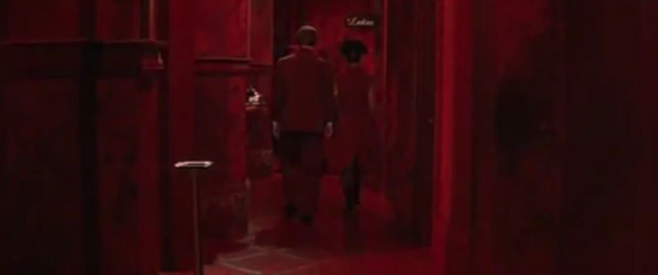

y uego blano

y luego negro
y luego verde

todo se mueve por colores
cuando cambia de elocacion
cambia de vestuario

MODELOS DE COLOR
RYB:
es el modelo de color tradicional
es red yellow blue

es una forma de trabajar el coolor tradicional pero limitada
pensamos que nos servia opara generar todos loos colores
se urtilizo para las primeras impresiones en color

son imagenes un poco sucias
un poco opacas
per una primera gran combinacion

en el colegio cuando hacemos el circulo cromatico por el sistema ryb
nos enseñan que el rojo ye l azuzl sale violeta
pero si hacemos el experimento asi sale un coklor sucio o aproximado

espues tenemos la sintesis substractiva de color: CMYK
cyan magenta blacK yellow

el rojo no es un color primario, lo es el magenta
como el azul tampoco lo es, sino es el cyan
el amarillo si tho
:P

y s nosotros mezclamos estos 3 tenemos negro
elmrojo es magenta y amarillo
el azul es cian y magenta
y el verde es cian y amarillo
molaaaa

si no tengo cochinillas para hacer rojo
puedes conseguir el rojo del magenta y el amarillo

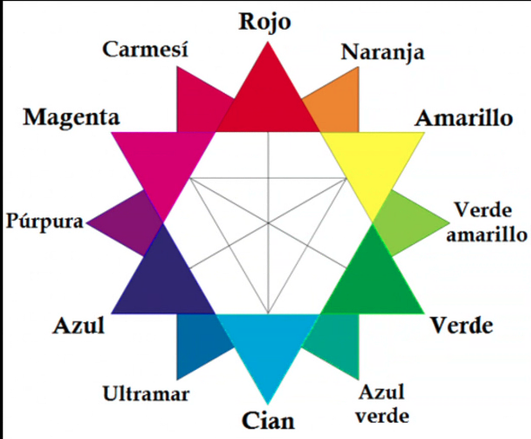
y este sistema de color
es muy importante en direcciónd e arte

lo vemos en impresiones modernas
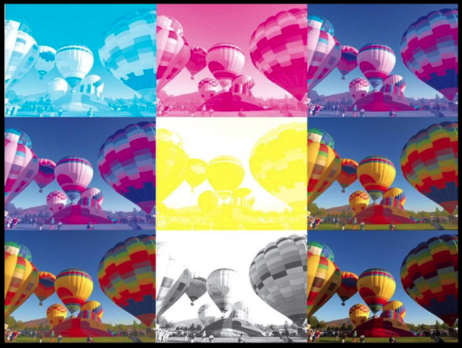
estoo es muy empleado para impresiones
una fotocopiadora tiene polvos con estos colores
y cuando a una impresion le empieza a faltar un color
empieza a versde asi

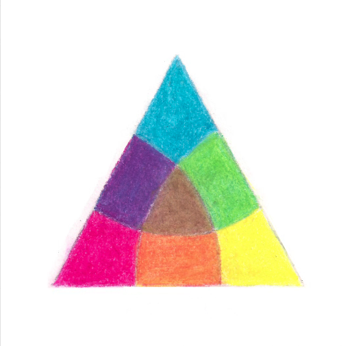

el CMYK es lo que nos acerca a la realidad de los colores 

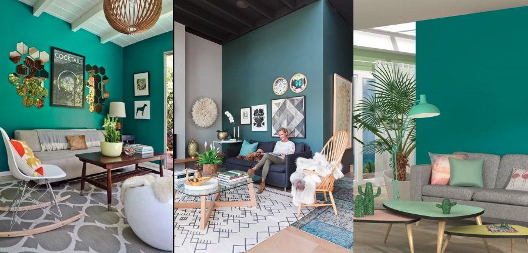

pero tenemos tambien la luz

el mismo color segun la luz se percibe ligeramente diferente
espues d eeste sistema tenemos e ultimo sistema: RGB

ese es el que está vinculado a la actualidad a todas las panttallas
que tiene que ver con halos dde luz

todos los aparatos electrónicosfuncionan asi

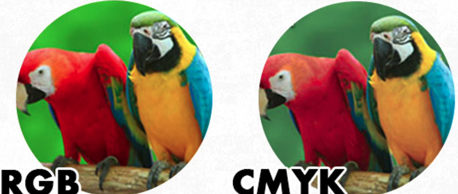

el sistema rgb se ve en la pantalla más luminoso
por eso se ve distinto en pantalla que impreso todo
//por eso se hacen las pruebas de color
//y por eso cuando ahces artes finales las haces en cmyk
//y has de conseguir traducir bnien uno a otro

also ninguna pantalla esta igual calibrada

antes los bocetos eran en mano
y ahopra todo es rgb por las pantallas
pero si vas a pintar una pared
pintaras en cmyk

trabajar en la camputadora siempre dará uan paleta más brillante
y se ha dde tener conciencia de éso

en direccion de arte no usamoso el RIB
porque da colores como opacos sucios y s no queremos esa sensacion adeu
trabajamos solo con RGB y CMYK

los colores **complementarios**
 cuanddo cogemos un color con su opuesto exacto, vibra en nuestro ojo esa combinación
y hace que brillen entre sí

*piense como una familia un poco disfuncional*: mamá rojo con mamá azul sale violeta
quién no ha tenido nada que ver en esta concepcion? el color de en frente
y ese es el amante

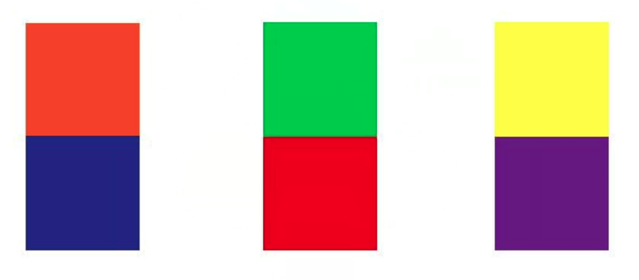

la la land usa mucho todo el rato colores complementarios con colores muy vibrantes

ahora internet nos da herramientas para crear paletas
pero pide que interioricemos cómo se mezcclan los colores para que cuando hayan crísises las podamos resolver
//**colorhunt 
// khroma 
//coolors 
//colorcode
//picular** -> cae en los estereotipos de color
//scale: coor
//adobecolor?
//[https://hihayk.github.io/scale/#4/6/50/80/-51/67/20/14/1D9A6C/29/154/108/white](https://hihayk.github.io/scale/#4/6/50/80/-51/67/20/14/1D9A6C/29/154/108/white)

la profe siempre lleva consigo un pantone
uno brillante y uno opaco

**psicología del color: eva heller**
dice que sólo tenía sentido antes de la caída del mundo
era una mirada occidental y patriarcal

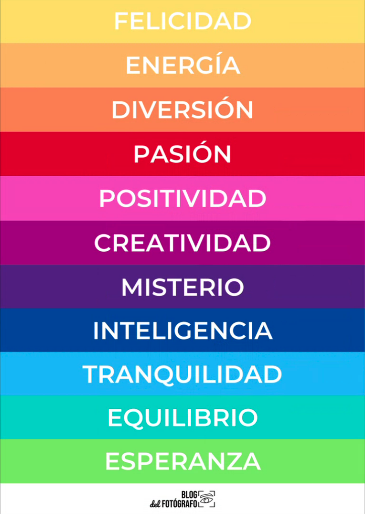

el azul se relaciona con el homrbe desd eel s 18 entonces es inteligencia su mayor valor la logica
el verde puede ser  eneno puede sder naturaleza por qué esperanza??? el rosita positividad?

entonces las peliculas rurales del camp en china
le servian mas para pensar el color 
en peliculas sobre la selva y lo indígena

**las temperaturas** de color
si dividdimos el circulo cromatico existen los colores cálidos
y los colores fríos

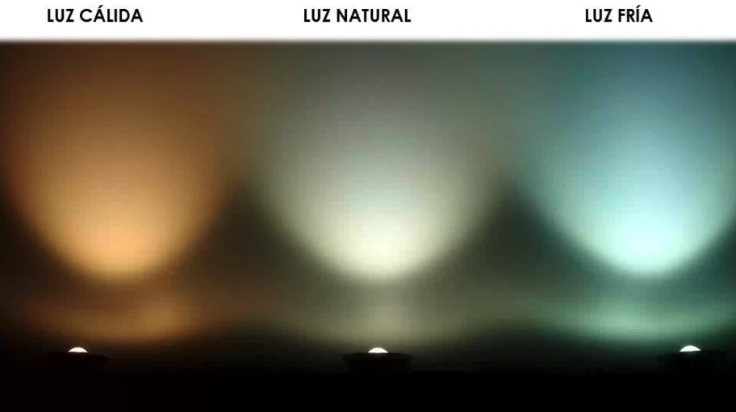

depende de la luz que pongamos los colores s evan a ver de uan manera u otra
por eso hay que conversar siempre con el director de fotografia

los colores son una negociiación
a veces hasta hablas as con el de foto
que con el director

mola que el dire de foto es commo que trabaja la luz y todo lo perimatérico
y el de arte trabaja todo lo matérico,

a  veces el director de fotografia dirige por encima de el director general
por eso ncesitamos conocimientos para poder negociar
*"no hay nada mas satisfactorio que cuando e corrector de color diga qu eno tuvo que corregir nada"*

todos trabajamos opara un fin
pero en la pre, tenemos que ir negociando
pero si escogemos unt ipo de luz
éspo es lo que se queda

muchas veces no es la luz que se pone
sino por ejemplo en la noche que hacemos?
las pelis por las noches a veces usamos haces de luces de color
y voovemos al sistema RGB

dice que le han tocado directores que hasta le han salvado el pescuezo
y otros son berrinchudos

el maquillador tambien necesita el acuerdo de la luz
el diseñadoor de moda necesita saber cual es la luz en el desfile

359- sin titutlo cindy sherman

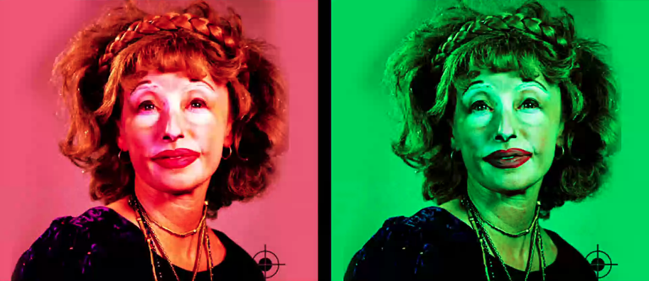

cindy sherman es muchos personajes
esa es su obra
mola

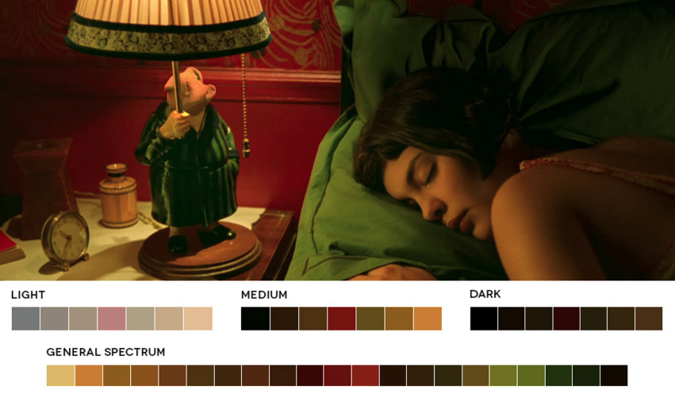

en su mommento a todo eel mundo le encantó esta película
que tiene esta película muy marcado el rojo y el verde

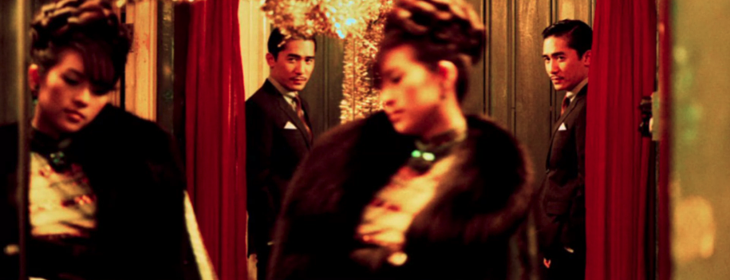

**jorge recomienda fallen angels de wong kar wai y happy together**

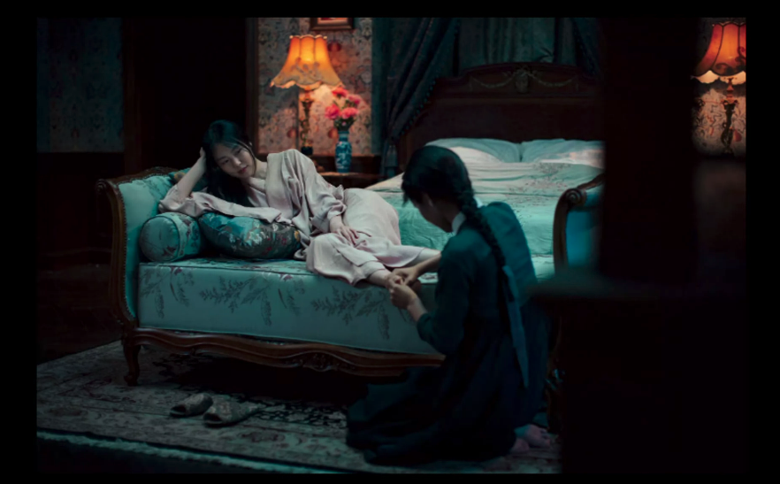

chan wook park

luces frias
y paleta muy frias
con resaltes de colores cálidos

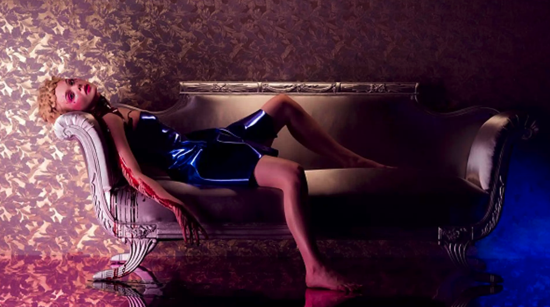

el demonio leon: como juega con las luces
*al final trabaja la moda 
y la moda es mucha fotografía*

blue velvet peli fav de jroge

**terminologías
matiz, tono o tinte.** el color tiene sinónimos, *busco un tinte para pelo*, un color, un tono

*wes anderson volvió a traer de vuelta el amarillo*
en los años 60 que viene lo pop
habian estas paletas muy pop 
y el amarillo se usaba mucho
y la pintura es plana, colores puros
y wes anderson es un buen colorista y tuliza muy bein el amarillo

**saturacion, intensidad**, no es lo mismo que temperatura o luminoso
un color intenso tiene el pigmento más puro
y un color desaturado es un color sin CYM
se vuelve plomizo

si queremos resaltar unos colores
otros colores tienen que bajar su intensidad
para que la retina no les preste tanta atencion

amarillo locura por van gogh??? no! lo que si sucede es que los colores intensos si generan situaciones que nos ponen más alerta
y los colores opacos nos bajan la frecuencia

***lost in translation*** **de sofia coppola**

muchas pelis del pasado las desaturan
proque pensamos en el pasado en peliculas historias concolores desaturados
un mal momento, un m,omento tragico

y cuando es un momento feliz
y personajes planos
lads convenciones ns hacen reslatar

*en la miniserie paquita salas*

crear varias paletas
y entender como van a trabajar estas paletas
con el director de fotoeagia

*el portero de noche* es una historia

**todas las de sofia coppola molan:**
las virgenes suicidas
mariia antonieta

proxima clase: algunos directores coloristas