# clase direccion de arte 5

propuesta de arte

no hay elecciones ni buenas ni mals
solo elecciones
solo hay que ver como lo venden

la persuasion
e slo que consigueen que se aprueben

**el armado de la propuesta de arte**

cuando arrancamos tiramos de la fuente
ahora tenemos que hablar del lo que hemos visto

a veces es un concepto
no es nada esrito

**el guion**: la idea el concepto, de ahi va a comenzar la propuesta. leemos lo que nos entregan o pensamos el concepto que nos han dado

reflexionar sobre las fuentes: ekl oersonaje el director y sus manías etc etc

y a partir de ahi hacemos un primer desglose general:

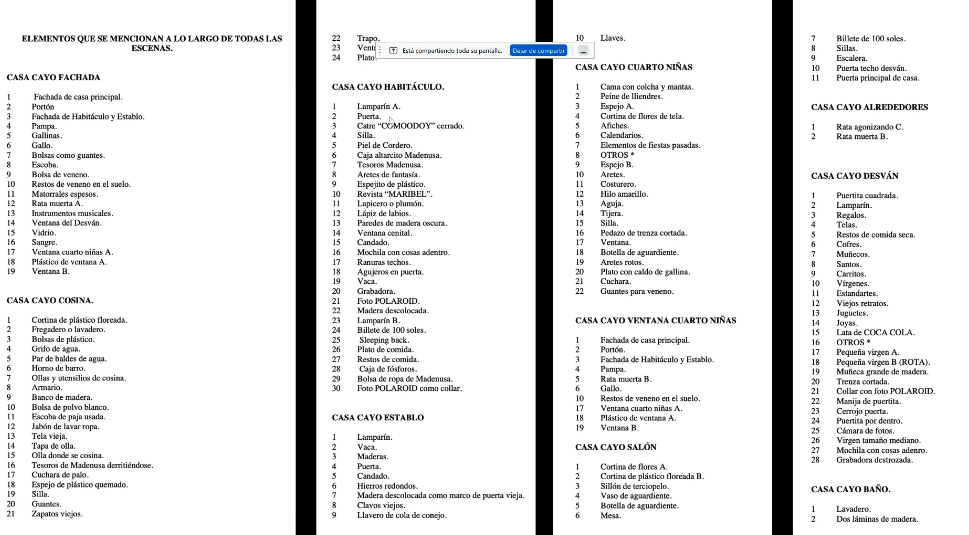
(desglose de la madeinUSA

uno puede pensar no por escenas sino por areas:
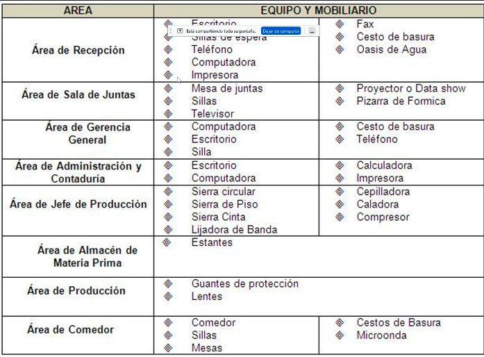

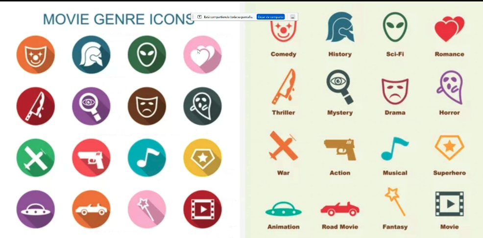
el género también es una cosa que no se suele dar con el guión pero es muy diferente un drama de un western o que una pelicula adolescente

que hay convenciones esteticas

podemos tomarlas en serio o ironizarlas y jugar con ellas

pero claro tenemos que tenerlas en cuenta

*a veces les invento un género les doy un nombre:* un drama con humor negro con absurdos, *le vas sacadno informacion para poder ajustarnos más a las convenciones estéticas establecidas*

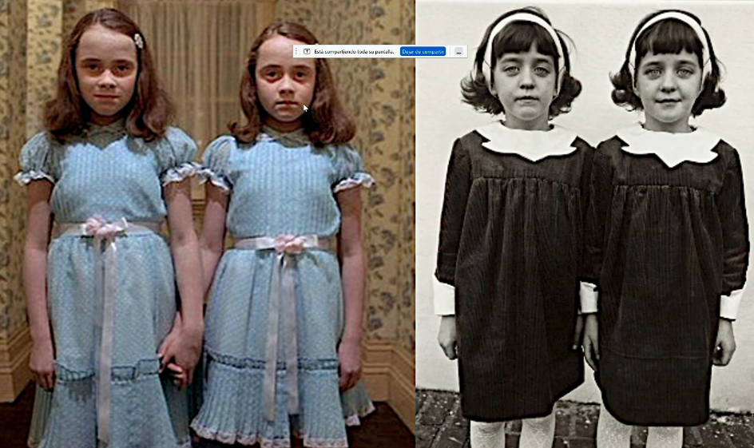

tras tener claro qué género es, buscamos las referencias, cosas que nos van a inspirar. **esto es algo muy postmoderno, antes en el cine todo tenia que ser original, la gente se avergonzaba si se descubria que habian citado**

cuando ya tenemos las citas es cuando las cabezas deberían ir buscando las locaciones. vsamso a las locaciones y tomamos fotos, pasamos tardes mirando locaciones y se han de conversar con el director general con el productor

las locaciones se dividen en **exteriores** e **interiores**

y tenemos que tener en cuenta diferentes tipos de locaciones: **naturales**. cada vez es más difícil acceder a éstas. hay que crear bases para trabajar pero sin alterar el lugar. 

y las **construídas** que son las que generalmente trabajamos. 

los **sets** ya son lugares armados, en eso se diferencian de als construidas, que ya están preparados para sseies de televisón o programas dee tele. almodóvar trabaja mucho en sets. pueden dar a una apariencia irreal pero todo está bajo control

en la teta asustada todo se ve 

 
     **escenografía**
 

una escenografia pouede ser colegial, o una más sofisticada como una maqueta del hotel budapest de wes anderson que lo usa activamente para que se vea maquetil e infantil

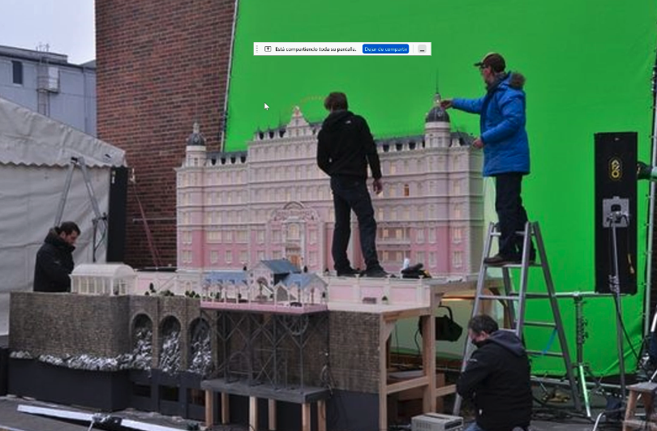

a veces el director de arte tiene ingerencia. los equipos hay que armarlos y susana torres los arma en torno a la historia. si le dan posibilidad a escoger escoge utileros carpinteros, por ejmeeplo, porque trabajaba en un lugar especia. en otra necesitara un utilero muy delicado para objetos delicados, o si en una peli hay muchos niños necesita un utilero con mucha *sangre dulce* porque va a convivir ccon niños.

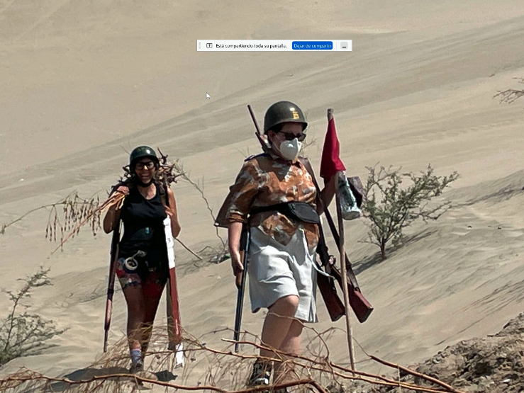

aqui se ve a lina siendo utilera

**qué equipo necesitas para determinada historia? a veces uno no tiene ingerencia pero puedes decir "necesiito este tipo de utilero o productor"** y a veces te contraoferta el dire de produccion porque es mas barato otro de lo que pides :(

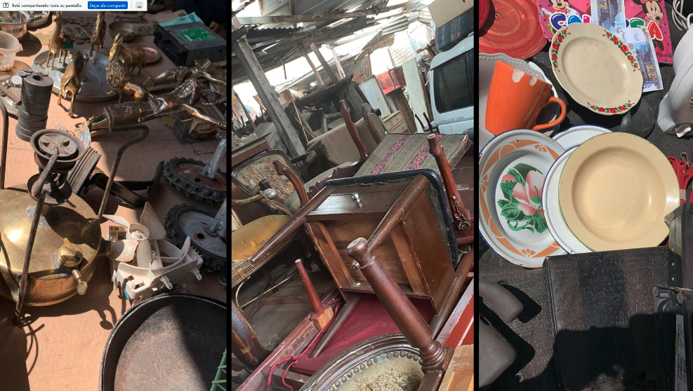

tras pensar
**los espacios** (locacion es)
**los equipos** (utilería, artesanos, técnicos, etc)
**necesitamos también los objetos que nos van construyendo la historia**. tener **el lñibr rojo** que es importante en la historia,

o tene en cuenta los texturas de lso espacios

**utiliario vs utileria o props**
**mobiliario**: copsas que se pueden mover. no solo muebles, cosas pequeñas

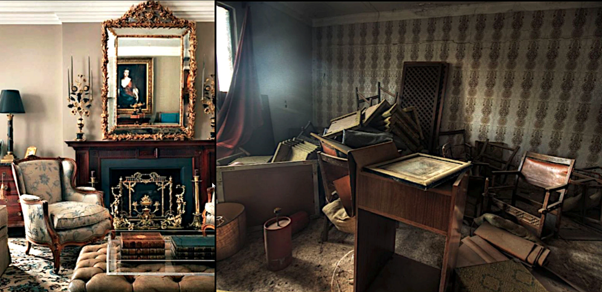
**mobiliarioo** armado vs mobiliario desarmado. a veces la escena necesita que el lugar esté desordenado. tenemos que tener en cuenta que en el caos **también tenemos que volver a armarlo** si lo necesitamos

**utilería**: objetos que forman parte del mobiliario pero son manipulados por personajs y son la parte de la historia. son elementos indispensables y el **utilero** los cuida

al igual que paletas de colores generales hay paletas de colores para el vestuario

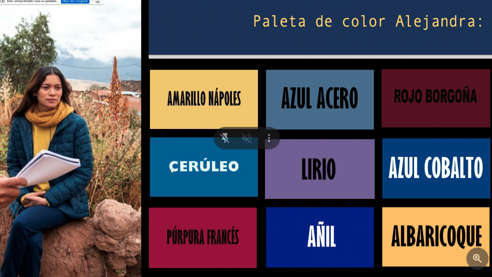

**vestuario**, y **maquillaje** son dos cosas que van bastante cerquita, hay que trabajar como un tejido como un equpo

los sets: el teatro tiene sets muy teatrales mientas que los sets de tele intentan apagar los brillos. en el cine el maquillaje ha de ser muy detallista, hay estos primerisimos planos que hacen que se note el maquillaje. 

ensuciar las uñas, engrasar la cara... hay cosas que en cine importan que en television igual no por ser mas "caricaturesco"

a veces es mas importante que se vean "maquillados" a que lo estén, la niña pobre no tiene que estar con las uñas perfectas, o tienen que tener cuidado para no afectar al raccord de la peli (poniendose morenos) y a veces hay que poder recrear la suciedad de la realidad... si se levantan de la cama un personaje no puede estar perfecta
, o de la ducha igua, opero claro hay que tener en cuenta como de caricatura ha de ser o no el personaje

se trabaja e maquillaje para las peliculas en blanco y negro diferente que a color!!! importante. para los labios en blanco y negro utilizamos un azul porque el rojo queda muy oscuro, por ejemplo

el pelo cuando no es un rubio muy claro aprecerá marrón

**plasmar ideas concretas en carpeta de arte**:

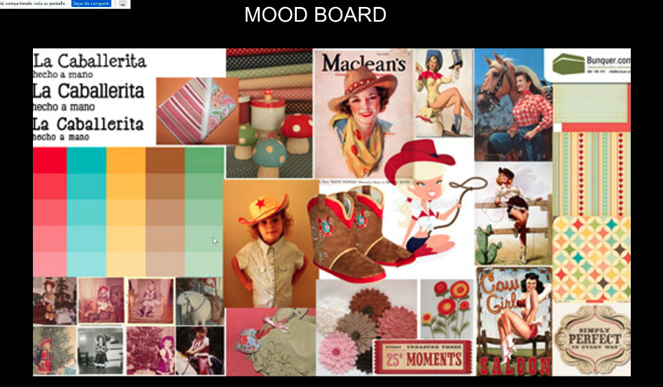

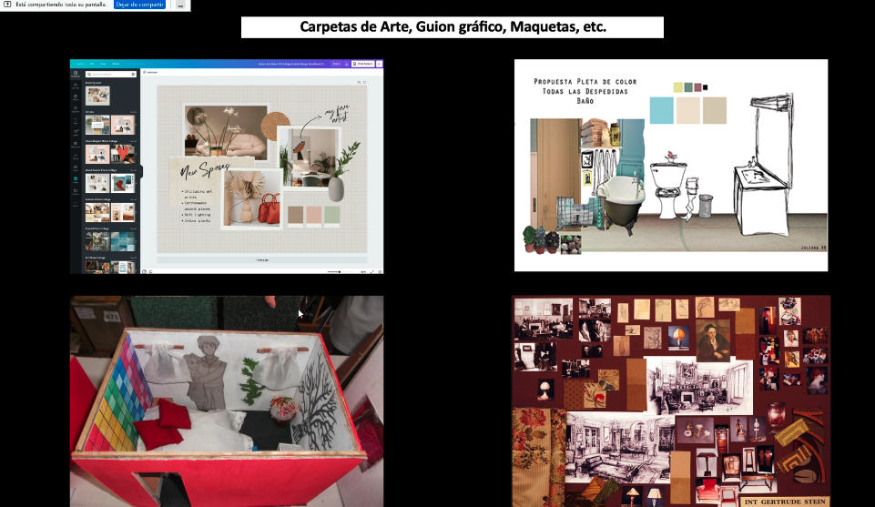

y despues de tener todo aprobado hacemos un desglose

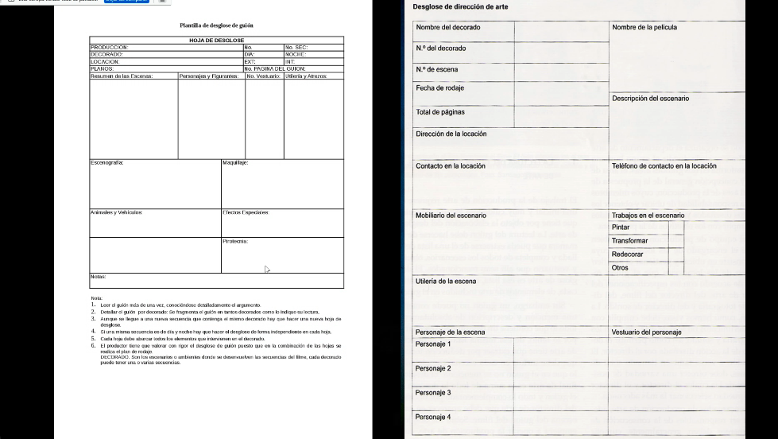

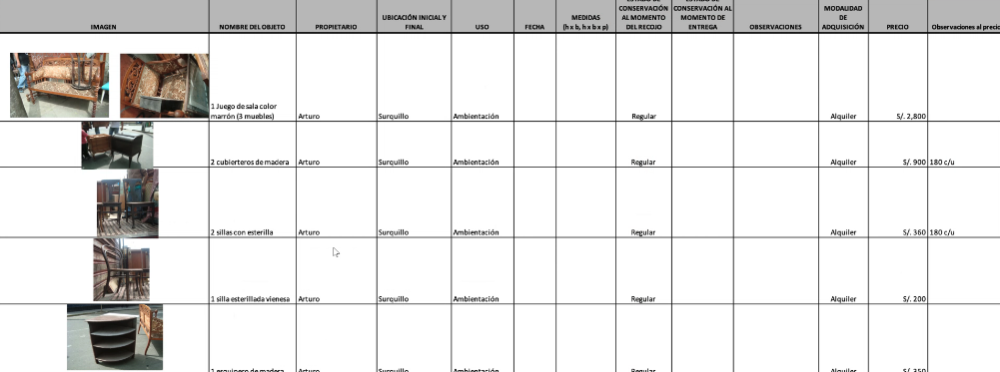

hacer un inventario con toods los datos para que nada se extravie

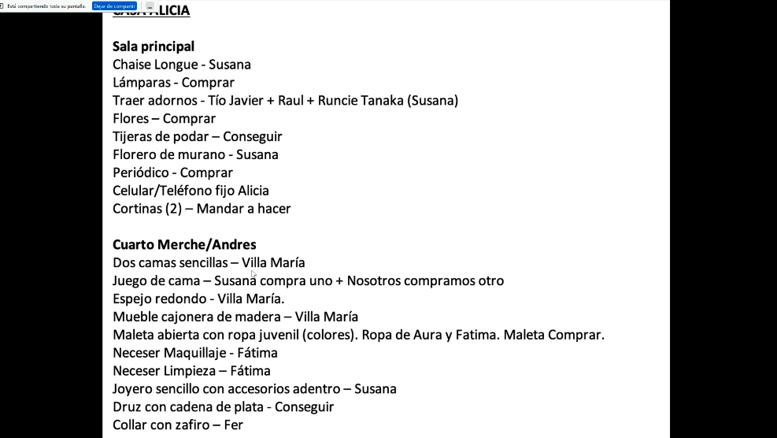

pueden ser apuntes muy sencillos

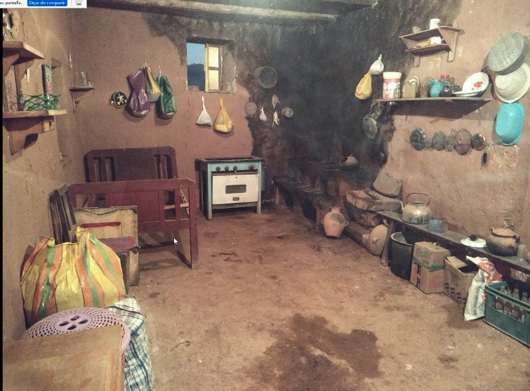

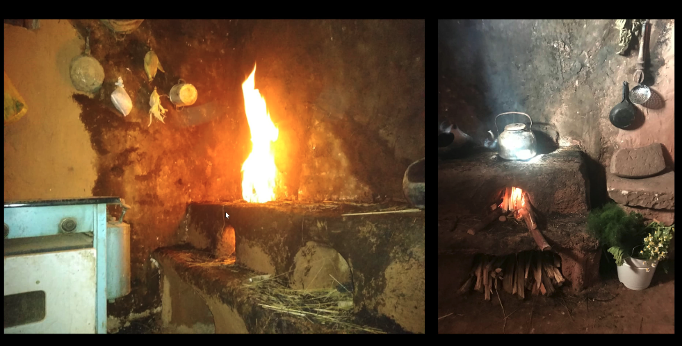
queem ar la pared para que quede parecido y kuego ya le vamos creando una patina a la casa la vamos ensuciando

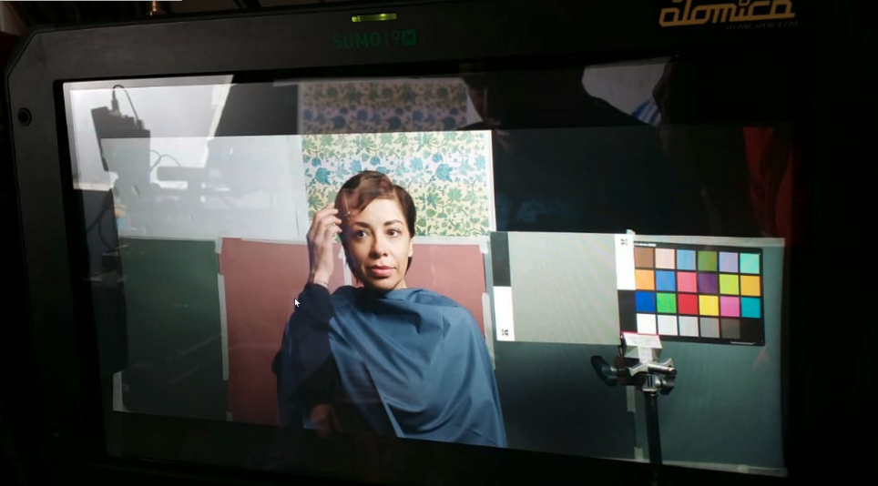

y la prueba de camara es super improtante!!!

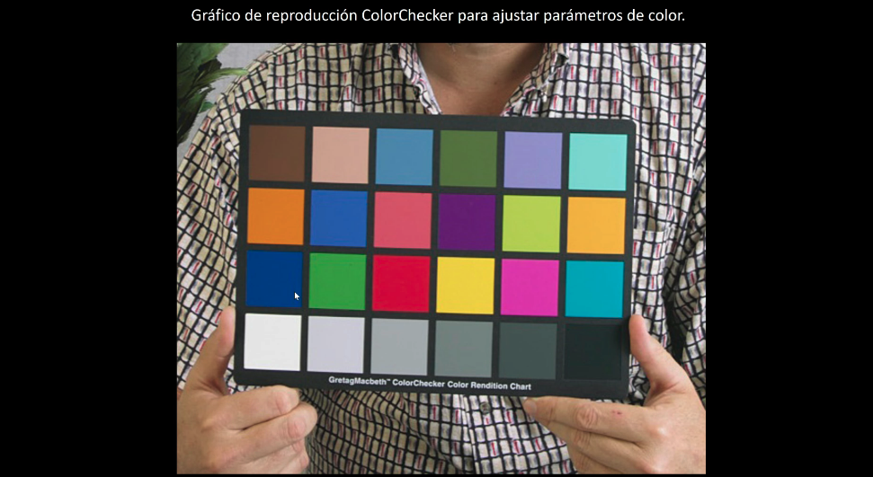

color checker: cartulina con pruebas de colores para ver como quedan los ccolores en camara

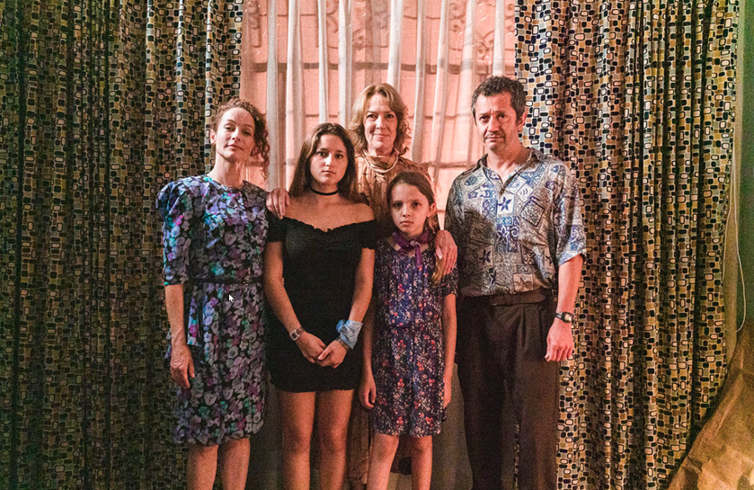
y aqui vemos textura con textura, almodovar mete muchas texturas pero no hay ruido visual

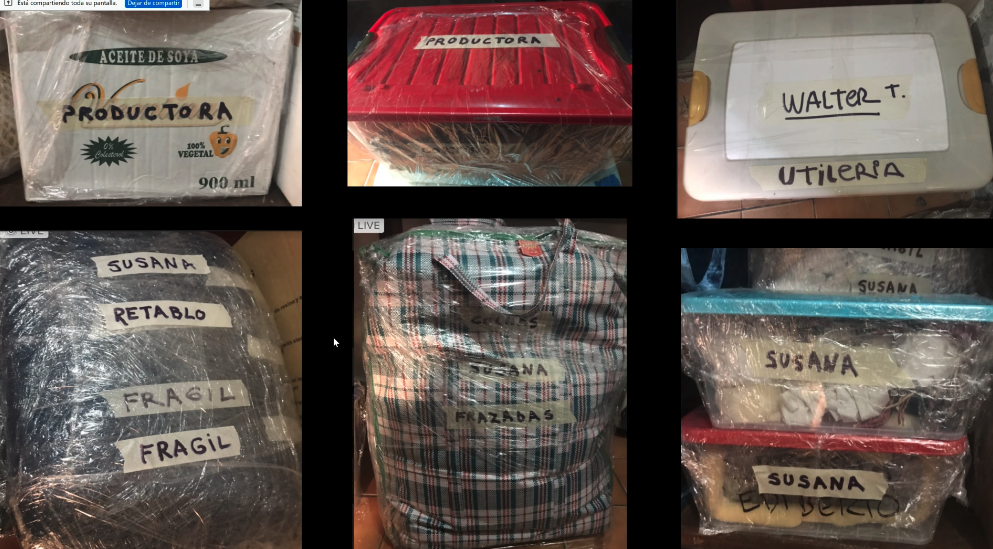

tiene que haber mucho orden en el embalaje y es un proceso que pasa paralelo a el trabajo

//las biografias son dificiles de hacer porque si queires contar todo no cuentas anda

