# clase direccion de arte 6

referencias o citas

uno siempre necesita referencias

desde los 50 comenzamos a tener acceso a la fotografia aparece la televidsión, y poco a poco la visualidad se convierrte en el principal de  nuestros sentidos

y tenemos un gran conocimiento visual

en los 90s con el internet y las redes todo se conecta con la globalización. se democratizó y extendió el acceso a las imágenes

y con la postmodernidad ya no necesitamos los libros o las fotocopias para acceder a las cosas, ahora tes mucho más fácil acceder y crear imágenes

**las citas y referencioas son la base de la dirección de arte**

siempre podemos seguir rascando, investigando, profundizando las referencias

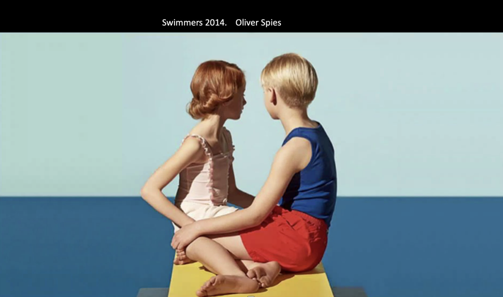
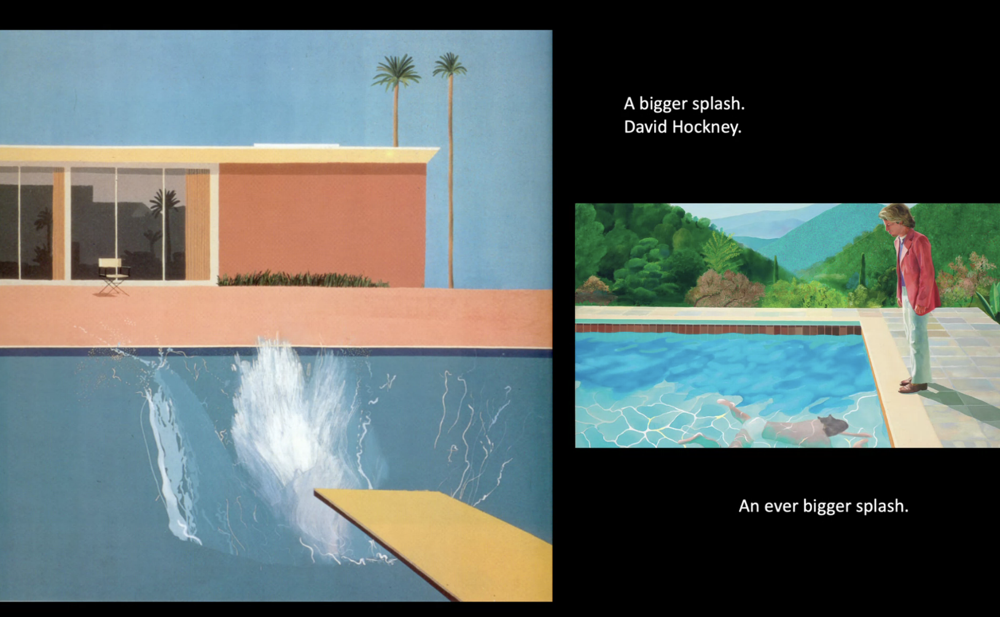

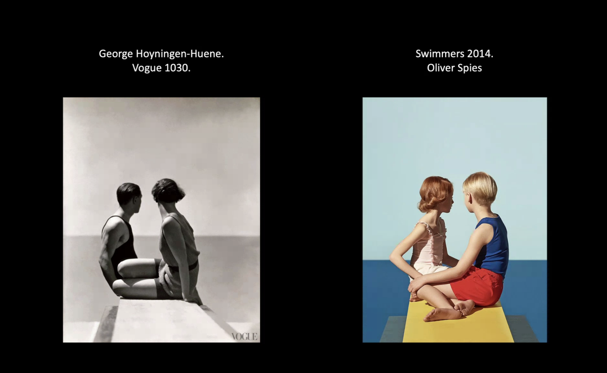

el homenaje no lo ocultas
la copia es **sinvergüenza**, en la referencia el orgiinal no se oculta

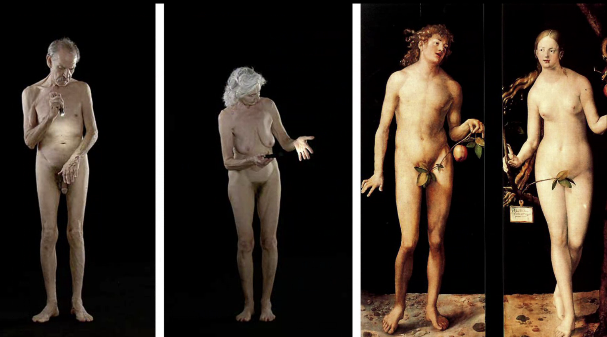

bill viola se inspiro muchisimo en el renacimiento

**la verdad de la milanesa**: siempre existio la referencia o la cita pero siempre los artistas intentaron ocultarlo

el mito y el artista: los artistas soempre intentan elevrse como algo especial.

**ser artista es como un zapatero**, la dirección de arte es zer un obrero, y siempre va a haber referentes siempre vamos debérselo a otro

**no pretendamos ser genios, seamos humildes y busquemos referencias visuales** si viene la inspiracion mola pero siempre es bien tener un proceso consciente

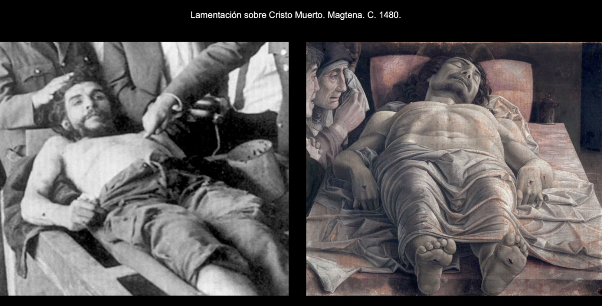

madonna bebe mucho de artistas como tamara delempika (ccuando estaba siendo revolucionara y no tenia solo complejo de peter pan), marlene dietrich, greta garbo, marilyn, james mansfield

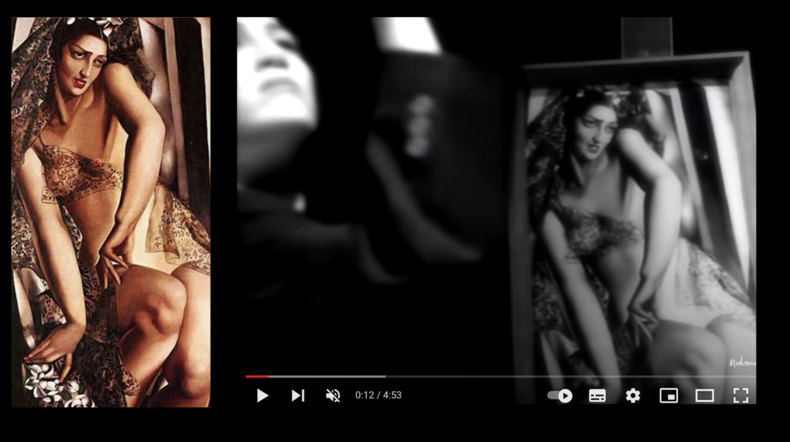

cher hizo un pacto con el diablo y le fue bien, madonna le fue mal, se ve

madonna simepre innovaba, si bien ahora parece ingenuo en su momento revolucionó vsualmente todo

bette davis siempre usaba una escalera, llega un momento en el que cada uno se referencia a si mismo. **si vamos a trabajar con un director investiguemos a ese director primero

-----------------------------**

y después quién imita a madonna???

lady gaga

al final supongoq ue el juego de las referencias es este

seguro que boticellilee a optras que hemos perdido y que ya no podemos seugir el hilo

pero el mito de la originalidad es inexistente

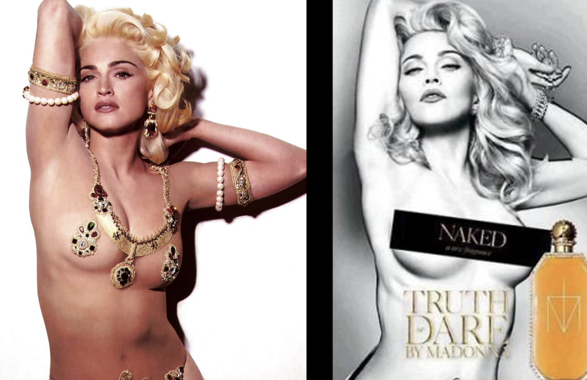

uno imita lo que le es optimo

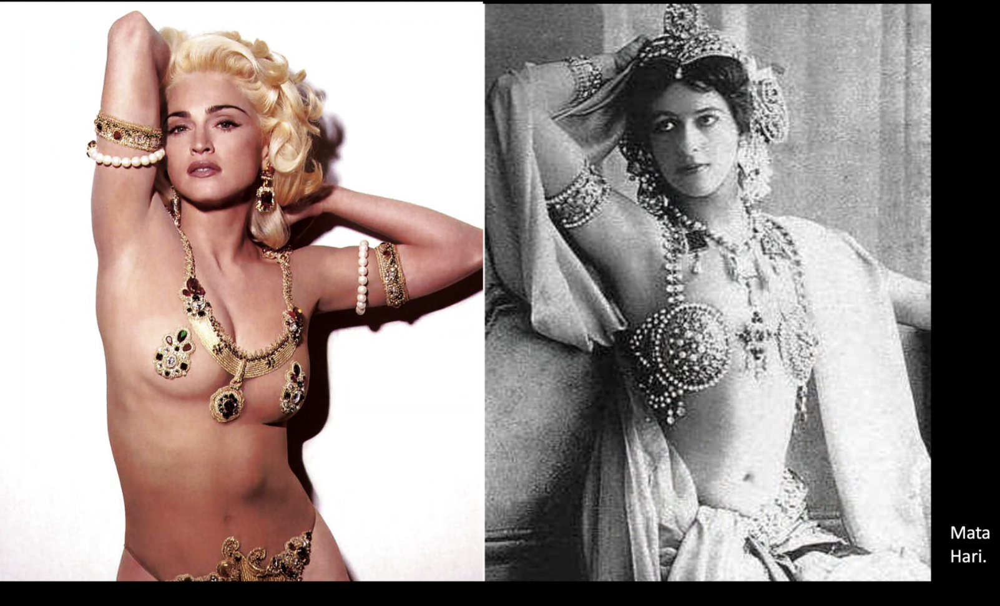

y madonna siempre imita a alguien

dicce que veamos cuadros cuando vayamos a hacer una pelicula o cualquier cosa

de hech o esto de las referencias no es solo algo del cine

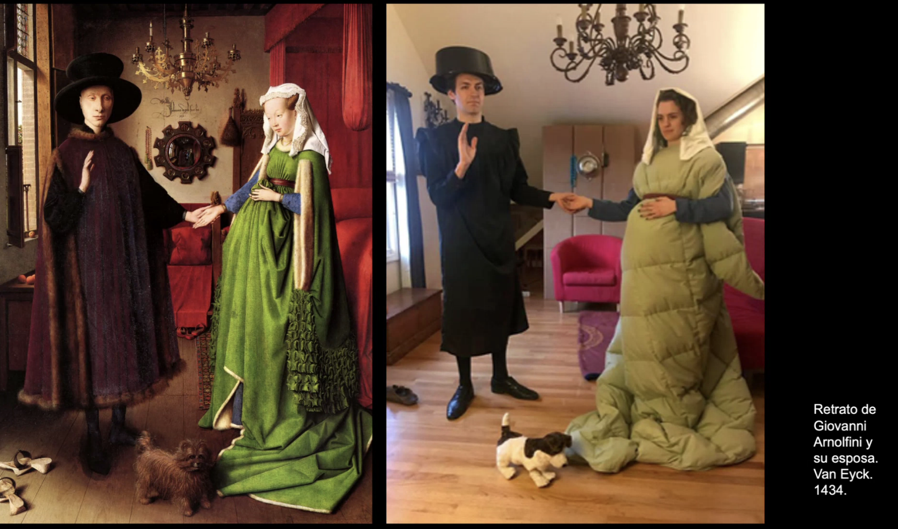

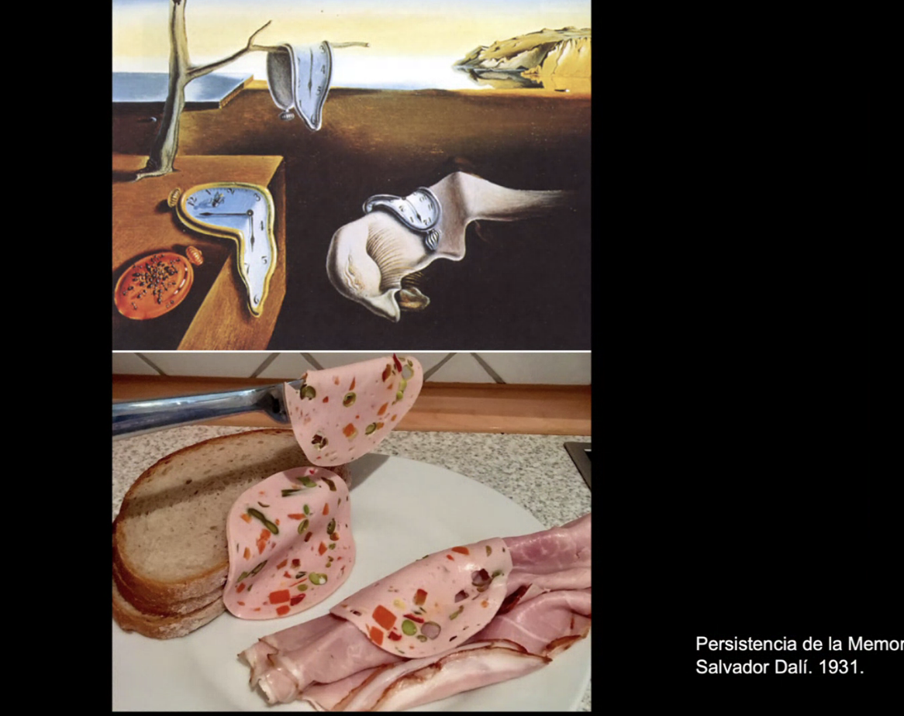

**nosotros podemos incidi en las historias**, no solo en la visualidad sino podemos incidir en la historia, hay dorectores que van incorporando imagenes en toda la hiostorai

el poster de la tetas asustada esta inspirada en la foto de las papas de martin chambi

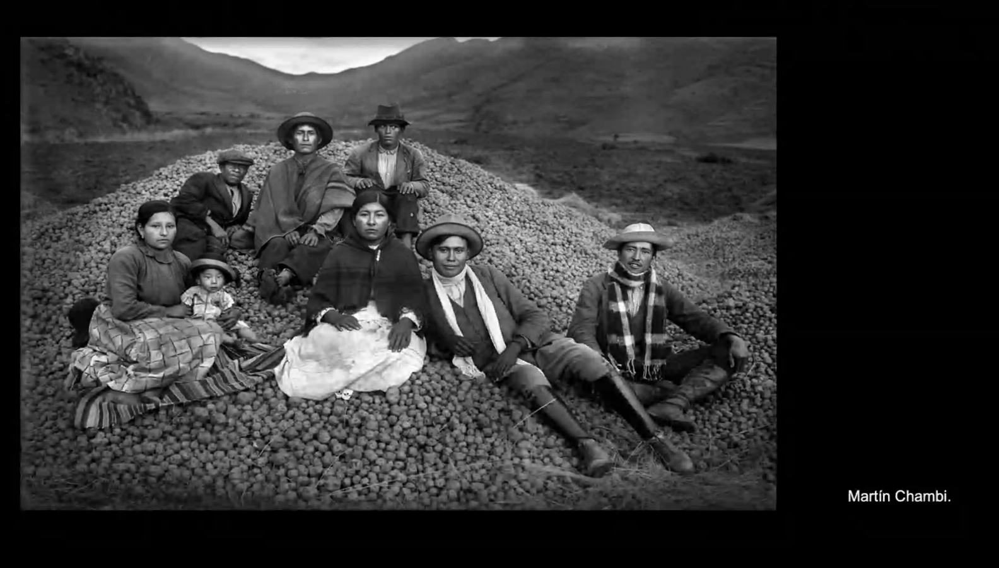

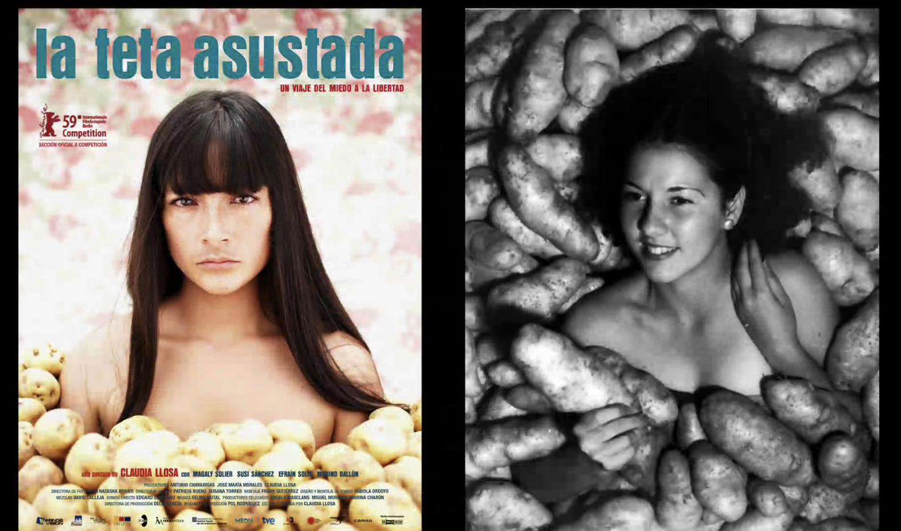

**traten de volver al origen porque eso va a hacer que ejerciten su cerebro**

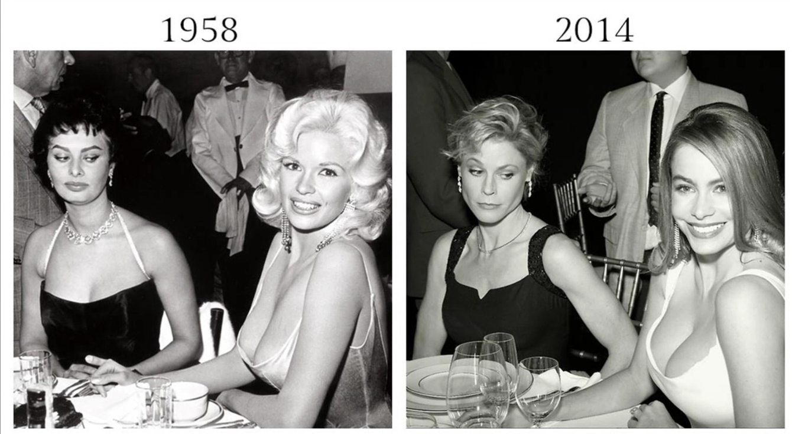

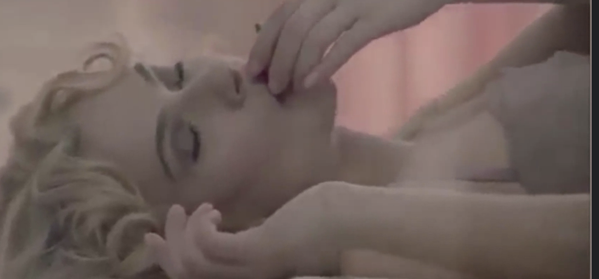

no hay coolores opuestos!! porque queremos que se funda con la cama

fashion film: se le ssuele dar a directores reconocidos que tienen que ver con la marca, wes anderson tiene un  monton

**uno no inventa nada** uno no puede exponer el vacio uno genera oponiéndose a algo. no podemos crear nada nuevo si no nos oponemos a nada

en la moda todo tiene que ver con oposiciones: todos hacemos algo ontrario a nuestros padres

hold your horses 70 million-¡> todo lleno de referenias

nunca surgen las cosas del vaccío
todo parte de algo

**hacer busqueda inversa de imagenes poude servir para encontrar imagenes parecidas a algo que queremos**

la generacion nuestra dice que nacemos con los referentes
y en su epoca eso no pasaba

**cuando hay demasiiado no sedimenta**

(refiriendose al exceso de referentes que hay pr todas pates en nuestro dia a dia)

