# clase direccion del arte 7

CARACTERIZACIÓN
tomnar una caracteristica para representar algo

bjork: una de sus caracteristicas a parte de su voz es cómo ella se caracteriza siempe, siempre lo hace de maneras inusuales

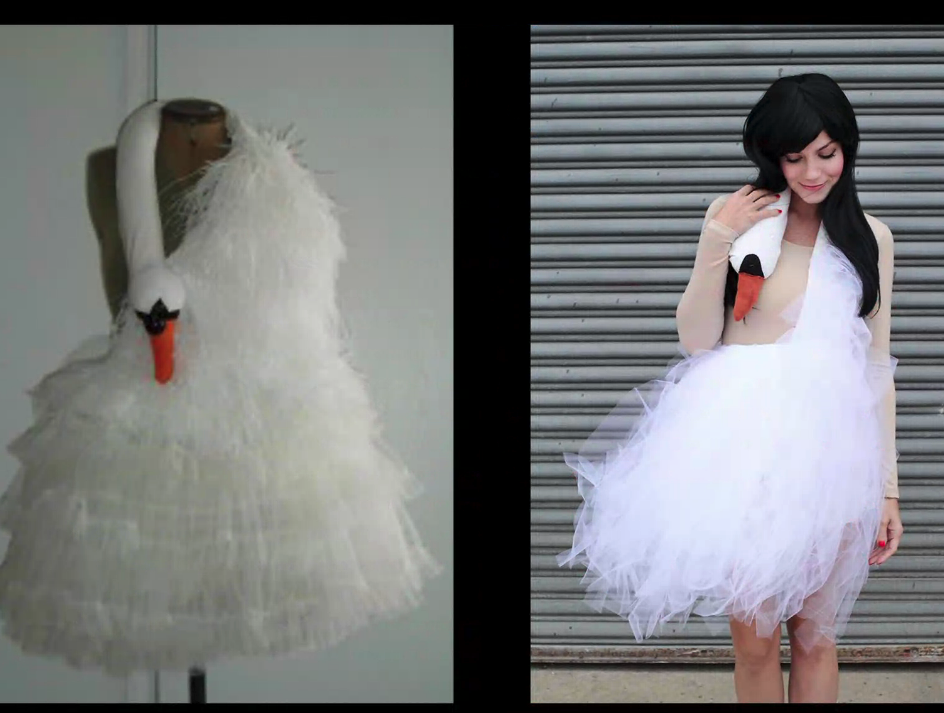

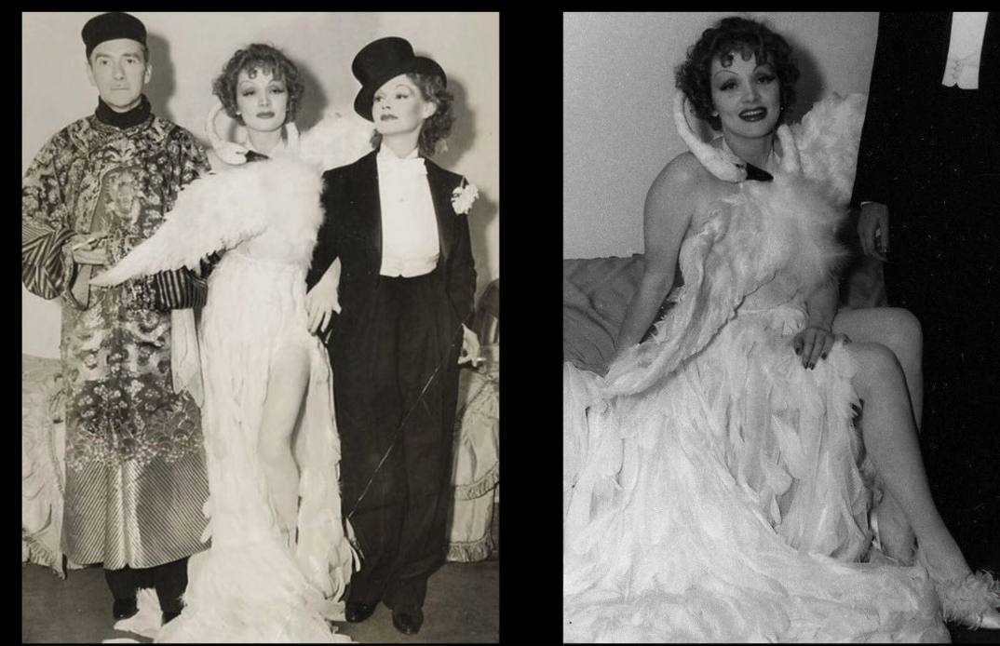
su traje para los oscar de 2001 es tan recordado que es incluso repicado por millones de personass incluso caroline polachek pero el origen es marlene dietrich y el origen es un mito en el que zeus se transforma en cisne

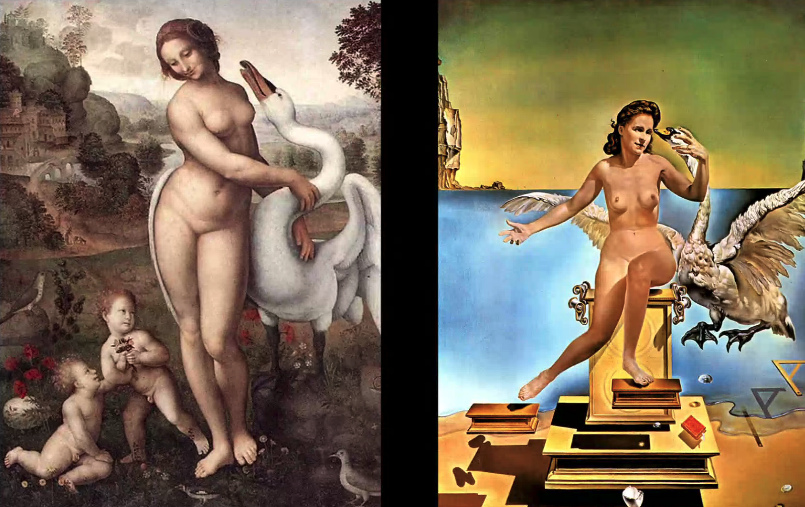

y este mito ya ha sido retratado más vecess

tilda swinton o kate blanchett ha sido caracterizada de muchas muchas formas por muchisimos directores!!!

(peli manifiesto)

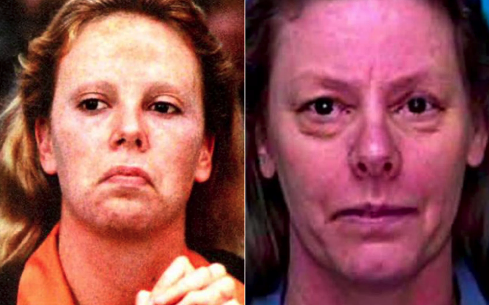

esta caracterizacion recibio un oscar a la actuacion pero la ccaracterizacion es de oscar

algunos actores ponen tambiçén de su parte: bajan de peso se ponen más fuertes se ponen más grandes

(el blackface es caracterizacion, de alguna manera)
y een cierto modo mola el debate que abre el que no permitamos el blackface
pero sí permitimos el poorface(gente que va de clase obrera o del barrio cuando es gran tenedor), el fatface (gente de tallas grandes que no son realmente de tallas grandes)

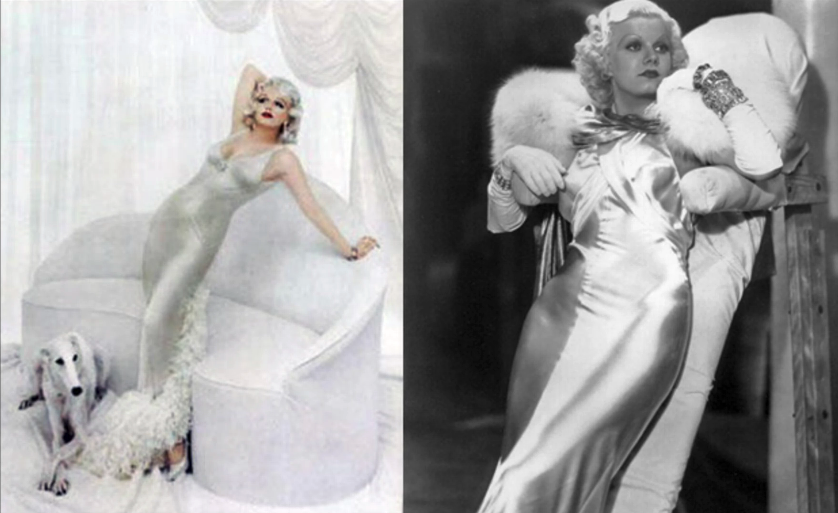

antes la caracterizac ion literal cosia los vestidos a los actores y tenian como esta cosa especial que se ve a  la derecha para que descansasen entre toma y toma)

anyliss maria franchicnc?

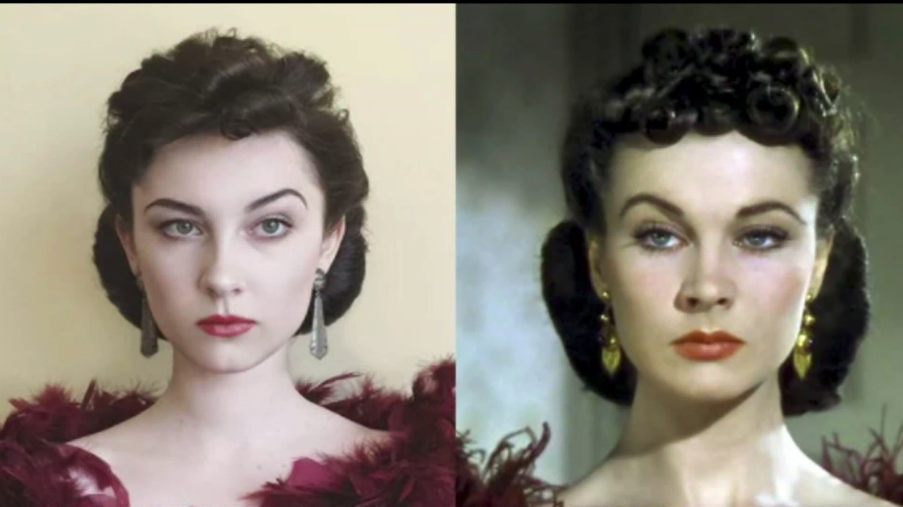

es más meta que cindy sherman: se disfraza de actores que se disfrzzan de otra cosa

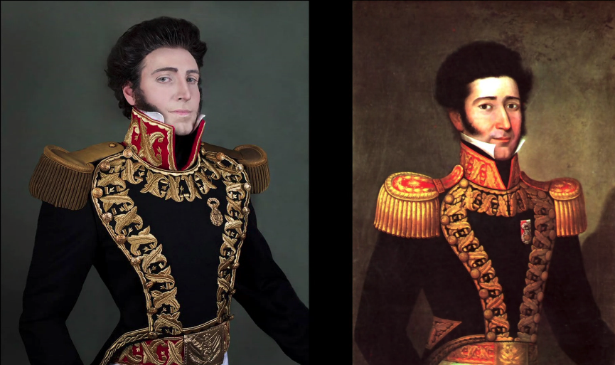

otro hombre que hace esto tambien (christian fucks)

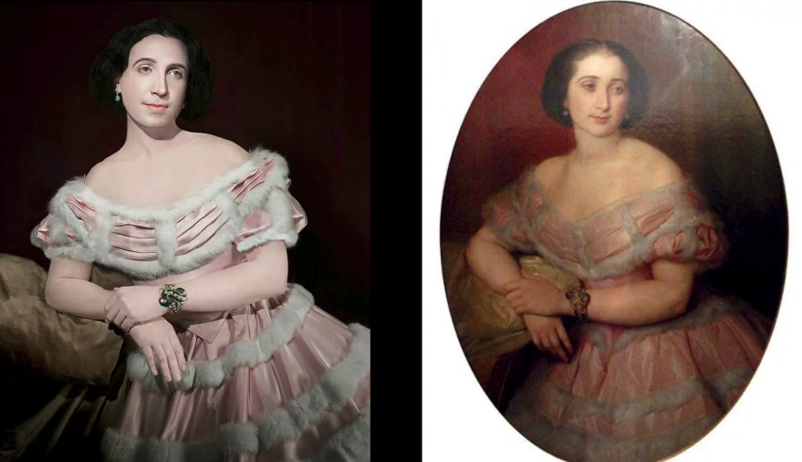

alexis stone dice jorge que mola tambien

hollywood quiere preservar la belleza
y a veces la belleza se lleva por elante la historia

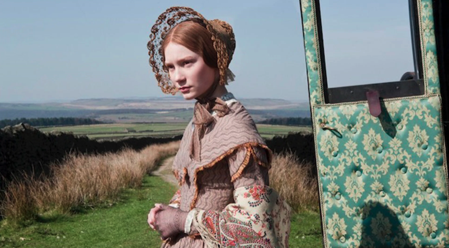

jane eyre

**no os baséis en un actor disfrazándose de algo, hay que llegar a la primera fuente, el mito, la historia, la época histórica, sus relaciones, sus contextos**

y hay que tener cuidado con los anacronismos, como maria antonieta que se le retrata como alguien super altivo pero nos basamos en su mito, no en su persona actual. y eso es una decision valida, solo ha de ser decidida *me da igual la verdadera maria antonieta, esta es mi maria antonieta* y encontrar referentes y conceptualziar bien éso

hayu mcuhas maneras de caraccterizar: *históricas,* de acuerdo co la edxactitud del contexto, perom también pueden ser *estil´sticas*, según el director, o especificas, o ficticias, 

*aunque sea una peli de época puedes ver en qué época se hizo una película*, porque hay convenciones de caracterización según la época

(como lo bollywood, (iuna cultura interpretada a partir de un imaginario específico), lo otaku (una cultura nacida de una comunidad online), lo pin-up o lo kitzch)

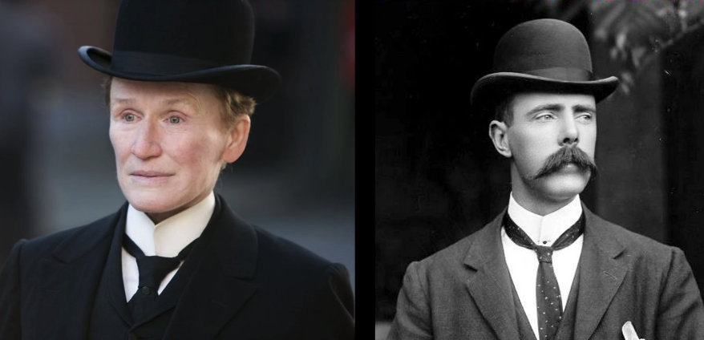
este sombrero fue el primer "sombrero ssport" para cuando los señores iban de cacería que fuese algo más pequeño y que no se entredase con las ramas todo el rato

**vayan** **a las fuente sprimeras**, igual no quieres ir al romatnciismo sino a la victoria guiando al pueblo, son os cosas superdistintas

---------------------------------------------------

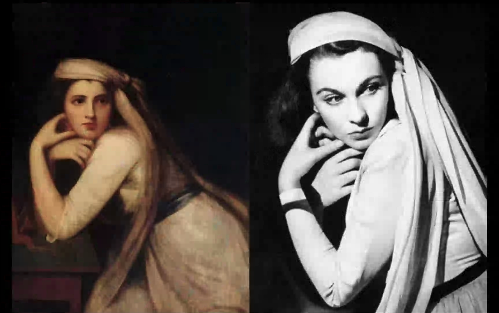

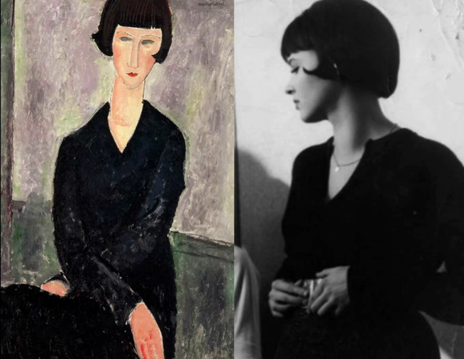

aunque hollywood se base en historia del arte tiene un estilo claro de caracterizar siempre

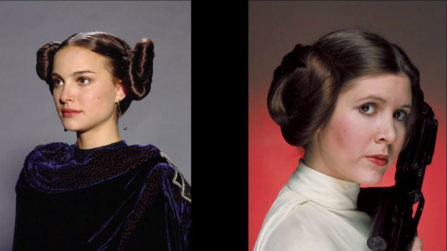

y hollywood se basa en sí mismo ambién

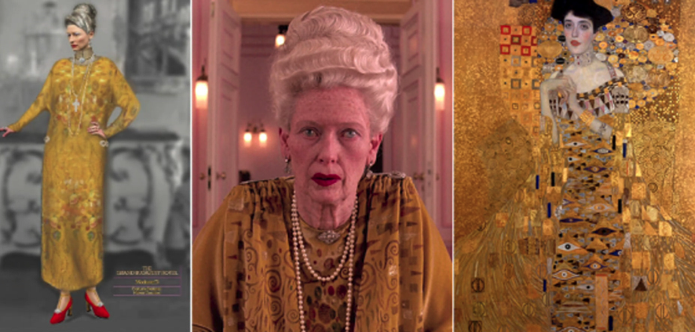

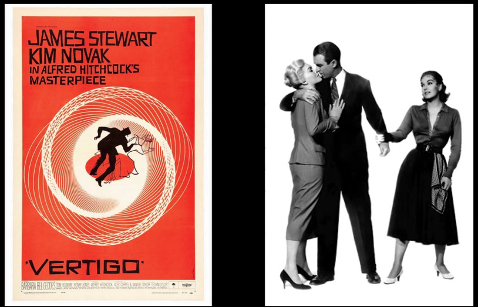
vertigo del 48 de hitchock

hitchcock es e, padre de muchos diirectores

pjuedes estar enamorado de la caracterizacion

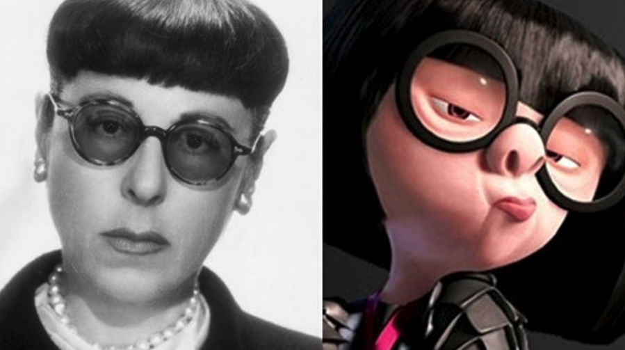

edith heud? caracteriza mucho a haudrie hepburn 
y edna moda se basa en ella

**b****uto**

*si* *trabajan copn un director miren sus otras peliculas incluso sus cortos siempre se va a repetir*

**t****elas baratas bien trabajadass son telas caras, telas caras mal trabajada parecen telas baratas**

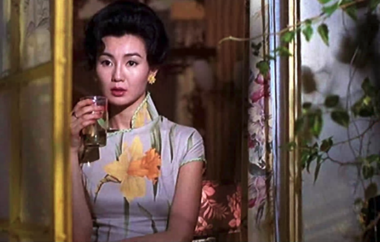

die antwoord: muy buena caracterizacion todo el rato

y que acusan de que han robado su estetica

**dónd****e están los límites de la apropiación y la copia?**

para mí la diferencia es la referencia, si hay referencian, si no, copia. la copia es algo "mnalo" porque la copia buena acerca, recuerda que todos somos lo mismo y caminos para volver al todo, la copia mala cerzena este enlace y presenta como único e inigualable un algo que quiere se distinto del todo, 

es por eso que no me gusta pesnar en copia y referencia
sino en copia y plagio

lo trans racial enq ué encaja
rachel dolezal hizo mucho por la ccomunidad afroamericana?
las unicas que las defendian eran 2 trans

