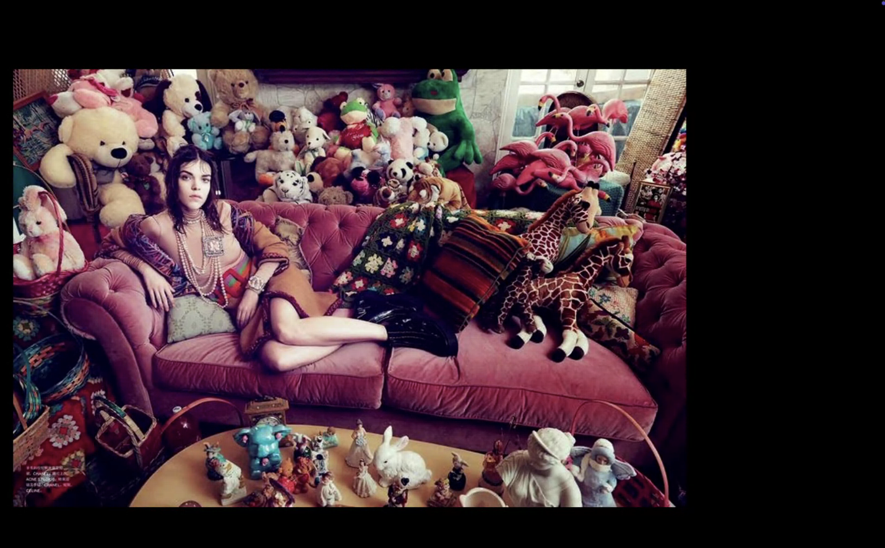
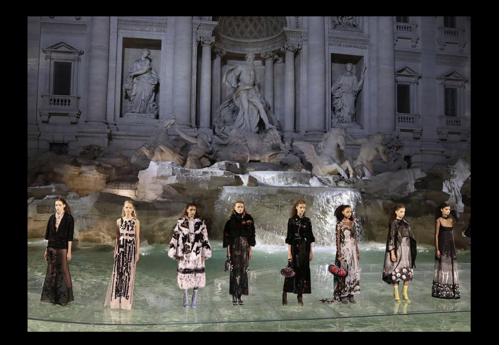
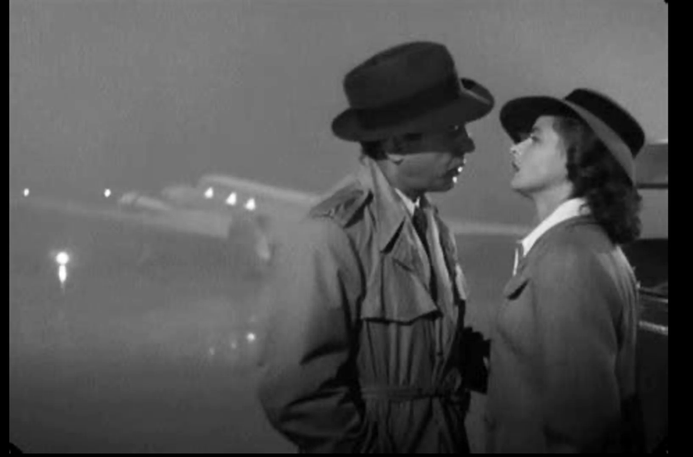
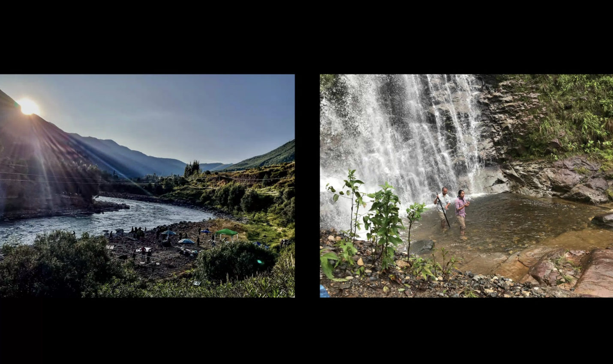
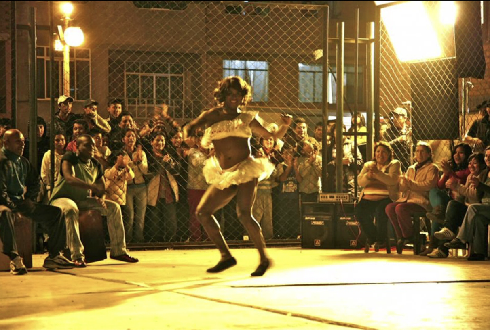
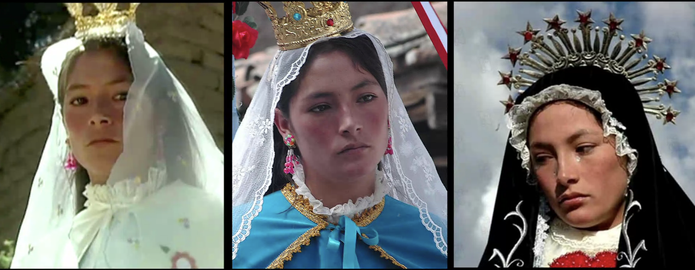

# direccion de arte 02

7 11 2024

william cameron
La primera persona en ocupar el cargo de director de arte (o diseñador de producción) fue William Cameron Menzies, quien logró hacer un espectacular trabajo en 'Lo que el viento se llevó' 

"primer diseñador de prduccio"

El primer afortunado en ser bautizado Director de Arte fue Wilfred Buckland, merecedor de este título por sus proezas escenográficas.

él hizo el ladrón de bagdad de 1924

*El ladrón de Bagdad* fue una de las películas más caras de la década de 1920. El director artístico William C. Menzies construyó la ciudad de Bagdad en una parcela de unas tres hectáreas (la mayor de la historia de Hollywood).[7](https://es.wikipedia.org/wiki/El_ladr%C3%B3n_de_Bagdad_(pel%C3%ADcula_de_1924)#cite_note-7)

y él decía que *un directr de arte conoce la arquitectura y todos los tiuempo y todos los lugares, pero tambien tiene que ser diseñador de barcos, de interiores y* ... en definitiva dijo absolutamente cadaprofesión ene l mundo que creasen cosas

*tratar de imbuirnos en cada aventura para hacer algo nuevo -* susana torres la profe, y asi en una investigar el vestuario en una otra etc

**fuentes**
son elementos de los cuales nos vamos a servir para hacer la dirección de arte, es todo un bagaje una construccion un almacenamiento

nuestra primera fuente es el **guión**, ,la oprimera funte dde la historia, puede ser un relato, es una idea, *quyiero que todas las modeloos de esta sesion de fots vayan de granjeras* o puede ser una hsitoria larga, oral, escrito, es **información básica**

y **estudiamos** la fuente, la nvestigams la entendemos completamente

dice que la gente que es adolescente ahora o la que han crecido con internet que no le temamos a investigar, que **esto va a hacer la diferencia**

la primera fuente es el guión, apuntar todo lo que entendamos de él, libretas, hojas, en el ordenador, volver a reescrbirl los pensamientos

la segunda fuente es el **contexto**, *caperucita roja estaba en el bosque*, ¿qué bosque? ¿qué época era?

**lugar y época e** historia y contexto histórico
//puede no ser histórica sino fantasiosa o imaginaria???

**contexto general**: comienzan los 90, el lugar y la época de la historia. para hacer *ana karenina* de tolstoi tenemoos que entender época turca dificultat

**contexto específico:** un padre que come con sus hijas y quiere que busquen novio

ella dice que para no equivocarse se va a la biblioteca y hace archivo de cientas de imágenes, al final todo esto genera un **sedimento** del que luego brota la inspiración

**pelicula orlando** ddel 92, dice que todo el mundo flipó con esta vida. esta pelicula tien multiples contextos, y eso es lo qu sucede a veces

**el mago de oz** pelicula con contexto distinto

las clasicas tienen pelis que comienzna con el pasado y un perdonaje que se va a morir y la pelicula es su vida y al final se muere, pam, un contexto

la terera fuentee es la geografía, se trata de que cuando uno ya tiene la hisotria tien que empezar a buscar un lugar muy parecido a lo escrito, un lugar que tenga los espacios id´neos, si no existe este espacio ver dónde recrearlo

hay que crear un banco de imagenes de localizaciones. ver el esopacio a crear y qu cumpla con lo necesario

hay que etar muy de la mano del localizador, y muchas veces tambien hay que estr pendientes como de director de orquesta. si no hay localizador sera e diretor de arte quien esté buscando 

y si no tenemos el lugar ideal tendremos que ensuciarlo que hacerle la humedad, 

claro es que aqu tienes que entender que no es solo articular el espacio sino está megaordenado para que quepa la cámara, es conseguir tambén un espacio que tenga el ruido necesario o que podamos conseguirlo luego

hasta para espaicos muy sencillos hay que ver que ccumplan los requisitos. igual es el espacio perfectoo pero hay demasiado ruido y el sonidista te confirmaría que no se puede trabajar ahó

**que tenga las posibilidades para filmar y las comodidades para trabajar, dóndee se poenn las cosas los trabajadors, etc etc**

es que hasta el clima se ha de tener en cuenta en una localizacón, ¿cómo cambia la luz enb un exterior y en un interior?

**un interior** ha de cumplir muchos requisitos, si no, construirlo de cero, pero lo ideal es conseguirlo para ahorrar presupuesto. que tenga tamaño para trabajar, que no haya que ponerle muchos filtros extras

tambien pensar en la base donde se va a trabajar, donde dejar muebles utilería, el backstage si es un dsfile de moda, porqu trabajamos no solo con objetos sino con elementos de arte y con personas

esta pasarela ha de resistir las models, porque si no noo va a poder ttrabajar el escenógrafo y la culpa es del director de arte

cuando hacemos dirección de arte trabajamos para un fin. para un artista clásico el primer espectador es uno mismo, en cambioo el director de arte tiene muchos espectadores y tener conscienccia de que trabajamos para otros

//mola

casablanca del 42

es un avion no tan grande sino las personas que se ve son personas enanas en una epoca en la que los avion es se reserrvaban para la guerra, nunca estuvieron en un aeropuerto y aun asi lo consiguirieron con escenografía

no tenían los recursos que se tenían luego, e incluso los actores eran acróbatas. efectos que no son efectos sino realidades

**sunset boulvar**: todo es esquinado porque el lugar no es gigante y van falseando el espacio *y si comienzas a grabar esquinado* porque se supone que etamos en un fiestion y no hay tanta gente y si no se siguen esto consejos *se notara* que el espaico no era tan grande como tenía que ser

en el cine clásico hay mucha inspiración porque no tenían casi recursos para imitar cosas muy fuertes e inccreibles

salvador dalí huizo la escenografía para "Spellbound" ("Recuerda" en España)

tierra de 1930, la naturaleza rusa. tendremos que buscar la época

en la teta asustaba habia una flor que se necesiitaba por la epoca y trajeron una y la mmetierone n invernadero y no funcionaba y al final ttuvieron que tener un arbol florido con las flores recortadas

*cuando uno se equivoca y lo corrige es maravilloso* 

poara lka pelicula de la isla elefante justo un terremoto lo tiro abajo y tuvieron que buscar algo oparecido y en ese momento **se crearon** las primeras ttecnicas de falsear, y david fuentes conocio a un FX artista se pudo recrear una isla y como no se podia dee 0 se tenia que buscar un buen islote para empezar a trabajar de ahi

y tenemos que ver a los perosnajes en ese entorno: tiene que ser un lugar donde por ejemplo el actor pueda actuar bien, si es una pelicula en la altura igual el actor le sangra la nariz

en la peícula de la izquierda las entiddades naturales han de pedirles permiso al lugar antes de grabar, eentonces llevo y no siguió los rituales

y comenzaron a grabar y se jodio la camara

y la segunda vez se hizo el ritual se pidió perdon al rió y se le hicieron ofrendas

y en la pelid e la izquierda

cuenta que estuvieron horas caminando para una toma tan cerrada que se podría haber grabado en cualquier otro sitio mucho más cercano

?¿vale la pena ir a la cumbre del himalaya? es que igual no... ¿cómo de peligroso es el lugar? ¿o cómo de peligroso es llegar?

para esto tuvieron que entender el barrio, pagar un cupo, al principio ni querían bajar del busa localizar

¿quién se va a encargar de cuidar al actor? si vestuario no lo hace ¿a quién le cae? dond eestá la bata par ael actor y unas toallas? si el actor tiene que estar entrando en un lago 

los **personajes** son también un elemento plástico. una persona tiene color tiene forma tiene textura, cómo se ve éso con la geografía? cómo va a funcionar en la historia?

*crear un personaje visualmente hablando*, la princesa leia con estos  rulos, un perosnaje que visualmente marca, a veces es un poerdsonaje en especifico hecho con un actor

si logramos tener el personaje muy bien ubicado nos va a ayudar en manejarlo en colores y en vestuario ettc

**tipos de personaje:
personaje plano**: son personajes estereotipados, sont an importantes como los perosnajes mas compkejos pes eal desdeño que le tenemos. una villana de telenovela es un personaje plano, por ejemplo. son simples, no cambian, y son necesarios y trasciienden muchas veces la burla, son geniales en su trabajo y los colores son más planos no hace falta que sean tan realistas

vídeo villana perfecta de vanity fair e un libro megameta de esto: explica un personaje plano mediante un personaje plano

**tenemos que ver el person aje para ver cual será nuestra estética**

orange is the new black tiene todo el rato **personajes redondos**

y hay que saber las reglas para saber romperlas, pero no podemos romperlas sin conocerlas

**5 frases de paquila salas** 
el personaje de paquita ees un estereotipo y eso es lo que la hace graciosa, y los fondos no siemopre sin realistas

**noermi arguelles y el contouring** 
estos personajes planos se vuelven un poco excentricos en el vestuario, por ejemplo

las modelos son super estereotipo, y los estereotipos vuelven todo horizontal. todos los comerciales de perfumes son super democraticos, hay de todo pero muy bueno, es una escencia una escenografia que es una esencia y todas son lo mismo pero siempre algo como inalanzable

personajes oplanos como grace jones, que era tan plastica que empezó a salir hasta en películas, ella era una flor una lámpara, sus carátulas de disco son geniales. con ella eestaban todos los artistas de la epoca, andy warhol, keith harring, etc etc

**personajkes redondos:** 
pelicula del 2005 

**hard candy**

el personaje que vemos de la chica es un personaje como inocente , esta actriz luego crece y transiciona a actor. pero la cosa es que la viste entera de rojo, como caperucita roja, y parece que el hombre este de las gafas se la va a devorar, la va a comer con zapatos y todo

y ella es un personaje redondo, no es lo que uno piensa, es complejo y tiene contradicciones

*yo necesito que paquita siempre se porte mal, son  resultados ede una biografia imaginaria, fruto de pensar en lo que no se ve del personaje.*

en las primeras citas con el guionista ella pregunta y cómo era su madre, e igual ese guionista no había imaginado éso y comienza a pensarlo y crear estas biografíias que no salen en la película son imprescindibles *si la mamá era así se viste de esta manera* *este personaje*.

**imaginar y preguntar todo lo que no se contó**, porque todo es parte de un tejido que igual es planísimo pero para eso hay una decisión 

**made in usa**: pelicula con un personaje redondo y es interesante ir viendo cómo se ttoquetea el inconsciente del espectador, es lo que queremos como director de arte

**cruella**, otro prsonaje redondo. 

ahora se estilan mucho los personajes redondos, tanto que hcomienzan a haber edtereotipos de personajes redondos, como cuando un personaje redondo se vuelve malvado se convierten en maravillosas

**malefica**, ella a pesar de que ella quiere ser mala no logra serlo, pero en el personaje de disney es un personaje plano. las caricaturas para los niños suelen ser también caricaturas, mientras que la de angelina jolie está relatado como un personaje redondo, etnocnes al prncipio serä un maquillaje muy suave, y poco a poco se ira haciendo más afilado

los travestis pueden ser tanto planos como redondos: leiw bovery

y es importantísima **la visión del director**. nosotros trabajos para alguien y tenemos que conocerlo. los autores terminan repitiendo. ver las películas anteriores y trabajos de los directores, a veces se citan a sí mismos, hay cosas que les gusta que no les gusta, etc.

 **a almodovar le gustan los ciirculos,** entonces si trabajas para él comienzas a buscar cosas circulares. le gustan las tomas cenitales, 

a bergman le encantan los espejos . siempre están ahí los espejos. mirror silvia plath.y siempre los actores termiann repitiendose, *si a alguien le gusta un plato lo va a repetir* y ésto es lo mismo

tener conciencia de que trabajamos **para** alguien, podemos hacer una obra de arte pero no conseguir comunicar lo que se quiere

y ésto serían todas las fuentes

**momento de ppreguntas:**

si el director de arte hace tantas cosas al final todo lo tiene que hacer, las responsabilidades tamopoco están tan definidas las responsabilidades?

profe responde: que uno nunca debe tomar por sentado las cosas, y dice que a veces ha trabajado fuera e improvisar era lo que le ha funcionado. para una pelicula pulverizar aceite del catering en toda la escena ella consguio el efecto oleoso que queria

*la necesidad agudiza el ingenio

prepárate para lo peor pensando lo mejor

escúchenme no me hagan necesariamente caso

si  nosotros somos los creativos el resto lo son más*

¿y si no hay locación o no hay personaje o se cae el actor? es buscar y correr a buscar. ser director de arte no es dar ordenes sino es estar constantemente recibiendo

el papel nos iempre aguanta, y a veces no es poner sino quitar, incluso caras muchisimo presupuesto en un espejo chunguisimo y de repente no funciona y hay que quitarlo

//puede no ser histórica sino fantasiosa o imaginaria???

supongo que investigas igualmente fantasías, tanto similares como disimilares

y dice que para los personajes smples no coge estereotipos sino referentes visuales, *para romper tu primero necesitas tener las convenciones visuales*

la psicologia del color esta arraigada en el occidente, en las opelis chinas el rojo es otra cosa. el verde es vida y es envidia y para hitchkock el verde es sensualidad. la psicologia del coloor es algo totalmente occidental, mira wonka wilde o mira peliculas de pueblos indigenas, no tiene sentido traer la psicologia del color de occidente

**es una clase de consejos** esta clase

ella se pasa la vida viendo todo tpo de documentos en videos para desentrañarlos entender imagenes texturas todo

**tarea**: ver un video de lana del rey 

dice que no son artistas plasticos
que son obreros, los directores de arte
y que si el director dice no, pues ella se disculpará y lo volverá a hacer

<!--
es literalmente una clase de tips en paln 
todo el rato pam pam pam pam
igual a aprtir d los tips reconstruir el trabajo entero
esta siendo icnreible
-->