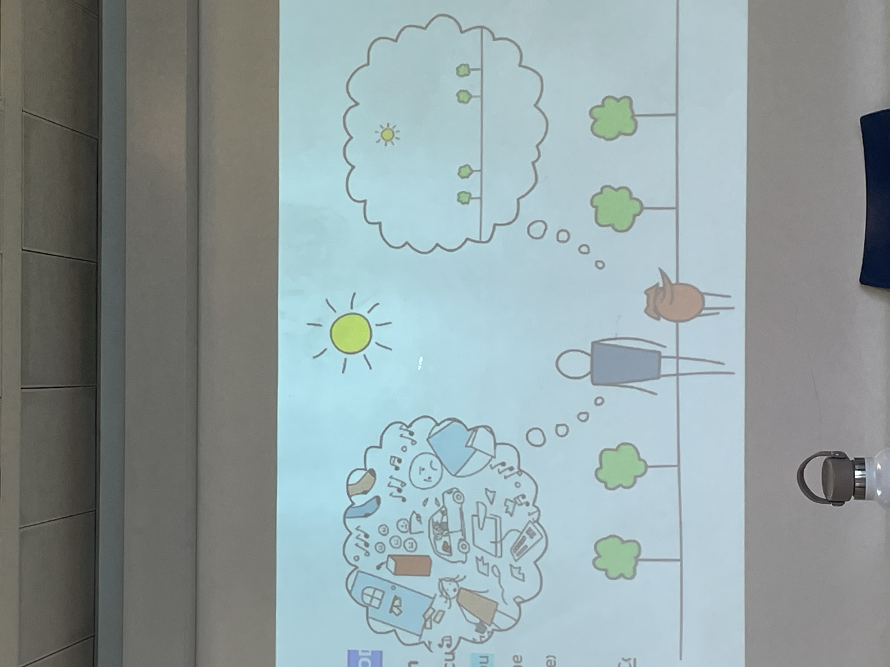

# grupo insomnio 3

adenosina : caca de neuronas
cuanto mas residuo mas vobanit

practica escaner corporal: aterrizae la mwnte donde yo quiera

atencion como un foco de luz donde yo poco mi atencion, donde pones tu realidad, depende de donde pongamos el foco swntiremos una cosa determinada y nuestra realidad sera una u otra

el foco se puede ir al presente o a un recuerdo del pasado, un quehacer futuro(...)

traer la mente al cuerpo es anclarme en le aqui y ahora y puedes ver el movimiento de l mente y traerlo de vuelta: sacar s la mente de ma eplicula

cuando estoy presente hay calma

## la mwnte tiene 2 modos de funcionar
hacer y ser (yan y yin?)

### modo hacer (piloto automatico)
movimientos, miedos, preocupaciones, juicios,... va hacia el pasado o el futuro, como un baile

### para que va hacia el pasado la mente? 
para qprender de los errores... pero aparece la culpa, ya sea para mí o para el otro

y quedarme anclado en el pasado lleva a la depresión

### para que la mente se va al futuro?
anticipa y lanza juicios de lo que va a pasar todo esto no es real

todo lo que se cuenta la mente no es real, pso, pero ya no esta psando

anticipo cosas sobretodo negativas, casi siempre anticipamos que algo va a ir mal

si me quedo ahi genero sufrimiento

y lleva a la ansiedad: atraparme en lonque va a ocurrir aunque no ocurra

cuanta parte del dia nos tiramos en este baile ansioso-depresivo??? 95% del tiempo!!!

todo esto es involuntario, y sin darme cuenta estoy alimentando el sufrimiento

es el piloto automatico porque cuando andamos por la calle no vamos pensando: el cuerpo camina solo, y como no tengo que pensar para caminar la mente se va

el tipico a que vengo a la nevera, en un trayecto del salon a la nevera

### no puedo recordar lo que no he vivido
si yo no estoy presente como lo voy a recordar

y cuanta cantidad del dia no vivimos? cosas automaticas: caminar, conducir, leer, limpiar, cocinar

por la noche como no hay distracciones vamos a escuchar mas el modo hacer 

el modo hacer es el de los bucles, como
una noria

sesgo de atencion: las noticias del telediario son negativas porque saben que eso es lo que nos atrapa

la sociedad en la que vivimos contribuye a que la mente este siempre en movimiento: multitasking, sobreestimulacion, productividad, extractivismo,... todo esto fscorece casa vez mas el movimiento de la mente

la persona que no produce no es valorada

nadie se aburre hoy en dia, pero porque no haye spacio para ello, y tambien ubicar la responsabilidad tanto en uno mismo sino en el sistema tambien

con la persona aue mas hablanos es conmigo mismo

hacer el ridiculo es un juicio

es la realidad que sw cuenta tu mente pra darle un sentido a lo que estas viviendo, y te atrapa y depende de la pelicula puede generar mucho sufrimiento

para salir de todo esto hay anclas, que son cosas que si estan pasando y regresar al presente:

irnos al modo ser, que es el infravalorado, es lo que viene que es lo que importa, la promesa del capitalismo

el modo ser es estar consciente
es cocinar y comer delicioso y te sienta bien y te lo comes lentito

disfrutar el momento

el modo hacer etiqueta: me gusta lo quiero no me gusta no lo quiero y me aferro a cosas

y mi mente no es capaz de soltar porque estamos entanchados a lo que queremos

todos estamos interpretando lo que estamos haciendo aqui y ahora: con un juicio u otro que siempre es subjetivo

cuando desarriculas las maneras de pensar empiezan a aparecer otras maneras de swe y otras espectativas

la idea es el equilibrio h la decision

el sueño se consigue cuando soltamos la lucha: psar del modo hacer la modo ser nos permite crear las conficiones internas para que el suwño ocurra 

deberes: poner atencion a las rutinas de la vida cotidiaian

despertar
ducharte o asearte
desplazarte
hacer una actividad
hacer una actividad fisica
esperar
recoger ordenar o limpiar
cocinar
descansar 

centrarte en la tarea prestando la atencion con lso 5 senridos: lavar los platos con conciencia

contemplaseo

### la tarea de manu sera lavarse los dientes con conciencia

hacerle una grulla a lola!!!