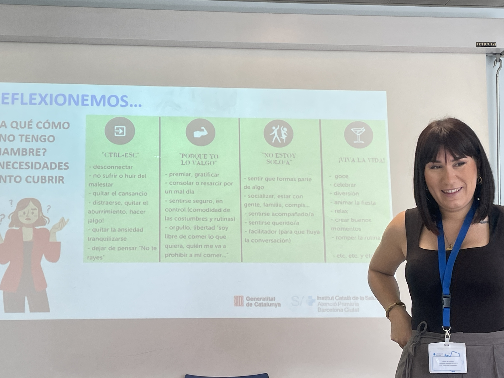

# grupo insomnio 4

para que comemos si no tenemos hambre
comida para escapar: quitar el cansancio, huir del malestar

la cantidad de veces que comemos sin hambre

la diferencia entre el hambre real y el hambre emocional es que el hambre real o fisica siempre es gradual: conforme pasa el tiempo va subiendo

mientras que la emocional aparece de golpe 

en el punto mas algido de ansiedad buscamos dulce, sexo, drogas, deporte... y la cosa es que calma

y entonces el cerebro interpreta que lo necesita porque ayuda a calmarme

y la proxima vez que me pse me pedira lo mismo

y asi es como se desarrolla una adicción

"pan para hoy y hambre para mañana"

lola dice que era una prepotente porque con 48 años que sw murio su hijo se volvio alguien muy importante dentro de la cocina le dieron premios libros etc y se codeaba con moda y cocina y high standings

y se le engordaba el ego

y cuando le dieron de baja larga fue cuando empezo a ser mas feliz

((si tuvieramos el tiempo de tomarnos un cafe(...) el tiempo que tenemos no nos da el permiso))

la invitacion es a surfear la sensacion de ansiwdad hasta que desaparezca, saber que esa ansiedad desaparecerá

porque piensas que va a seguir creciendo pero eventualmente cae, la ansiedad dura 20minutos y si no la alimentamos tal y como viene se va

la ucraniana dice que dios ayuda a todas las personas que saben lo que quieren, ya sean malas o buenas, "si no sabes lo que quieres como te va a ayudar dios???

si dios conmigo quien contra mi

lo primero es fijar la hora de despertarse
y la de irse a dormir ira ajustandose poco a poco

las pantallas siempre fragmentan el sueño

cenas ligeras:
algo de fibra que sacie 
bastante vegetal
y la proteina

siempre un puño de hidratos si es despues de entrenar, y si no el hidrato por la noche en mi cuerpo no es necesario

empciones sensaciones y pensamientos can en la mente

y son las voces de tu mente que sw suben en el autobus 

y nos dicen que una nueva ruta/riesgo/sueño de vida no nos va bien

passengers on the bus ACT metaphor
wntrar en lucha con los pensamientos
y el otro bus no intenta lucharlos sino que les da las gracias y sigue (que psa si no haho nada con ellos y simpelmente sigo)

no te creas lo que dice la mente
porque los recuerdos no son lo que paso
y recrear peliculas