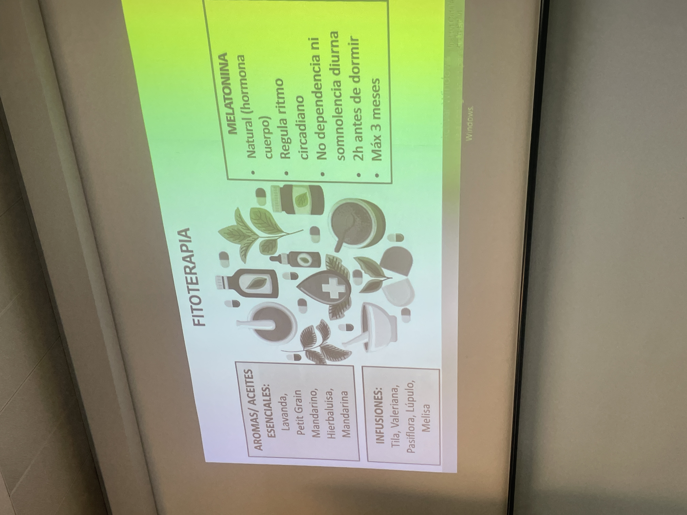

# grupo suwño 2

#insomnio

la tristeza se define como una congelacion o una falta de emocion

generar conciencia

el problema de las sustancias
como mecanismo de regulacion
es potencialmente adictivo

al usar una estrategia interna como mecanismo de regulacion esto ya no pasa

abrir pecho

EJERCICIO DE RESPIRACION
tumbada en el suelo
piernas encima tuya en plan apoyadas en la cama

y toalla enrollada como un rollito en la linea donde acaban los homoplatos

de 3 a 4 hay un microdespertar
((sueño bifasico))

para el sueño necesito pisar el freno
sist nervioso simpatico acelera
y sist nervioso parasimpatico frena

para dormir y comer necesitas pisar el freno

el insomnio como gestion de dia mas que problema de noche

ritmo circadiano: reloj interior de 24 hs
luz y oscuridad: yin y yan
ayudan a sincronizar el reloj interno

el sueño
la fase no rem repara el cuerpo (75%)
si estamos activas por el dia las primera shoras del sueño son las mas importantes

hagas o no ejercicio esto es un ciclo, da igual que entrenes o no, el ciclo siemprw sera el mismo (como en el tema de la alimentacion, un cuerpo siwmpre gastara las mismas calorias, buscar el video)

y la fase rem (25%)
repara el cerrbro
si estoy esrudiando, aprendiendo, leyendo (...) sera impoerante que lleguemos a las horas mas tardias del suwño, es la fase donde mas soñamos

cuando hay insomnio las siestas no son recomendables

y si estas desteuisa por no dormir lo mwjor ws tankearte el dia y confiar en el ciclo

la fase REM tenemos el cerebro tan activado comodurante la vigilia!!!

al recordar el sueño es cuando despiertas en rem

de forma casi natural tenemos despertares pero no hay que rallarse

diferentes tipos de insomnio:
te cuesta conciliar
te cuesta mantener
te despiertas precoz

arquitectura del sueñon

que pasa cuando nos acostamos tarde???
el ritmo circadiano ha empezado ya horas antes

cuando duermes bien no necesitas buscar dopamina en la comida

dormir que hace
eliminar radicales libres??
actividad electrica cortical
regulacion termica: los organos necesitan descansar de temperatura

el sueño regula el hambre y la saciedad
si dormimos mal esto se desregula:
agrelina (saciedad) y leptina (hambre)
si duermes mal tienes mas hambre y menos saciedad

a veces no es perdida de memoria es falta de presencia

horas de sueño
un bebe esta en constante activaxion
y al hacerse mayor vamos quitando obligaciones y cada vez vivimos mas contemplativamente
el cerebro entiende que necesitamos dormir menos

pra sobrevivir necesiramos 4-5 horas, mas de alguna noche mueres. en adultos hasta 8 horas es lo necesario para tener bienestar

receta para dormir:
necesitamos somnolencia (adenosina, el residuo de las neuronas)

y bajar el cortisol

necesitamos bajar el cortisol y cansarme
la acumulacion de vasura permite inducir el sueño

la siesta permite vaciar la basura
y cuando hay un sueño sano y reparador esto va bien y cuando no, es mejor que se acumule el cansancio para que el ritmo circadiano se vuelva a sincronizar 
(y que las siestas si son sean antes de las 16)

seran varios dias horribles

el cortisol por la noche empieza a subir y de manera natural va bajando
la melatonina durante el dia se mantiene bajita y cuando se va em som vien ela melatonina 
y la tmeperatura corporal de noche sera baja y de dia sera alta

al ir a dormir necesitamos
somnolencia (si no no vamos a dormir)
misma hora de despertar (asi ayudas la ritmo circadiano) y a partir de ella el ritmo circadiano se va gestionando hacia atras

una rutina de noche: un ritual que acompañe la curva de cortisol: pasear, ejercicio susve, meditar, leer, musica bilateral, infusiones, aceites

aceite de lavanda muy indicado para esto

el dormitorio ha de estar fresco, entre 15 y 22 grados, y darte una ducha caliente antes para que asi puedas estae caliente para que la temperatura corporal pueda bajar, y una hora o 2 antes de dormir la ducha

porque si te duchas con agua fria tu cuerpo generara calor

y reducir el ruido (ruido blnco tampones etc)

la cama que sea para dormir y follar que no se hahan otras cosas para asociar la cama con dormir, si te despiertas por la noche es mejor salir de la cama

hay que evitar la resistencia y la lucha en la cama

tunea tu camada para que sea bonita que huela delicioso que estw ordenadita que sea un lugar sagrado

si tienes noches jodidas tienes que tunear un poxo tu espaxio

y el cerebro quiere control
entonces hay que decirle a la mente que no importa el sueño
quitarle el hierro al insomnio

(porque piensas en lo que tienes que hacer al dia sigueinte) (igual los problemas son los quehaceres al dia siguiente)?

al despertarte bien a tu hora del ritmo circadiano buscar la luz t el aire fresquito es genial para evitar quw entre otra vez la somnolencia

relojes luminicos

luz calida sensacion de cueva

si necesito cafe tu cuerpo te dice que estas cansada y necesitas dormir (no cafe), el cafe impide que la adenosina se acumule y evita que tengas sueñito porque la cafeina se prece mucho a la adenosina y engaña al cerebro, y tapa los receptores de adenosina y el cerebro no se da cuenta de que hay mucha adenosina acumulada

y se reocmienda ir al te verde, que no activa tanto en el sueño. para dejar de depender de Ustancias como objetivo esto puede ser un buen intermedio

