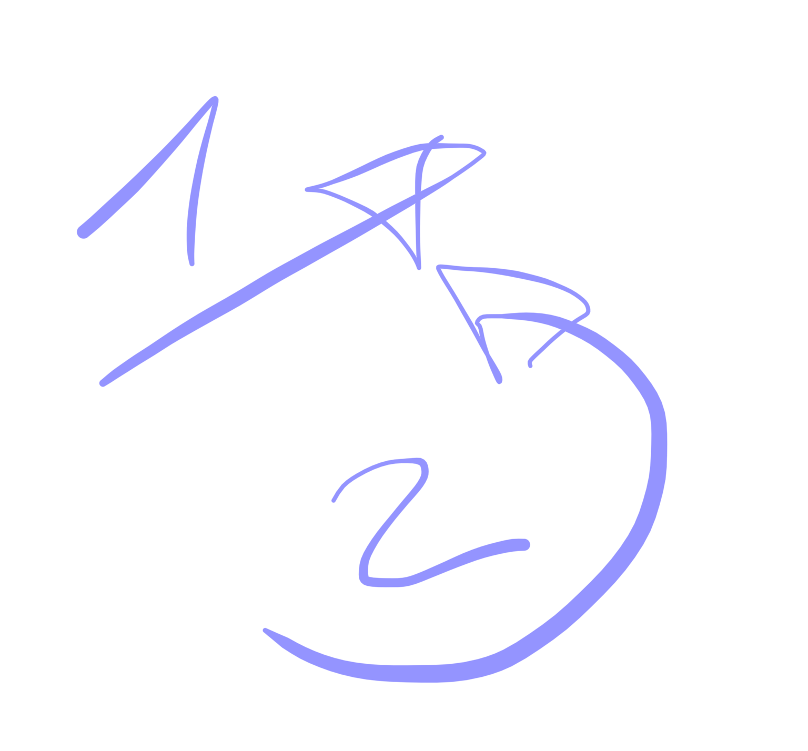
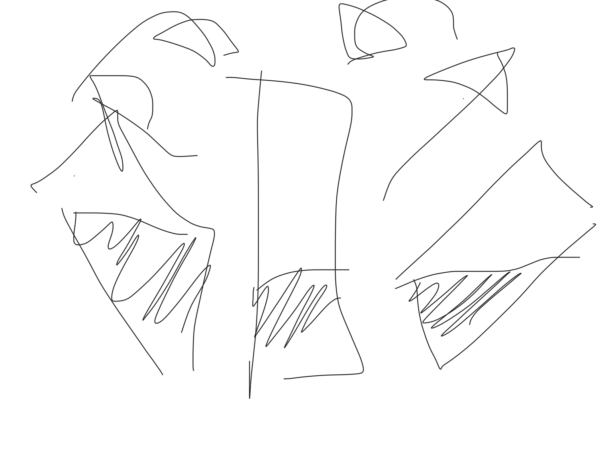

# wushu 1/09/25

yan de cabeza:
2 acciones: 
la lateral se irrigan los dos hemisferios celebrales
y el latigazondw giro de despues es lo que elimina los pensamientos innecesarios. en este es muy importante relajar los hombros para que s epuedan mover facilmente los liquidos

el secreto de todo es el chanchuan ( meditacion de taichi) y eso contribuye a tirar todo hscia abajo

como los riñones y los pilmones son 2 hay que hacer pes los dos lados

((es el yan de cabeza))

cuando hay uno ya vamos a los dis lados se teabaja el movimiento de energia en cada uno de los dos lados

y cuando hay dos lados hay que tener en cuenta la coñumna que esta en el centro: la colimna si no se trabaja pasa a ser un obstaculo

la gente a veces esta sorda de un oido solo (el riñon izq controla el lado der y vicebersa) (depende del riñon que este vacio apareceran sintomas de la otra parte)

hay que intentar que lleguen liquidos a ambos hemisferios cerebrales en este yan de cabeza

y cuandk sacas los vrazos hacia delabte recuerda hombros fanson (relajados)

y tienes que sentir el lado lleno u cuadno lonsientes lleno mueves los liquidos en el interior del cerebro como una votella de agua que giras muy rapido

**disciplina intrinseca sostenible**: hacer de nuestra sartes una forma de vivir. incorporarlo a nuestra vida y transformar el interior.

CONTINUACION forma corta
despues del agazapados cok los puños bien puestos te pones en un chimapu y las manos un poco de bagua

y luego giras aun en mapu hacia la izquierda y pones las manos como para jinso y haces un jinso hacia la izquierda solo que la palma que va acaba cmirando hacia abajo y el corazon apuntando en la direccion donde ha ido

y el peso en el lado contrario

y vuelves a mapu

y lo haces al otro lado igual, moviendo el peso de un lado a otro

## que trae de bueno la praxtixa del taichi??
practixamos el taichi para buscar el silencio interno, la paz, que solo se encuentra desde la lentitud. 

que a ese movimiento lento le acompañe la respiracion

sou tien sou da: relajado silencioso y natural

la serpiente y la tortuga: cuando vamos rapido la respirazcion tiene que ir al unisono con la respiracion (como el jinso la respiracion zen que ralentiza la respiracion)

un caballo es fuerte es rigido tiene una rwspiracion tensa y vive poxos años

y una tortuga vive cientos de años que es lenta

la serpiente y la tortuga: la tortuga simboliza la quierud y la swrpiente simboliza el movimiento continuo de su cuerpo: la seriente se mueve entera siempre de la cabeza a la cola, en elt aichi todo se tiene que mover constantemente en particular la columna

el constante movimiento del taichi la serpiente

SHPCQ

es un estilo interno y desfe el chikun se empieza a notar esto

al hacer el chua hu sou tou chui tienes que buscar la energia de hundimiento: hundirse y antes de proyectar el puño en cruz es importante que tomemos consciencia del movimiento pélvico que aun no tenemos

tomat tiwmpo y proyectar: nei kung: con el giro para tiear los puños se genera el poder desd eel ming men?? 

la fuerza se genera desde el tantien con el min men

los riñones necesitan pulmones y el corazon necesita higado (la relacion entre los 5 elementos)