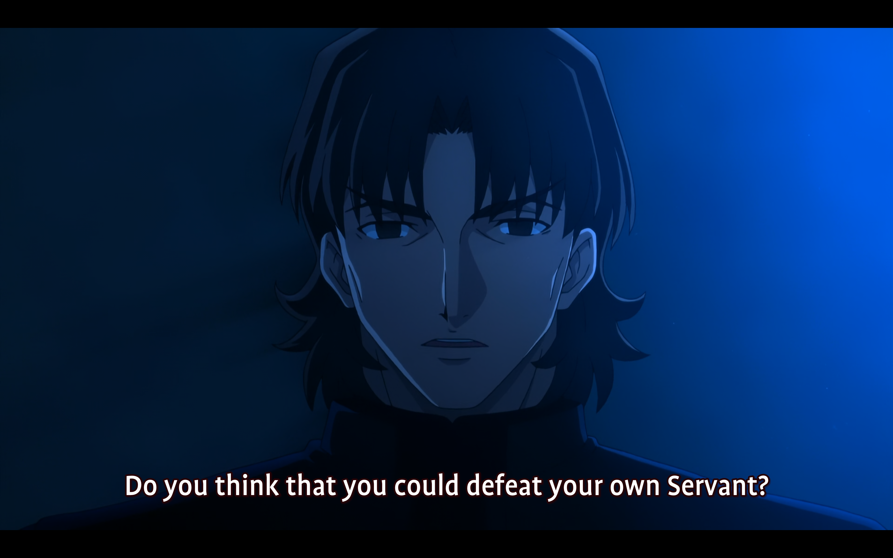

# arquetipos una guerra entre ellos

# 
arquetipos una guerra entre ellos 
y para la sangre de esos dioses un grial

y que solo quede un arquetipo

y como emiya y battler de umineko son el mismo arquetipo
de héroe

de hecho tanto que elservant de tohsaka es literalmente emiya
eso no la hace que sea la mas poderosa de toda la saga??? en plan literal tienes un heroe  META 

y la relacion con esta teoria de que al veir al mundo pedimos 3 deseos
y cuando se cumplen es que regresamos

y los 3 reijis que tiene cada master
cuando los gasta el arquetipo queda libre
y sólo él puede tocar el grial

es entoncees cuando se “nace”? el paso del pakua anterior al posterior?

qué diría jung de todo el sistema mágico de fate stay night unlimited blade works? de toda su diégesis? qué diría si la leyese en clave jungiana?