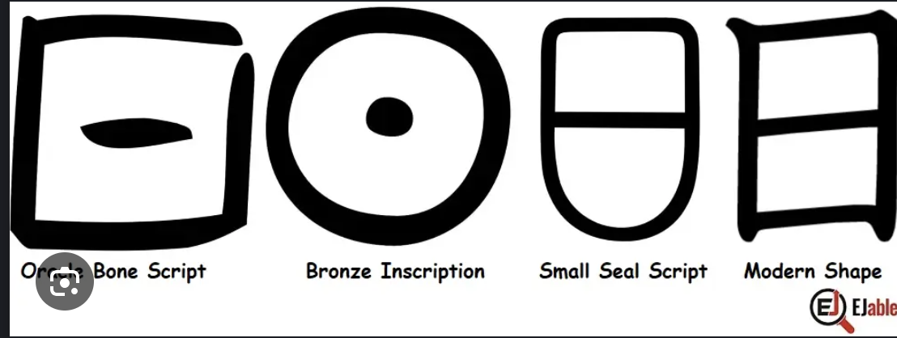

# una de las pruebas de que oriente y occidente no estan tan separados…

# una de las pruebas de que oriente y occidente no estan tan separados es la similitud entre el hanzi de sol y su etimología 

con el simbolo que usamos ahora para el sol en, por ejemplo, la astrología occidental

o las similitudes de las etimologias con las que hablamos de algunos planetas
jupiter siendo madera y zeus el dios del trueno, por ejemplo

