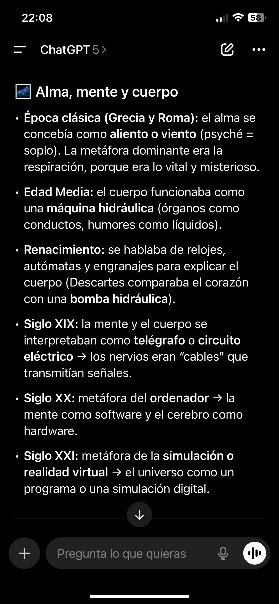

# Al final eran las historias las que me acompañaban

Mis padres no me hacían caso 
Y cuando me lo hacían casi era peor 
en el colegio, lo mejor que podía hacer era ser invisible y creo que lo entendía con algunas cosas, pero no podía entender porque no podía tener el pelo largo por ejemplo o porque el peluquero siempre me cortaba el pelo relativamente igual y luego relativamente mal

Y como que ningún momento a mí se me ha recordado mi capacidad creadora de oye yo que sé vas al peluquero te cortamos el pelo, te sientes raro? pues la próxima vez lo miramos juntos no? te echo una mano 

Y entonces para mí figuras como Hatsune miku tenia canciones como muchas producidas por neru-p que hablaban de cosas que a mi me resonaban

hablaban de bullying de resistencia 

en el mainstream la gente hablaba de cosas que yo nunca entendia, de amor hacia los padres de vivencias en institutos que jamas he tenido ni tendre

eso es ser una disidencia 

y cuando lo eres es muy importante que te ayuden agestionar esa diferwncia entre tu wspacio interior y el espacio exterior al que te expones

no es protectivista sino mitologico

es importante que cada persona pueda escribir su historia

y esto al final tira de muchos hilos

tira de una renta basica universal
tira de un modelo de vivienda distinto al rentismo parasitario
tira de una economía con responsabilidad económica donde la gente deberia mirar mal un ferrari pasando al lado de personas sin hogar

y a mi, ahora, me dicen que soy autista

por no rendirme

por no haberme integrado a un mundo que nunca me ha tenido sentido ni me ha dado siquiera la oportunidad de integrarme

nerea Pérez de las Heras lo decía en uno de los saldremos mejores o ellas os invitada. Me gustó mucho también la cita esta de esta mujer poderosísima que decía que cuando se la trinchera de todos lados y que tenemos bastante claro o que deberiamos  tener al menos bastante claro en que lo de la trinchera estamos cada uno 

Pero Nerea, creo que decía que el capital ismo ahora era y que seguramente lo haya leído algún sitio no sé 

Y dice capitalismo cuando yo creo que ya estamos en un Marco tecno feudal Ista que a mí me gusta mucho como insistiré en esta palabra porque es que realmente el calvo este tiene razón 

Y es una persona que ha tenido que estar en un puesto muy alto del gobierno de un país al que Europa le ha hecho pasar muy mal

Y que ahora el capitalismo es aspiracional

Pero es mentira, porque realmente es una meritocracia, pero la palabra meritocracia de la misma manera utopía, aunque signifique etimológicamente no lugar una utopía simboliza algo hacia el futuro es como un hechizo de la esperanza si lo quieres llamar 

Pero la meritocracia no es así, no quiere decir sexo con dos sabes 

ahí me hace mucha gracia el argumento etimológico de la bisexualidad, porque también lo hacen con el feminismo y es como que yo soy una persona que defiende abiertamente que deberíamos dejar de usar la  RAE

yo siempre que busco una palabra, la busco en etimologías de Chile y en lugar de entender su definición intento entender la historia que tiene y mola que flipas porque el lenguaje de repente se convierte en algo precioso 

No es como que me las aprenda, pero tú tampoco te memorizas la definición de una palabra sabes simplemente pues te quedas un poco con la idea igual lees dos o tres veces más en tu vida 

Y hay algunas que se te quedan porque es que hay algunas definiciones que son muy bonitas lastimosamente no? Yo no me he sentido enamorado muchas veces definiciones de la RAE

pero es verdad que necesitamos en un momento que la orientación sexual fase biológica y ya está no pasa nada fue una fue una hipótesis que nos funcionó porque necesitábamos que dejasen de atacarnos 

Y la meritocracia al final es el gobierno de aquellos que escriben la historia 

Porque aquel que escriba la historia podrá manipular la historia como queramos o sea y esto es algo muy sencillo Julio César escribía su conquista de la Galia en tercera persona 

y que el hebreo por ejemplo tiene una concepción muy distinta de los tiempos, porque pasado presente y futuro son otra cosa, pero a un nivel gramatical 

En inglés, el verbo ser estar es el mismo verbo  

De la misma manera que en Latinoamérica, en algunos lugares se vosea

A mí cuando me llaman en francés también en el instituto a mí se me quedaba mucho la cosa de que tienes que hablar a la gente de usted, porque es algo que en español se estaba perdiendo pero que en Francia era imperdonable pero a nivel lingüístico

Como también yo que sé en el japonés, yo desde pequeño me daba cuenta de que había una manera de referirse a la gente que era muy distinta, pero un nivel como intuitivo de una persona que está leyendo los subtítulos y que poco a poco empieza a pillar unos sonidos y empieza a captar unas ideas

Es muy chulo también acercarse a los idiomas de esta manera no yo siento que aprendí japonés un poco como aprendí el castellano que es mi lengua materna

De hecho, yo me acuerdo que iba de pequeño bueno yo no me acuerdo pero mi madre me decía esto siempre para justificar que si me hiciesen 1000 idiomas que yo de pequeño iba a un preescolar pijo de estos de del palo bilingüe

Y que yo mezclado el castellano y el inglés y que no sabía diferenciarlos

pero es que es eso hasta qué punto. Cuando nos damos cuenta el error en esa frase parece que es mío, pero realmente puede ser que no lo sea y que como un niño pequeño haya pillado en intuición de lenguaje de que al final es una manera de de referirte al mundo que te rodea, y de relacionarte con el mundo que te rodea, que no hay tanta diferencia que igual hay más diferencia entre lámpara y escobilla que entre eight y ocho

Y tú me dirás esto es una fumada de porro, pero es que esto es sabes

Yo creo que algo que pasó interesante lo poquísimo que sé de todo el movimiento hippie en lo New Age y el tema de las drogas del LSD en occidente, porque también recordemos que otras culturas y otras religiones tienen ritos que que son han sido y eran drogas

Y que también recordemos que el alcohol es la droga por excelencia porque yo tengo esta mitología yo no sé si me lo inventado lo tengo que buscar pero yo en algún momento leí que la marihuana no iba bien para la guerra. Y que por eso se empezó a perseguir esto a nivel en tiempos romanos.

Y que luego más tarde se relacionó con un grupo de gente disidente e improductiva, improductiva, no solo por disidente, sino también por cosmovision

Y yo creo que es una pena, pero se acertó mucho en que la guerra que se tenía que hacer contra esta gente era una guerra cultural no era una guerra militar que también

Pero franco por ejemplo lo hizo y yo lo digo muchas veces franco lo consiguió o sea antes de franco se hablaba catalán de Navarra a Murcia 

Y yo entiendo mucho la gente catalana que está desesperada por preservar su lengua el problema es que para deshacer una violencia tremenda así lo único que puedes hacer es ejercer otra violencia distinta

Las políticas de identidad son muy peligrosas 

Y son lo que lleva, por ejemplo el terfismo

Son lo que lleva al racismo, a la misoginia a las fobias en general 

Y yo creo que creo esto que volver a una concepción por ejemplo dual de todo y que además sea la concepción que existe por ejemplo en electromagnetismo no hay un solo material que tenga un solo polo o sea todo absolutamente todo objeto tiene un polo positivo y un pololo negativo al menos a nivel atómica que es algo que parece increíble porque muchas veces se desarticula la realidad de lo divino porque se reduce la materia a partículas

desde que me he leído el libro este de salvar las apariencias me di cuenta de que es mentira y de que dios está tan alejado de un árbol como las partículas que lo componen, porque tú realmente para explicar el arbol desde las partículas

Tienes que contarme unas historias complicadísima de evolución de procesos químicos, de procesos moleculares, que yo no te digo que no sean ciertos 

Pero lo que lo que te digo es que no tiene ningún sentido con decirte que el árbol es una manifestación de una forma de vida vida, entendida como algo sagrado, pues todos formamos parte de la unidad absoluta que lo es todo 

Y que es una forma que la vida ha tomado para disfrutar de la gracia divina, que es la luz solar 

Que yo te diga esto y tú me digas no son partículas es como pero es que una cosa no quita la otra 

Y siento, también creo bastante la navaja de ockham, por ejemplo que generalmente la definición más elegante, siempre va a tener una superioridad de alguna manera

Y que yo cuando miró yo veo en todo en indiferenciado sabes o sea yo no veo o sea si veo que hay una casa veo que hay una puerta central por la puerta y tal pero todo forma parte de aquello que cubre mi visión y de alguna manera lo que está dentro de mí, lo que está delante y lo que está detrás no es diferente todo forma parte de una cosa entonces que yo coja y a una persona porque esté fuera de mí le trate peor si estuviese dentro de mí

Porque al final esto es como van los vínculos sabes o sea la jerarquía amorosa es esto una pareja está más dentro de ti y un amigo y una madre tiene que estar más dentro de ti que un amigo al igual que tu mascota tiene que ser lo último, a no ser que estemos con otro tipo de mitologías 

Pero claro que voy a tener yo en el interior cuando el exterior que me rodea solo es un vacío de partículas y me estás diciendo por otro lado que las partículas lo son todo hostia pues que puto miedo no 

Y entonces vendrán Youtuber en plan un fractura de a reírse del horóscopo 

Cuando realmente no han entendido nada y que yo no te digo que todo el mundo que usa el horóscopo lo entienda sabes para nada es eso de hecho es todo lo contrario aunque no lo entiendas es algo o sea es algo muy fuerte y que te puedo dar mucho 

Como lo es el islam que hay gente que muere por esto 

Y que tan importante es lo lo mate como lo que sientas porque yo realmente cuando voy por el mundo, yo he hecho un esfuerzo activo por dejar de escuchar lo que hay dentro de mí y solo escuchar lo que hay fuera, pero desde que empezó a ir a terapia es verdad que el tema de terapia es una cosa no? 

Porque de alguna manera siento que es en los Psicología donde se ha guardado todo esto donde se esconde un poco porque es como el único sitio donde le queda porque yo siento que es un poco como que llevamos mucho tiempo como una especie de inquisición de la magia 

Como que hay hay algún motivo por el cual queremos ver el mundo como algo terrible y como algo malo y es que no lo es así o sea el mundo es y ya 

Verbo. To be mínimo común múltiplo. 

Y el número es mínimo común, múltiplo de todos los números es el uno 

Está todo solo que la gente no lo ve lo quiere ver y a mí me dicen que soy esquizofrénico por esto es como sabes en otra en otro sitio 

Donde no tuvieses que estar 40 horas produciendo dinero para poder vivir tú podrías pensar estas cosas, pero es que hoy en día no se puede 

Porque hoy en día un vagabundo es una persona invisible prácticamente es que no los ves 

yo recuerdo un día que estaba hablando con una amiga y le decía que o sea yo por ejemplo no voy a ninguna manifestación de Palestina en las manifestaciones ahora mismo he ido manifestaciones antes pero desde hace un tiempo son que me generan muchísima ansiedad en plan no puedo tolerar tanta cosa en plan es que me agobio muchísimo no y ya y no voy pero no me quiero yo poner la el pin de Palestina por aquí

Y de hecho hace muy poco o yo al final es una persona que ha estado disociada prácticamente hasta los 25 años de los 25 años empecé a terapia yo creo que ahí se empezaron a remover cosas y ya ha sido como la torre 

Que me apellido latour es que al final es fuerte 

pero es que yo no hago nada más que mirar y la gente me dice azar pero es que al azar no es algo tampoco demostrable sabes es que al final como que el materialismo científico como que siempre acaba estando cojo de alguna manera 

Que yo le decía, no sé qué lo decía, pero dame un milagro y te explicaré el mundo es esta época en la que vivimos 

No hablemos de esto para nada, pero ya de aquí en adelante todo todo guay haz como si nada 

Tú cuando entres por la puerta de la empresa, los problemas han quedado fuera aquí todos somos amigos y luego nos vamos a echar unas birras 

Y yo, por ejemplo siento que el mindfulness es mucho esto 

Pero eso, yo soy un gran defensor del deadscrolling o sea si te lo curras bien te algoritmo puede ser literalmente conectar con tu subconsciente, porque es que al final ya el nivel de tecnología que tenemos es una locura

Y como que realmente yo a veces hay este meme, no de que como una persona del medievo, si se come un Doritos se muere porque le daría como un shock Afil láctico del sabor que tiene 

Normal que todo el mundo esté con anfetamina si sea TD es que yo esta doctora que me dijo que últimamente todos los jóvenes tenéis TDA. es como qué coño quieres 

pues imagínate si eso es por el gusto que le daría que al final siempre es el quinto sentido el último un poco el más olvidado junto con el tacto, pero yo creo que mucha más gente perdería antes olfato gusto y tacto que vista y oido 

Y yo se lo voy a decir que al final los sentidos que más predominan hoy en día son aquellos más exteriores de alguna manera, porque tú lo que ves está fuera de ti y se te enseña que está fuera y separado. Esto lo hizo Descartes 

Yo realmente no tengo, no creo que Descartes lo hiciese con el objetivo o sea yo lo digo de verdad yo creo que si mucha gente que hoy en día cita gente de box y tal si estas personas se levantan hoy en día se escandalizarían 

Porque lo que está pasando en Palestina es un holocausto, solo que del holocausto al menos no había tantas imágenes hoy en día lo que pasa es que siento que hemos perdido la vergüenza y como el respeto por la vida como una cosa que compartimos todas 

Que esto no es una tontería de hippie, que esto es la realidad chicas o sea tú cuando miras por la ventana todo lo que ves está dentro y fuera de ti te conforma 

Tú ves una cosa o sea tú ves ves Everything Everywhere All At Once

es que en el tiempo de los griegos por ejemplo el tiempo era un titán, pero esto entiende también en un lenguaje simbólico en plan que es una cosa enorme incomprensible que lo inunda todo sabes cómo queda origen todo y que está como por todas partes porque se despedazó no me acuerdo qué hicieron con él, pero sabes hay una edad como esta descomposición y al final de difusión no como que todo está inundado eso es un titán lo puedes ver desde cualquier lado es enorme

Y esto era una locura cuando voy a empezar a pintar sus cosas los monstruos que pintaba era una cosa en un cuaderno que eso no se vendía

Pero hoy en día películas, como Annabel gana muchísimo dinero

Y yo creo que es porque estamos en una época profundamente terrorífica, porque estas historias antes no no existían

De la misma manera que antes tú podías estar en un poblado medieval, y si venía un puto mercenario, estabas muerta

Pero en ningún momento te plantearías poner una alarma anti ocupas

Sabes no no no jugar con ese miedo porque hoy en día no tenemos respeto por la historia y las historias y la la integridad de alguna manera espiritual de la gente

En plan mi abuela no tiene porque estar viendo todo el rato anuncios de cómo entran a gente a robarle pero se han salvado gracias a una alarma

Porque antes en lugar de esto se contaban mitos distintos, o sea yo es que yo estudio o sea me sabe mal siempre tirar por Grecia la verdad me sabe mal pero no puedo hacer otra cosa

Y siento que Grecia siempre sienta muy bien no como también puedo decir que Roma puede ser que siente mejor pero por ejemplo si decimos Roma

El pueblo romano procede de no sé quién no me acuerdo quién era Eneas creo es como la antigua Troya contra la que Grecia destruyó, pero al final cada persona podía trazar su linaje hacia los dioses sabes y y esto era como una cosa y esto esto al final te llena por dentro, te dan un significado

Y por ejemplo, ahora las luchas de gladiadores nos parece algo inconcebible, pero en ese momento era algo que pasaba y la gente estaba mucho más conectada con incluso la realidad visceral del cuerpo humano que ahora

Y con una fragilidad distinta, porque antes el ser humano era mucho más débil. Hoy en día estamos constantemente venciéndole a la muerte haciendo hazañas increíbles.

Y claro, en griego en el idioma griego existía la hybris

Algo de lo que se hablaba era que se advertía de que te acabas cayendo si te pones pensando que eres un ángel en realidad te vas acabar dando cuenta de tu de tu mortalidad

Y aunque parezca que estas historias, como que hacen humilde a la gente

Y que habían verdaderos hijos de puta, pero hoy en día

Yo creo que en el Mainstream no hay historias esperanzadoras

Porque por un lado tienes muchas canciones de amor, pero que constantemente son un amor idílico que es que no es real y que por fin ahora se está empezando a cuestionar esto

pero sigue siendo cuestionado, sobre todo por la disidencia que no hemos podido participar de esto sabes

O sea claro que soy Gay pero yo lo digo muchas veces yo creo que soy Gay porque a mí me han hecho en plan yo con 12 años me estaban llamando maricón en el cole y yo ni siquiera entendía lo que estaba pasando alrededor mía 

Y yo realmente no creo que la orientación sexual sea una cosa en el ADN, puede ser que a mí me atraiga lo masculino como un nivel arquetipal incluso 

Y que haya un motivo que esté manifestado en las putas cadenas dobles que se supone que tienen el código recordemos eh que siempre en la época dónde estás las metáforas de aquello que no se comprenden suelen ser de la tecnología que parece superior 

En plan la imagen de dios como relojero era porque un reloj en ese momento era una maravilla. Hoy en día dios es una especie de algoritmo y estamos viviendo en una simulación sabes como que yo creo que de esta manera si estiras un poco 

De hecho, voy a estirar un momento

pues imagínate si al final la astronomía la NASA no como la NASA hoy en día es lo que antes era el oráculo de Delfos, pero porque es lo más cercano a las estrellas que tenemos

Y es que de manera literal es preciso que sea de manera literal, porque es evidente

Y nada eso yo al final también parto mucho de la esquizofrenia yo no sé si deban de esto en esos libros no me los he leído aún

Pero cuando tú coges y diagnosticas la esquizofrenia como una patología mental cuando en otras culturas se podría llevar de otra manera o sea yo no te estoy diciendo que tu abuela con demencia senil sea una puta médium 

Te estoy diciendo que hasta esta época que está llena de cáncer, no es sino porque hay un crecimiento excesivo constante y aspiración que se está manifestando en el propio cuerpo de las personas que estamos habitando esto 

omnia unum est