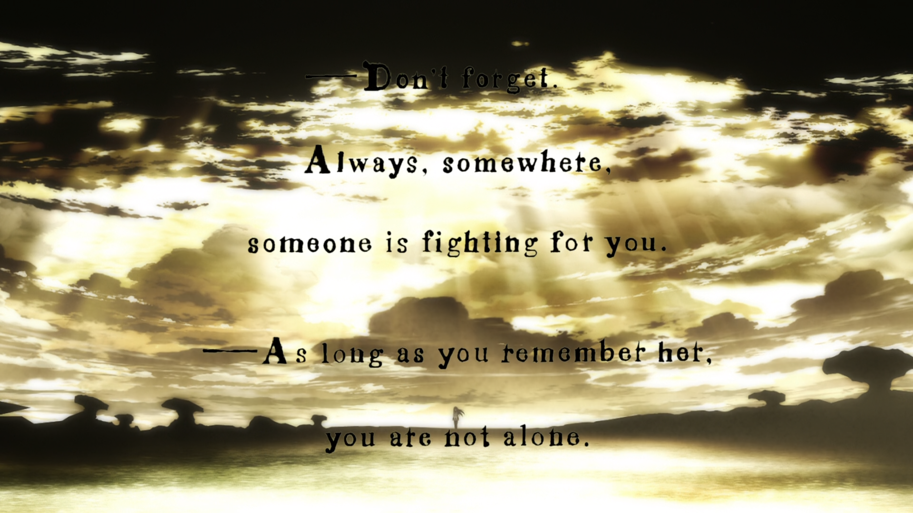

# creo tamnien que

soy el total opuiesto de la gente que decide abandonar sus "sueños"
y entiendo que eso pueda molestar a tanta gente

para mí es lo que madoka me dio, es la esperanza y sabiduría de saber que, quizá
y si quizá, por qué no 
que este mundo es el mundo que ella se sacrificó

cómo madoka y homura son el yin y el yan, como cada una es su otro saviour y salvee

y entiendo que, quizá, el señor joan sea la persona que se rindió en todo
y cómo homura, aunque sea dura con madoka, lo hace desde el profundo amor que siente por ella
creo que me ayuda, también, a ver un poco de luz en lo oscuro que fue el pasado del que vengo

recuerdo quemar diarios por pensar que estaban malditos de todo lo que descargaba ahí
y desear que la vida me fuese dificil para crecer

me alegro de dejar de ser así
siento los hombros cada vez más ligeros y, siento
el pecho crecer, y
llevo como mes y medio con agujetas cuando muevo la cintura
el cuello me cruje raro, a veces
y pienso "igual son esos growing pains que nunca me dejé tener"

y pienso "y si es esta mi voz, de la que deseaba quedarme mudo
porque, piénsalo, si tienes 3 dones que son la vista, la escucha y la voz
por qué no hay un 4o que sea tu presencia? 
acaso será sólo por el fallo de la mirada? que como un espejo solo atrapa lo que está en su rango
y no permite como el oído el eco de aquello que damos

porque todo yin tiene yan, toda voz tiene escucha
entonces quué tiene toda mirada? presencia?