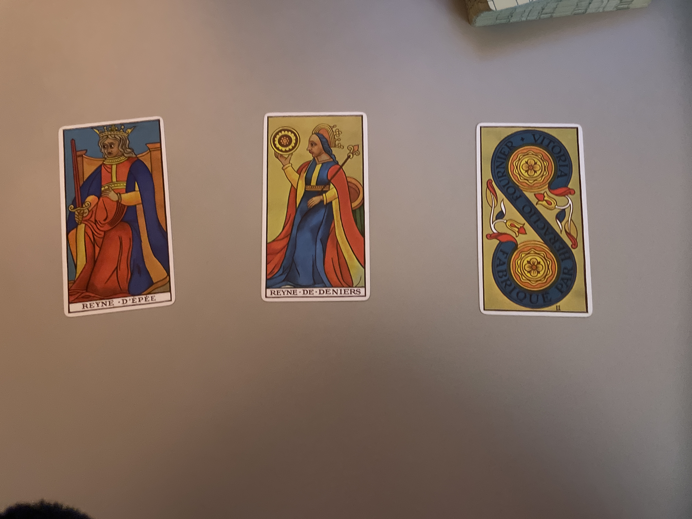

# porque yo el único que quiero es

que no me toque
Y que no sea cercana conmigo
Porque es una moderna productivista

Todo lo piensa en función de ganancia para su mitología personal

Todo el rato está haciendo, lo divertido, lo atrevido lo guay lo que ella quiere

Y quizá sea eso, lo que me da trigger que a mí me cuesta mucho lo que vengo de una infancia muy difícil

Pero cada 2 × 3 me toque tragar discursos de por ella es mejor que por ejemplo camille porque sus padres son migrantes y porque los suyos son una historia de superacion

Pero realmente eres una tía que cree la meritocracia a un nivel incluso mental, no nivel de conciencia, sino subconsciente

Y que yo sé que esta tía ha visto a dios yo sé que ella ha conectado con cosas

Es por eso que me parece ridículo muchas veces que

Yo sabiendo hacer las cosas mejor, y sabiendo que es verdad, porque

Yo viví con un padre con muchísimo toc y es un narcisista del libro, mi padre todo el rato o sea todo el rato era sobre él y todo el rato decía que tenía la razón

su razón era que los pisos vacíos se tenían que tapear por el ayuntamiento, para evitar que la gente sin casa entrase a vivir en ellos

Con el tema político hay muchas cosas que realmente lo que lo que pido es que miremos

Que no hace falta leerse un libro y fumarse dos porros solo hace falta que cojas mires en tu ciudad alrededor y digas es esto lo que quiero

Pero claro, como a haber crecido con dos padres profundamente narcisistas y ahora estar viviendo con una persona que es un poco narcisista compartiendo un espacio que para mí es muy íntimo con otra persona que también es muy narcisista

Pero que a la vez por ejemplo

Grandes maestros son muy narcisistas y estoy aprendiendo mucho con uno de ellos

Que me quiere decir todo esto

