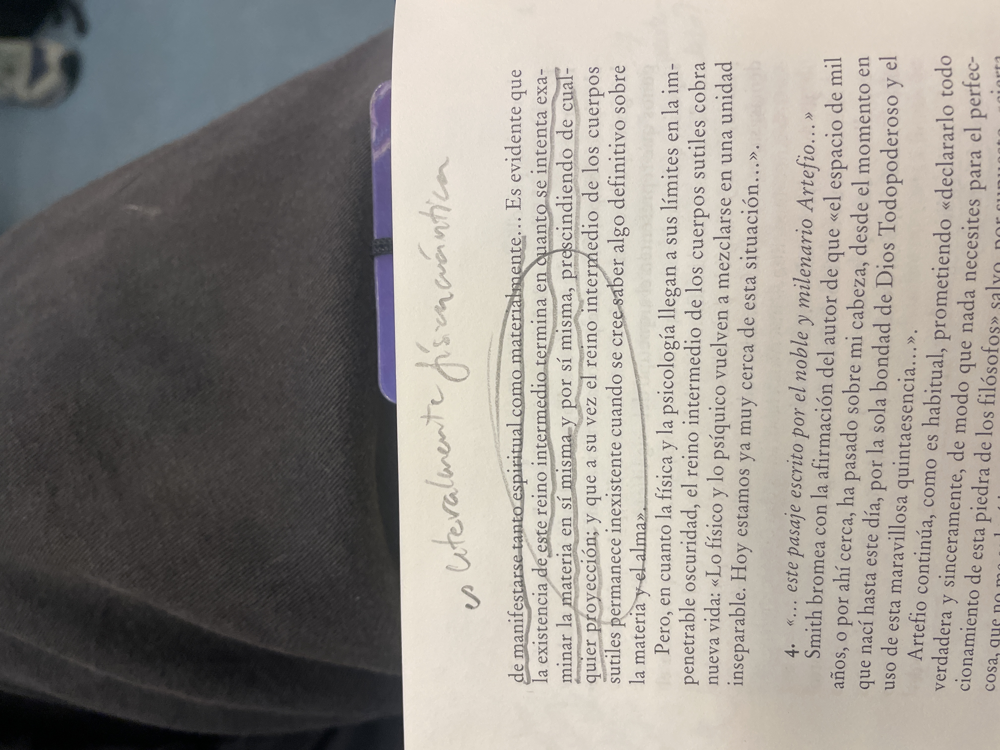

# master en mitologia

 [https://www.blanquerna.edu/es/diploma-de-especializacion-universitaria-en-mitologia-y-simbologia#becas-y-ayudas](https://www.blanquerna.edu/es/diploma-de-especializacion-universitaria-en-mitologia-y-simbologia#becas-y-ayudas)

# 
# 
# titol tesis doctoral
### "esta investigacion comienza por culpa del vuelco que me causo leer el vuelvo de kripal... ya habia algo interior pero este libro lo saco y me lo volco a la cara y ya supe que no pude escapar"
# la irrelevancia / impotencia de la verdad vs la potencia del relato
la realidad es realidad en tanto que es contada
sin registro no hay existencia
si el registro es creado
se crea la realidad

descartes habla de esto en sus libros menos conocidos?

qué tiene el lenguaje en todo ésto al ser la manera de registrar lo real e invocar/conjurar nuevas realidades?

cómo es posible que podamos imaginar cosas imposibles? si se puede imaginar se puede realizar?

cómo afectan las ficciones de las que nos rodeamos a nuestra realidad? (de la misma manera que nuestra realidad afecta a las ficciones que podemos imaginar (como en los sueños: pgs 24-27 el mundo bajo los parpados))

cómo el mundo podría ser mejor
si la gente confiase en la magia y en la belleza y en la bondad de todo
porque todos somos lo mismo y cuando ves eso eres d enuevo uno con todo y te realizas que todo da igual

pero eso requiere ser honesto, requiere dejar de huir del deseo y desearlo

enfrentarnos al anhelo y desear el deseo

si lo puedes imaginar
existe
porqye esta en tu cabeza
al igual que existen los cereales o la mesa
entonces
puede ser real?

puedes imaginar cereales
y hay maneras de hacerlos

puedes imaginar magia
hay manera de hacerla?

moalria investigar foros de ocultismoa  ver como estan haciendoe sto
y ver si todos son scam
o si hay alto de verdad en ello

hay algo entre la traducxiin y la magia que mola porque cuando un libro en ingles y castellano dicen cosas diatintas por ese vacio del lenguaje y esa necesidad de adaptar palabras que siempre perderas y generas singnifi ado
es como un poco gaslight no?

la separacion de dios (el olvido de la pertenencia a la unidad y el recuerdo de llo mediante las practicas de meditacion o drogas) [https://www.youtube.com/watch?v=1Am6CH3C3Rc](https://www.youtube.com/watch?v=1Am6CH3C3Rc) 

igual es eso
la reunion de cielo y tierra de la filosofia antigua olvidada con la mecanica cuantica que rstamos descubriendo

señalar la diferencia entre que un doctorado en filosofia te hable de la consciencia de la materia y que un hippie te hable de la pchamama y observar como hablan de lo mismo

porque al final todo es lo mismo

# la totalidad del todo
un master en la uni de valencia de artes visuales investigandk ma totalidad dem tkdi. es qje ws escalofriantlel clmplicado que oueje der

## una tesis contra el materialismo metafisico
revisar notas de el vuelco, de de por que el materialismo es un embuste y de realidad y gnosticismo

# como la realidad es lo que tú creas que es
de la misma manera que un arbol se distant anto de un dios como de unas particulas invisibles

qué es dios sino esas particulas invisibles

que tambien te componen a ti

como cconviene al capitalismo el materialismo cientifico para poder violar la unidad de la materia a la que pertenecemos para seguir pecando contra la madre tierra

