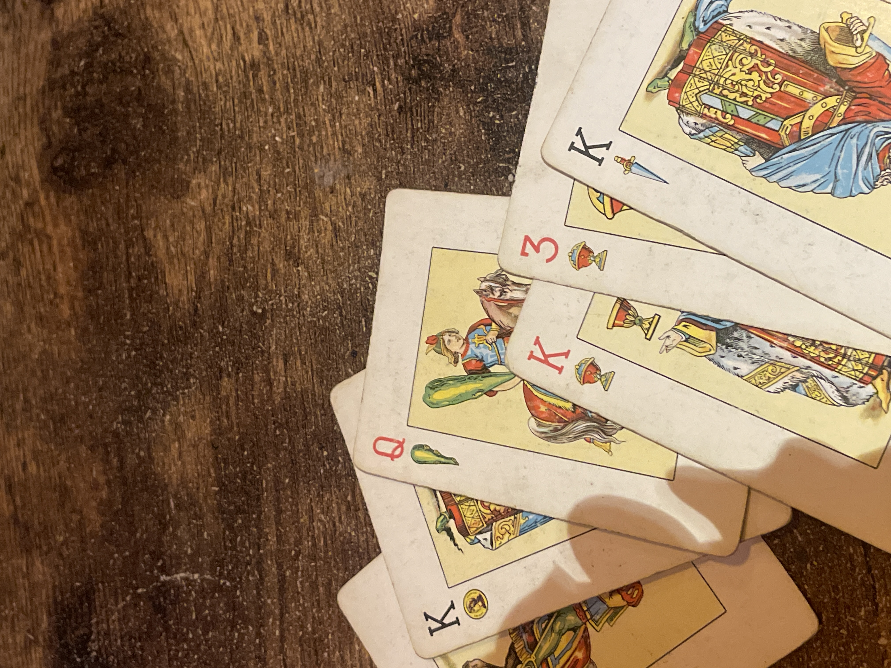

# gastar creditos de manu en una qeb que sea una baraja de cartas españolas

y te deje jugar al chinchon

y si quieres jugar al jno te convierte las cartas segun se hace cuando se juega al uno con la baraja española 

pero que se transformen de verdad

podria convertirE en el virus tambien!!

al rummikub

LA CODA ES QUE LAS CARTAS CAMBIEN ENTRE UN JUEGO YBOTRO QUE HAYA COML UN MENU ARRIBA CON 4 opciones y abajk kas cartas

y abajo un boton de jugar

habra una tabla con las equivalencias entr ecada xarta

o habra un array de cartas 
y cada carta sera una de las 4 posibilidades
la 1a sera el juego con mas cartas
la 4a wl que con menos

asi segun el array lenght sabes que carta va con que 

y puedes pensar en las equivalencias

abajo tienes los modos de jugar antes del JUGAR
en chunchin tendrias las puntuaciones para perder
u luego las puntuaciones para perder o hanar

introduces tambin el nunero de jugadores y cuando acabas la partida dice "pasar turno"

y luego una pantalla que dice "soy jugador """ cada jugador tiene una contraseña

y se desbloquea su mano 

y cuando termina y le da a pasar turno sw rebloquea

puedes "volver atras" con un boton que te pide la contraseña del jugador adecuado

hay relacionnentre las negras y rojas de la española asi y las negras y rojas de la inglesa? 

molria que puedasjugar un poker tambien y se convietta en la inglesa