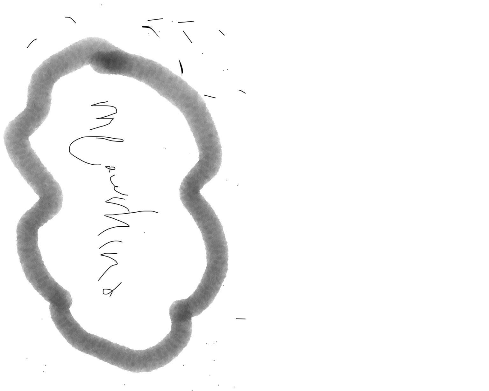

# pagina meowrhino

pillar estos coloores

[https://colorhunt.co/palette/654062ffd66bff9d72f4f4f4](https://colorhunt.co/palette/654062ffd66bff9d72f4f4f4)

es que en plan cambias el naranja por un marromn mas oscuro pero intermedio entre el amarillo y el de abajo, que lo bsucas un poco mas calidito y lo tienes

