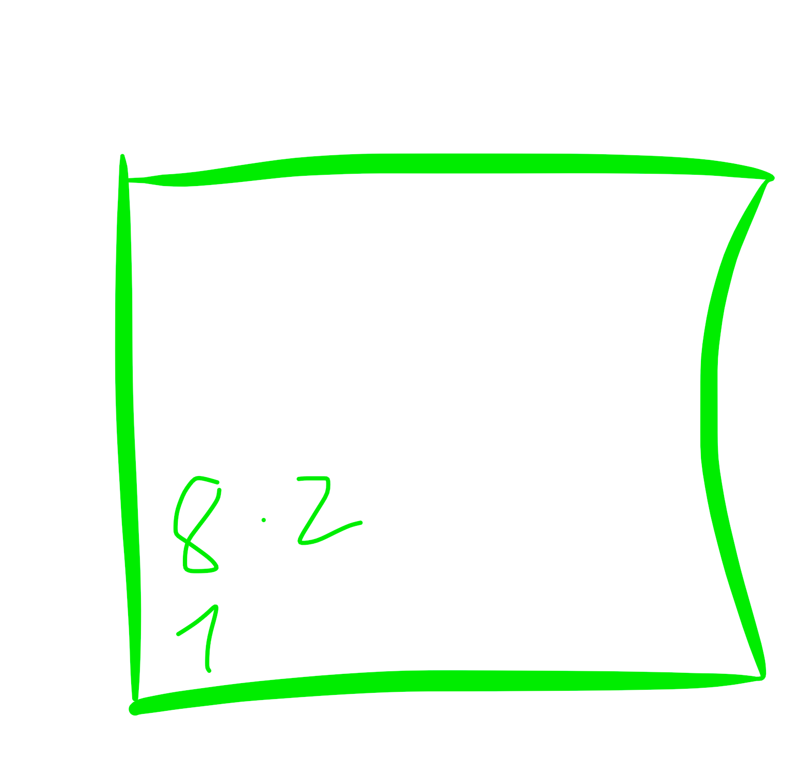

# Nueva nota

primero  la 1
40
30
50

luego la 8
20
10
350

ahora probaremos
20
10
150

y ahora probaremos 
20
10
150
2 veces

y ahora 
20
10
50

vols una web
20 
10
50

(ha pasado jna de 300 10 10)

el 2o vols una web
20
10
25

20
0
100

y el 4o es
20
10
50

y la 5a es
20
10
50
pero dos veces

x3 resolucion
/2 scalar en el smartcarve

(solo el texto no las nuves)

# 4 12 25 
LINOLEO
20 10 50x3

y el de al lado
50 45 50

nube3: 30 25 50
nube2: same
nube4: same

MUY QUEMADO
nube4: 25 15 50 y 25 15 50x2
nube1: samex2

meowrhino.studio: 25 10 100x4
meowrhino.studio: 25 20 50
meowrhino.studio: 25 20 50x2
meowrhino.studiox1.3: 25 15 50 y 25 15 100

vols una webx1.3: 25 15 100 y 25 15 50
meowrhino.studiox1.3: 25 15 100 y 25 15 50