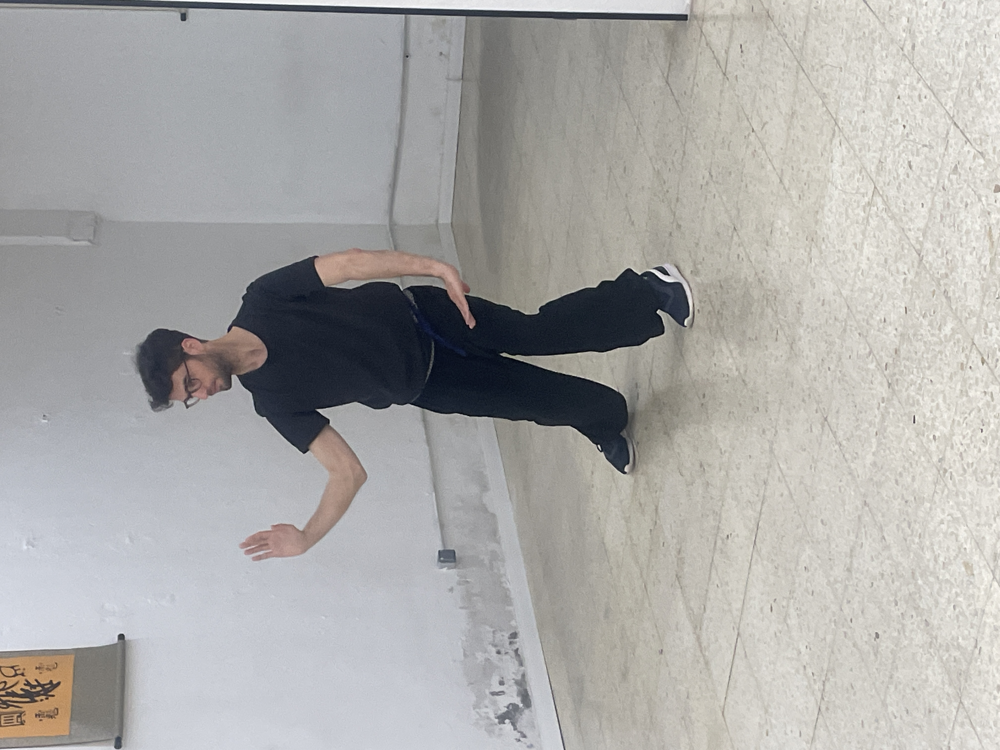
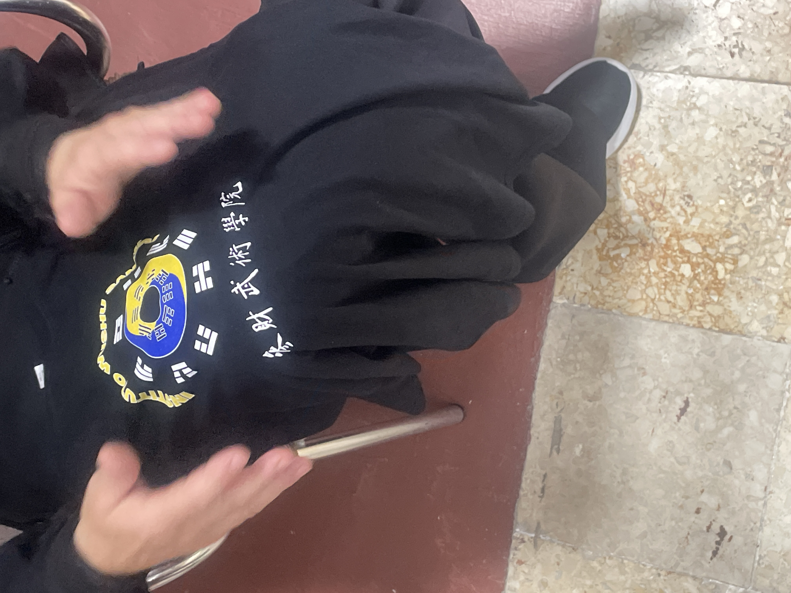
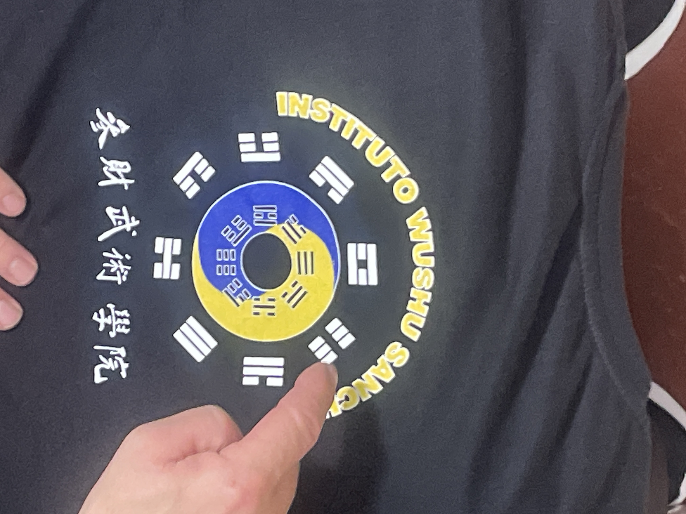
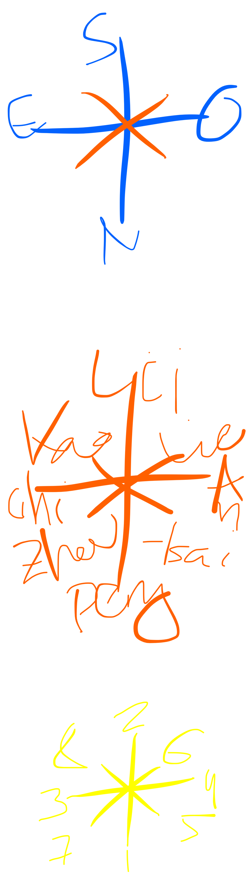
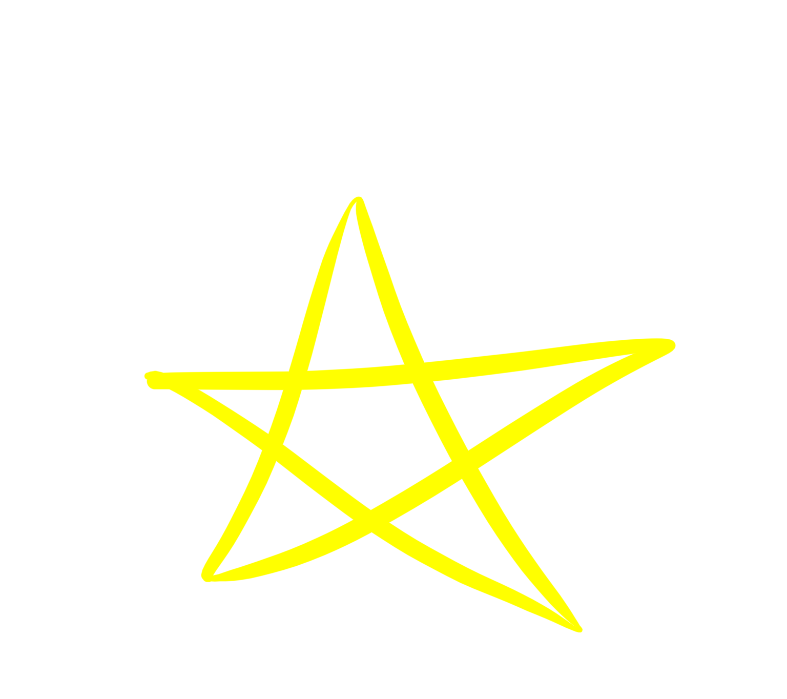
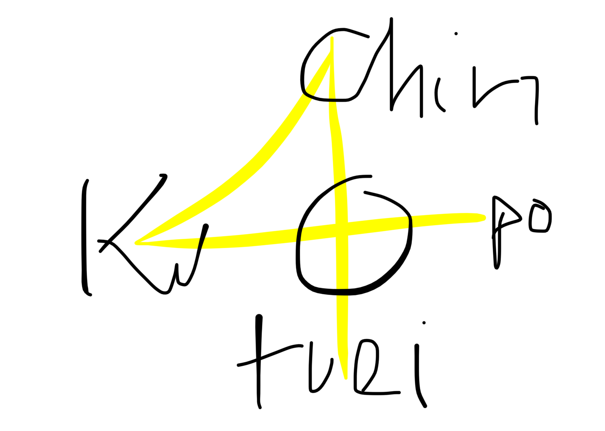
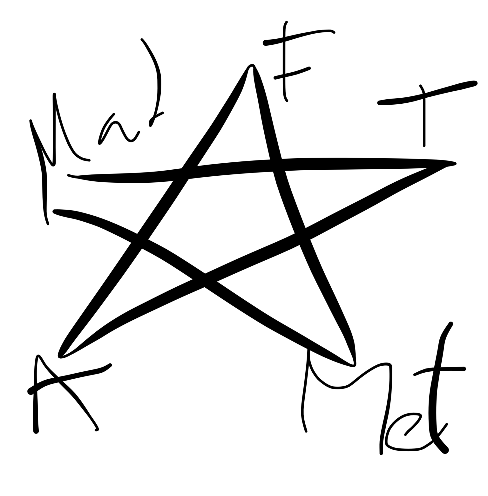

# #wushu 30/05

# #wushu 30/05
#wushu 
PATADA DE RIÑON
pierna derecha por ejemplo la flexionas brazo derecho codo altura de ombligo y mano hacia arriba pero retorcida hacia afuera con el puño saliendo solo el 2o nudo del dedo indice

y cuando lanzas la pierna bajas la mano
ambas retorcidas hacia la derecha en este caso la punta te queda como a 10o

CONTINUACION LANCHAI
despues de la energia en cruz que algjnas notas que tenemls son:

no hace falta inclinar la colimna al empezar 
primero es la serpiente
2o es la pierna
3o es buscar la cruz la cadera 
y 4o sacar el brazo der en cruz la mano que sale para delante ws como un golpe

y continuacion de esto:

recoger manos izq es mano der es puño
cambias peso a lder
mapu

recoges pierna der en han shi

base teorica del taichi
es el iching
el taichi chuan

los 13 principios fundamentales
2 cosas principales: 8 y 5
cada uno de los diferentes qua
(creo que son 8 y esos conforman el iching)

primero aparece el bagua natural
y luwgo el no natural

la herramienta del taicui chuan
es coger el bagua no natural
dinde las posiciones comforman 8 landos
(nombres en chino)
peng tira a kang
lü tira a noseque

nuestra base principal
el bagua del taichi

el taichi cuando se crea
lo crean basandose en el bagua

kan lin chen tui chen ton si su o algo asi
y las secuencias son otras
seguro que esta en el lurbo de bagua

cuando entendemos esto ya hemos entrado en la practica del taichi

por que el movimiento de la wnergia del riñon pra fads uno de ellos se practican 2 wnergias diferentes

taichi: yin y yan unidos en constante movimiento forman noseque

hay algo muy importante que se conoce como los qua

los qua sw conforman con 3 lineas que pueden ser yin (- - o yan —)

antes de qua viene el yin raya partida y luego el yan y cuando se conforma aparece el quanyin

aunque el lirbo de bagua sea de bagua la filosofia es la misma

un bagua (de 2 rayas)
y luego un trigrama  (3 rayas)
y luego un hezagrama (6 rayas)

el misterio
y nosoteos nos movemos en torno al bagua no natura

cuando hablamos de los principios fundamentales del bagua
esta constituido por 8

el que hay fuera es el bagua no natural
y el de de tro es mas el natural es muy dificil

empezamos a estudiar el de fuera

primero son yin y yan 
antes del nacimiento es energia natural
y como  los chinos conciben la energia y el mundo (es el interio)

el externo tiene un orden
kan li chen tui
chien kun ken sun

energias naturales con fuerzas naturales
el ciento noe s una energia es una fuerza natudal

abajo esta el agua
arriba el fuego
iza madera
derecha metal

abajo derecha 
cielo
arriba derecha
tierra

abajo izq
montaña
arriba izq 
viento

pen li chi an
chae lie chou kao

(se corresponde a los kombrs chinos que hemos dicho sntes)

y es el orden establecido en el chikun basixo del taichichuen

entonces abajo riñones
arriba corazon
izq madera higados
derecha pulmon

(son pentaposiciones)
//parece 5 elemrnos

y luego cabeza

y luego tantien

luego homoplatos

luego columna

el bagua no natural es cuando el agua esta abajo y el fuego esta arriba

para los chinos el agua esta en el norte y el fuego esta en el sur, pra ellos en la parte alta se eleva y el agua desciende desde las montañas

los organos mas bajos tenemos los riñones

y la parte mas alra que tenemos es el corazon, en la med china el corazone sta por encima de todo

agua abajo y fuego arriba rige el bafua no natural, por eso el taichi inica con la energia peng que es eiñones

NOS VAMOS AL NATURAL

cielo abajo y tierra arriba maximo de yan y maximo de yin (solo los hay una vez) y esto es lo que marca el bagua no natural del natural

y por eso en el del centro la tierra esta abajo y el cielo esta arriba

natural seria agua fuego madera y metal
pero el cielo y la tierra, la montaña y el viento no son natural

una energia natural sin los cinco elementos

cuando praxtixamos taicui
el chikung tiene 13 principios funramentales:
5 elementos chung ti ku pu chin
y el bagua del tauchi
peng li chi an 
chai lie chou kau

la tierra no se confunde con el estomago es para el tantien

el cielo es el de cabeza

el bagua prenaral (interno)
y el bsgua post naral (externo)

el interno tiene correspondencias
el externo esta rearranged

13 principios
2 bloques

el primer bloque es el bagua del taichi
movimientos conformados por 8 principios

esos primcipios se constituyen ml que se conoce por el bagua del taichi

8 puntos cardinales

el norte abajo
el sur arriba
el este a la izq
y el oeste a la der

(al reves de la rosa de los vientos)

y ahora vienen las diafonales

la forma corta sigue este esquema el 7 es el de en cruz que estabas aprendiendo hoy

y esto es wl bagua nonatural
porque la situacion de los qua es la que corrwsponde a despues del nacimiento

porque abajo esfa el agua
y arriba esta el fuego

y en el natural
la tierra esta abajo
y el cielo arriba

el bagua no natural nos ayuda despues del nacimiento (post natal) y te permite ele studio de las diferentes energias tal y como se mueven ima vez salimos del utero materno y tenemos contscto con tierra y cielo

y esta es nuestra herramienta de trabajo para limpiar los 7 espiritus elevados

pea que surjan los 5 naturales

y esto es solo el promer bloque del taichi 
como el taichi tiene 13 principios

### despues del bagua no natural 
## despues del bagua del taichi
## vendrian los 5 elementos

la forma corta lo contiene todo
el bagua del taichi
y los 5 elementos

los 5 elementos estan relacionados con los 5 principios de espiritu: cuando se limpian los 7 heredados surgen los 5

si quierws combatir con taichi tienes que liberarte de los 7 heredados
y entonces pueden nacer los 5 naturales

hacia delante xomo un tigre
y hacia atras como serpiente

sale de los 5 espiritus naturales
las tomas de decisiones, utilizando los 5 principios de espiritu:

para que se acrive todo el bagua del taicui se requieren los 5 espiritus naturales

cuando la gente no tiene esta herramienta lucha y rige sus acciones por los 7 heredados

(que no son los 7 pecados capitales e cuidao pero habran correspondencias)

## Y AHORA VIENEN LOS 5 elementos¡¡
viene cuando ya entendemos que hay una teoria de los cincoe lementos

pentaposicion

esta pentaposicion no se puede meter en el bagua del taichi, 

en el nagua del taichi falta una energia original

el estomago

que no lo hay en lanchai
pero que con el pso del tiempo aparece el centro (riñon corazon jigsdo pulmon) y aparece el centro en forma de cristalizacion de esencia (estomago)

el centro es el chung ting es quietud es centro

no solo es abajo tuei sino tambien es atras
como chin es arriba y adelante
porque el centro siempre eres tu y esto es un plano 2D que ouede ponerse de muchas maneras en uno 3D

la esencia es el cuerpo
enronces ahi estan los 5

el primer principio se llama chun-ting
luego ku
luego po
luecho chin
luego tue

chung-ting esta en el centeo

el espiritu del tigre es la decision
usa la misma fuerza y decision para matar a un raton que para matar un jabali

si mueve mueve
y si no no mueve

si dudas

esa indecision es impropia de los 5 principios de sspiritu

asi que esperas a no temer nada

y son esos primcipios a los que hay que temerles

hay que tenwe la vesicula biliar grande: cuando tienes el prinxipio de xhin tiene la vesicula bilir grande (tiene cojones vaya) y cuando vas, vas

esos principios estan conformados por 2 movimienros basicos

jinso y pa hou cui san

en bagua son 16

entonces hay 18 ejercicios de chikun del taichichuan o chuen

el yin de los riñones es para el cuidado del cuerpo: dormir 8 horas cada día, el yin es el descanso de los eiñones

la funcion yin de lso riñones es nutrir todos los huesos, mantener la medula liquida, que no se nos caiga el cuero cabelludo o se llene de canas prematuramente

el estrés durante años encanece el pelo
y el encanecimiento del pelo es un vacio en la energia yin de los riñones, entonces aparece el pelo blnco

y por un ecceso de yan se cae por clapas
y luego se van cayendo los dientes

los dientes es el final de los huesos
y las uñas es el final de los tendones (uñas quebradizas com jongos y tal es porque el higado no esta bien)

si el yin de los euñones es para el nutrimiento y descanso del cuerpo

el yan es subir una escalera, levantar peso

y hay algo a nivel fisiologico con todo lo relacionado xon los esfinteres del cuerpo, necesitamos esa energia yan

y por eso los viejos llevan pañales porque el abrir y cerrar son de la energia yan de los riñones

cuando uno se hace mayor ya se le ve a la persona 

y a las mujeres cuando han renido muchos partis a veces se le cae los organos sexuales en plan prolapso

por eso el taichi chuan tenemos yin y yan

el yin lleva sangre a los organos
el yan dispersa la energia

cuales son los principios del taichi
el bagua del taichi y los 5 elementos

cuantos ejercicios se compone el chikun del taichi: 18 (16+2)

cada qua tiene un ejercicio yin y uno yan y jay 8 quas (8*2+2)

en el bagua al estudiar se empieza por agua
se acaba por viento
y luego tienes los otros 2

en el pre-naral abajo esta la tierra y arriba esta el cielo

el natural es el que jay en el mundo
y el nonatural es el que jay en el cuerpo

o sea el interior es el del mundo
y el exterior ws el del cuerpo

el interno es el que hay cuando tu padre y madre te conciben

tu herramienta para llegar a lo natural es trabajar con el bagua no natural

com la practica cualquier persona se puede liberar de los 7 fantasmas heredados

cuando una serpiente se echa para atras
es como cuando enrollamos en los ejercicios

para luwgo salir xomo tigre

para que practicamos chikun
para ñimpiar las 7 energias heredadas

### hacemos chikun para equilibrar la energia yin y yan

| yin      | yan      |
|----------|----------|
| fem      | masc     |
| cuerpo   | espiritu |

equilibrio

el yin es la parte oscura del yinyan es la parte sombria de una montaña y el yan es la parte iluminada de una mintaña

los 4 yin estan relacionados con el cuerpo
pen li chi an

chai lie chou kau
es para el espiritu

las parologias son rodas del cuerpo o de la mente, con el cjilun tenemos el cuerpo en su sitio y la mente ewuilibrada

el desajuste de la energia yin y yan 
wl camino del cielo es llegar a los 120 años
(ya a los 60 se llama lao ren a alguien en china)

para poder alcanzar ese camino viene esta pregunta: para mantener equilibrado el factor yin y yan le un medico al emperador chisihuangti

corazon limpio
y pocos deseos

y no te puedes morir de sucio ni de hambre
(perder el interes)

aldeano pildora secreta para ser joven: dormir solo

pregunta pada el maestro
con la practica adecuada
cualquier persona puede limpiar las 7 energias heredadas?
entonces por aue echa alumnos?

# bagua

hay elementos muy claros que ayudan a poder dar el cambio:

vamos haciendi pero no cambiamos si no

el puño horizontal: tiene la espiral cuando se lanza

el chikun de mantis es parecido a los 12 animales de shinji

es la unica manera de que el espiritu de shinji este en la praxtixa de shinji

es para cambiar cosas del alumno

el maestro su yu chan dijo
que uno tiene que sabwe que de cada uno de esos animales trae buenanpara el praxticante

pierde la fuerza? hay un ejercicio para subsanar eso

ojo no ven puño? no es listo? hay un ejercicio de animal para trabajar la energia

el chikun de mantis es algo parecido
pero nos encontramos los movimientos propuos del mantis

como el lanzar los puñis con chansu y luego abrir las palmas ynponer los dedos corazon en el horizonte paralelo

mucha genre no puede haxer dañosnxon sus puños porque tiene el codo cerrado

y el chin pan kun o como se llame el de lanzar losnpuños poner las manos asi y recuperarlos estudia el chansu

la energia en espiral

hay energia en espiral de yan al lanzar el puño
y energia en espiral de yin al recogerlo

el chikun de mantis es muy superior
que tiene de especial el maestro su yu chan

los chikunes a un nivel elevado tienen algonmuy facil que mantiene jn cuepro joven

el chikun de mantis es cuerpo joven, no tiene dificultad, el chikun de taichi no es para joven el de mantis si, 

hay elementos para no hacerse viejo y tener el cuerpo joven

y en el chikun de mantis hay muchs dificultad

el inmortal saludo 
el shi pao lon han kun

EL SECRETO
dormir bien es un secreto
recuperar el yin
eso es muy importante
y dormir en silencio

# visitar o habitar
la gran diferencia

el crecimiento de un alimno viene en lampraxtixa perosnal a clase solo se viene a aprender del maestro

el maestro su ha sido el unico que ha podido recopilar los 5 estilos de mantis
del mantis de la puerta secreta
al mantis d ela algo esteellas

pachitanlan
incorporar la proyeccion de energia del tanlan (mantis) al pachi

pistacho nuez avellana almendra y y anacardo y cacahuete

manintis
chiso continuacio
despues de la iltkma palma
te cogen el brazo
bloqueas en shippu
proteges codo

y bloqueo patada en mapu
peng chue (golpe de reonco como diagonal hacia arriba derecha

y proteges con la izq (pen chue es con la derecha) mientras mandas atras la pierna derecha

entonces tienes la izq pierna delante y la mano tambien

recoges todo girando las piernas con el brazo izq cubriendo para que el derecho salga
y luego sigues con el esquema