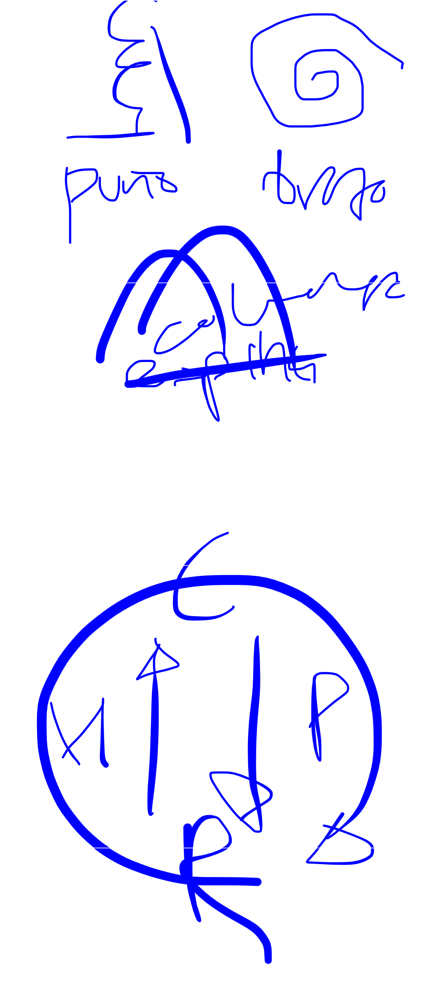

# #wushu

# 
#wushu 
taichi
la sangre se mueve como espiral
para manejar enerhia chang-zu (espiral)
tienes los ejercicios de puño, de brazo y de columna para practicar esto
+ sen chin pa kun

puño changsu:
para abrir es manos delante
luego mano abajo y puño mirntras mapu
giras puño hacia aguera
y vajas de golpe

brazo changsu: 
puedes hacer puño-codo-hombro o hombro-codo-puño, depende de como terminas metiendo el codo o con la mano

espina changsu:
cuando mueves beazos es primero cabeza hacia delante luego cabez ajscia atriba y luego cabeza hagia 

chin lan tan chuen??

por delante al corazon por atras alls riñones
para que la wnergia del corazon llegue a los riñones tiene que pasar por los homoplatos

y para que suceda los homoplatos han de bajar, entonces cuando hacemos el changsu de piño tenemos que vajar los homoplatos

pero como va a la vuelta?

continuaciin despues de lanzqr la patada
caes con el pie mano en el anteblrwxo y lanzas la mano

mueves mano

y mueves mano en konpu

y luego adelantas el puño y la mano que estaba delante se queda hacia la derecha