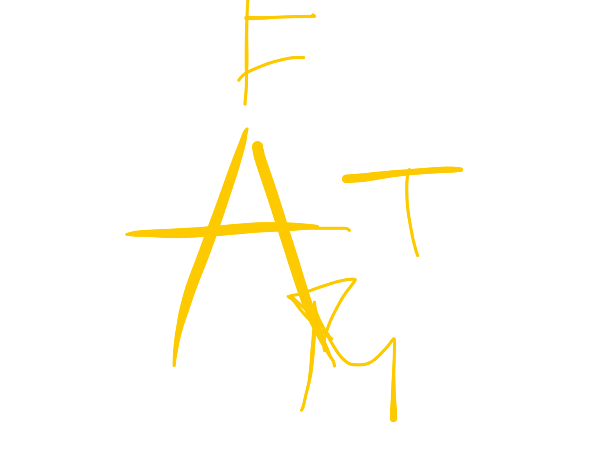

# 02/07/25 taichi

#wushu
trabajamos con la esencia

en el yan de corszo 
la mano de abajo tiene el dedo meñique hacia arriba h el corazon apunta al riñon

mientras quela mano superior edta todo lo estirada posible

y las piernas estiradas
porque es para la sangre
y si basculamos cadera se va la energia a los riñones

cosas del sparato locomotor del corazon: pericardio, laridos, balbulas

si el corazon no mueve energia la dangre mo tiene energia

el yin es sangre
el yan ges la enegia

cuando venimos al mundo estamos rextos
y el trabajo de escritorio debilita wl corazon

cuando miras abajo miras avajo porque abajoe sta la tristeza (en un velatorio nadie mira arriba)

y cuando miras arriva slineando hasta la boca con la fatganta se abre la alegria

energia de corazon: apertura y control de diferentes wmociones. el corazon ama la alegria y odia la tristezs

por eso arriba hay fuego

arriba der hay tierra
y abajo der hay metal

el espiritu del metal es mucha tristeza
y es trabajo del corazon vencer al pulmon y su tristeza, el fuego derrite el metal

"todos aquellos proyectos que uno quiera hacer es ahora el momento es ahora la energia" los proyectos se inician en verano no en invierno

el corazon es alegria que no felicidad
la felicidad es occidental la felicidad vendra
y vendra si hay alegria
y si no hay alegria
no habra felicidad

la alegria viene del yin
y la felicidad del yan

la alegria esta dentro
y la felicidad viene de fuera

si estas feliz pero te quitan las cosas de fuera se acaba... la fente tiene que estar feliz pero nosotros decimos mejor estae alegre

la alegria esta sujeta a la capscidad de mover la sangre

si conswguimos mover la sangre con la sangre va la alegria, que no la felicidad

mano doblada hacia arieba
donde se acaba el pliegue del codo con el esto flexionado por la parte blanda

ahi esta el 3 de corazon
el punto de la alegria
el 1 esta en el sobaco
y acaba en el dedo meñique

fé plena en el maestro
vs pastillas

EN ELLA FORMA CORTA
antes de hacer lo de despues del saludo de quanyin miras giras pie y manos como antes de lanzar el agua en el lanchai (es una posicion intermedia que sale muxho)

con la derecha por arriba 
pones el pie atras y juntas manos cruzandolas un poco, que desde arriba sw vea como una X y bajas el mapu

luego estiras cada brazo al lado que le toca (derecja a la derecha y arriba) inclinando em lado de la cabeza la oreja para mover los liquidos cerebrales

y cuando giras la cabeza miras primero a donde el brazo y asientas la cabeza

mientras que con el brazo tienes una olita
y la otra mano a la cadera

Y CONTINUACION
el pie de atras se pone en shippu (sin peso)
y lanzas el otro brazo con la palma hacia arriba y lo lanzas fomo 70% el codo a un puño del reverso de la palma contraria

estiramientos
como cuandot ensientas como chino
los pies cada uno a un lado (como una linea perpendicular con el eje del cuerpo)

y luego el del calentamiento el que tienes la pierna estirada y la otra doblada
pues tener las dos estiradas
y doblar una
y estirarlas
u dobar las otras

y otro es
piernas estiradas
pones la suela del zapato siguiendo la linea del contramuslo por dentro 
y tiras el cuerpo para abajo 

desbloquear la lumbar

las 5 virtudes 
wu de (confucionismo y tambien taoismo)