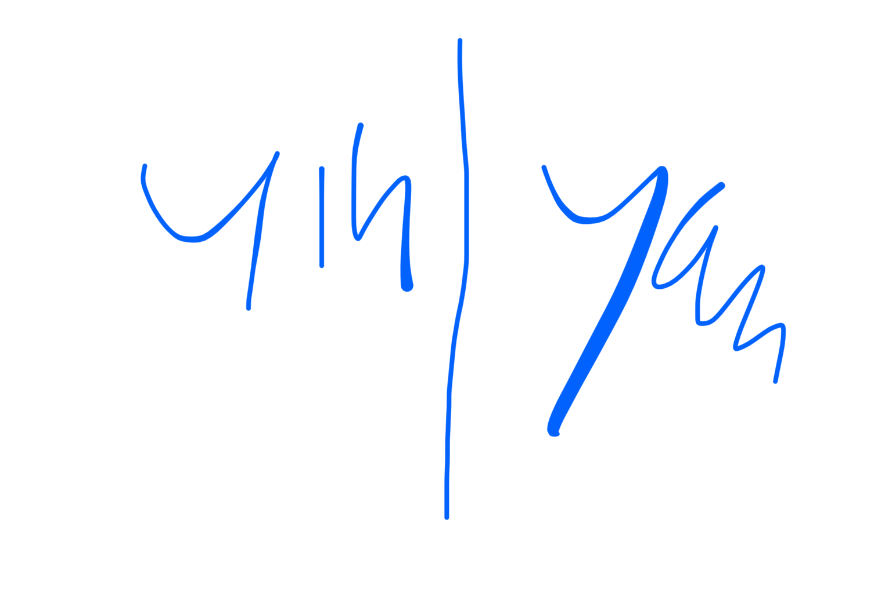

# 020525

#wushu 
taichi
el taichi es uja meditacion en movimiento
y la meditacion es para el silencio?

no nos importa lo que haya fuera podemos irnos al vosque y llevar mucho ruido debtro

primero es sulencio dentro: cerrar el pensamiento

para que cerramos el pensamiento?

sou tien sou ta
silencio, relajacion y natural

en la forma corta cuando pones la mano pizza hacia abajo cuando la abres lo que sientes es hundirse el codo en ese mismo grado al que apunta la mano y la mano cae como por si sola con calma

y luego la cadera esta a la izq

continuacion de foema larga
una vez has abierto la majo derecha y has hecho la flauta mirando hacia delante pero cadera hacia la izq

la mano derecha va a hacer un semicirculo pero teniendo el codo como ancla de esta ciecunferencia: metes un pcoo el codo hasta que te quede en el plano de la pierna y luego alineas la mano talbien, la mirada sigue la mano

la columna hace de centro

la energia se trabaja en forma de eco, cruzado, significa que si tenemos un riñon a cada lado, si tenemos un problema yin tendremos igual que ir al lado yan, el derecho

el cerebro funciona igual, el hemisferio izq afecta al derecho y viceversa

si hay un problema en una zona tendrmos siempre en cuenta el eco

mientras que eiñones hay 2,
tenemos un solo higado pero tenemos dos meridianos de higado!!!

BAGUA

la linea "0" es la de abrir los brazos y sacar uno y sacar otro y quedarte en la pose basica del bagua

la primera linea es la de PASO DE PATO es la de retorcer y cambiar de lado y entonces recuperas pie retuerces giras el otro pie y sacas mano y recuperas pie

recuerda el objetivo de msnrwner una misma linea de cuerpo de rodillas no ir subiendo y bajando

la segunda es la de PASO DE POLLO es mas complicada es desde la postura principal retorcer la mano para que el reverso este paralelo a la izquierda y lo lanzas y miras hacia la izq ahora con pies y todo 

y entonces vas retorciendo la smanos y cuand o lanzas el pie el otro se queda spoyado solo el talon (paso de pollo) 

kun chuang chen guo

y cuando paras haces lo de la poerna otra vez para or hacia atras

//el respeot y la practica van juntos