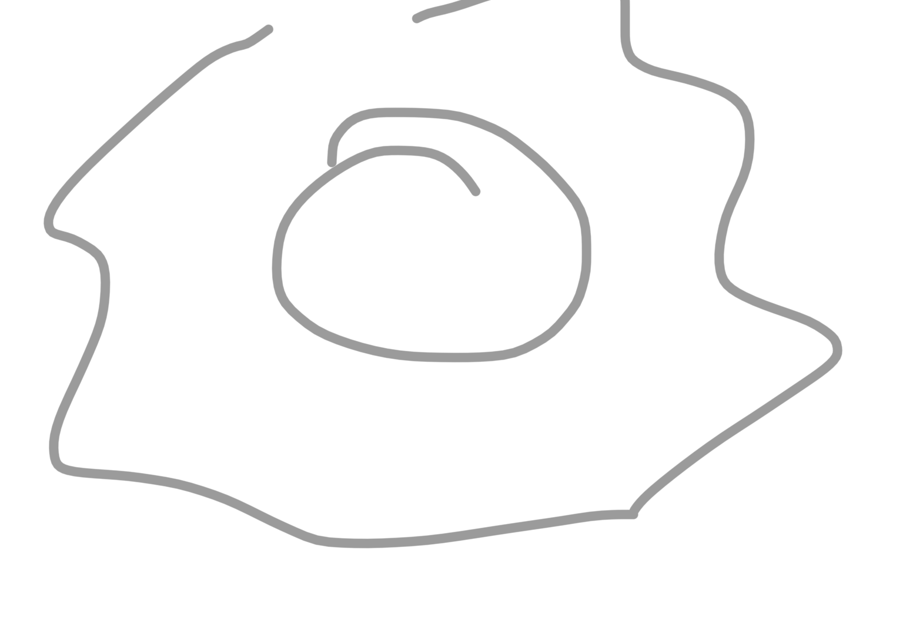

# chin kan pa shi chuen

los ocho puños diamantinos

los dos xaracteres de shin kan 
(oro y duro: lls dos caracteres)

el saludo de quannyin travaja higadony estomago

la energia de esencia solo hay roñonncorazon jigado y pulmon

pen li chi an

ese y en el lan chai se ayuda al estomago

en las escurlas tradicionales de taichi se mueve siempre la cintura eso es lo que las diferencia

cuando hacemos taichichuen estudiamos el pakua dem taicui que estudia los 9 placios: cuando hemos estudiado el bagua del taichi: 8 principios del pakua y 5 elementos

lls 5 principios de espiritu

cuando estamos a un nivel superior del kung du lluchamos connlos 5 naturalesy no con los 7 heredados

el pakua del taichi son las 8 estrategias de combate (kan li chi an (...))

pero necesita alguien que diriga esos 8, un general: para que surja de manera natural necesitamos que aflore los 5 espiritus naturales y eso se encuentra practixando jinso y el saludi de quan lin 

kun po chi y tuei: los desplazamientos a traves del espiritu

el maestro su yu chan decia que si luchamos con 7 heredados tu muerto. 

el final de etspa es para que surgan los 5 naturales

todos tenemos los 7 heredados que son muy yin sin myy pesados

nosotros estamos aqui para linpir los 7 heredados

este huevo feito: la clara es lo yin que son los 7 y opacan a la yema que es el yang y al limpiar los 7 surge los 5

cuando muerto los 7 no impiden que los 5 se eleven 

es como que los 7 anclan a los 5, y con la practixa vamos limpiando: odio, egoismo, depresion,(...) 

cuando estos 5 se elevan se alcanzan diferente sniveles que hay en el taoismo, si los 7 son muy pesados cuando muere no dejan que seeleven los 5 naturales

la tristeza ahoga los pulmones y eso desemboca en patologias relacionadas con los pulmones 

y el metal que tiene que ayudar al agua no la ayida

la tristeza ca bien cuando hay mucha ira, es el unico que puede controlar la ira, porque la tristeza es metal y el metal corta la madera

con el paso del tiempo con el taichi se siente vacio de emociones

//movimiento tanpien

al praxticar taichi tenemos que conswguir silencio para que el movimiento salga lo mas facil posible

hacer cosas para tenerla emmoria activada eso no sirve, es una parte y nuestro objetivo esllegar muy arriba

como se ve eso: nunca estas enfermo (infirme)

(es como en el que cruzas las manos  y levantas la mano cogiendo la punta, en diagonal, hacia abajo, lo syeltashacia el otro laso elnotro brazo

y siempre ha algo que se esta movimendo

(es en la forma el que es antes de ir para delante))

el movimiento del rampien es de lls mas importantes del taichichuen

trabajas la energia del higado de izquierda a derecha y de derecha a izquierda con la columna en medio

este movimiento viene de la forma y es importante no denernos

es inportante que para manejar la wnergia interna del cuerpo las palmas adopten formas fistintas

las palmas manejan la energia de dentro del cuerpo: en tan pien hacemos kou chan y li chan a la vez

constamtenemente en el de tanpien los costillares se abren y cuerran alternamente

lo que no se ve se cuida con el pensamiento mojo cuida movimiento

si tu ves y tocas no necesitas pensar
pero si no estas piensas

//el de tampien es depsues del jinso kusto. y tuene yin y yan uno en cada palo

"si no estas tu no piensa 
tu solo piensas en los que estan"

usted por que tiene que pensar en los que estan y no en los que no estan en su vida: 

los que no estan ya no estan, ya no hay nada para ti, no esta en el tao

y los que estan son los importantes y para que no te roben la energia tiends que pensar en empate: si yo entrego 50 tengo que rwcibir 50 pra que no haya desequilibro en el mjndo

si tu no me quieres yo no te quiero
si tu me das guerra yo te doy guerra
empate
centro

el jinso 

ustedes entreguen lo mismo quw entregan a ustedes y asi ustedes estaran en silencio

//a veces en esta nota se dice lanchai en lugar de jinso

lan chai, cuando haces este ejercicio toda la vida el lanchai nos ayudaa algo muy especial: a no estar triste

son los 5 espiritos naturales
