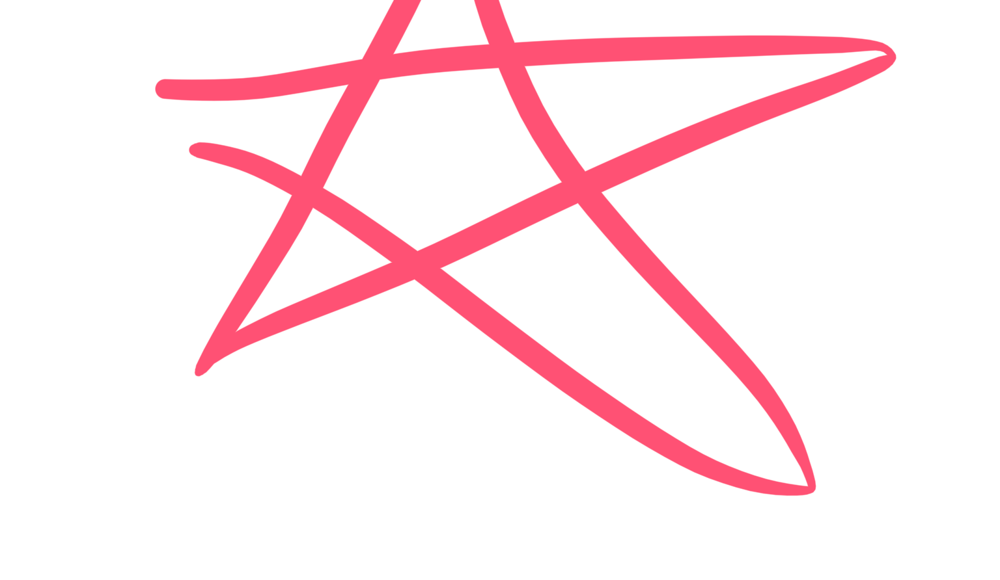
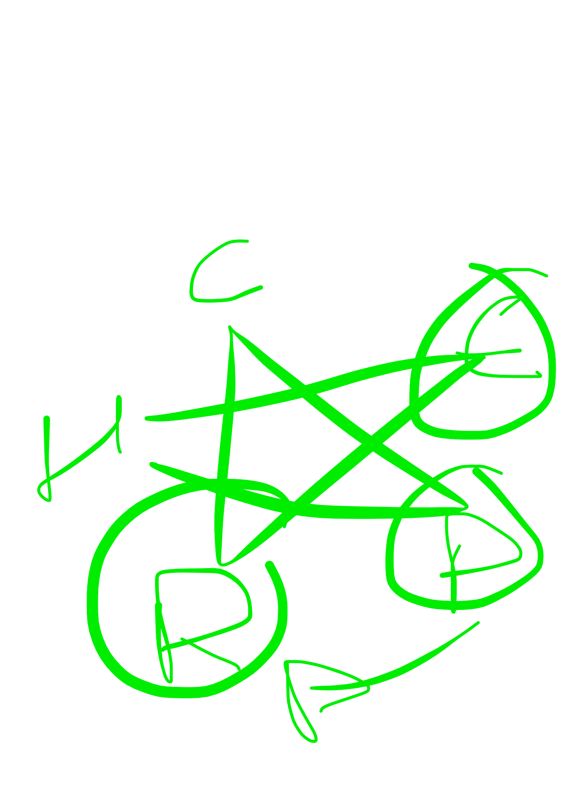

# el calentamiento lo haxe todo aquel que quiera hacer alguna practica…

# 

el calentamiento lo haxe todo aquel que quiera hacer alguna practica deportiva (y segun esta practica la rutina sera distimta) y calienta la parte esqueletico-muscular del cuerpo

la calistenia prepara al cuerpo, energia y espiritu para la practica de arte marcual chino

si bien el calentamiento puede swr desordenado, la calistenia mantiene un orden especifico: de dentro hacia fuera: 
1 huesos-medula-sangre: mover la medula de la espina dorsal, alargar los brazos, mover la sangre a los extremos
2 musculo-tendon-ligamento: para trabajar el higado (impulsor de la sangre para que nutra todos los tendones y ligamentos)
3 respiracion (combinar la energia yin y yang)

en la calistenia: sen jin pa kun?: estirar musculos tendones y ligamentos para ayudar a la parte terapeutica del cuerpo

----------------- 

inspirar es yin
expirar es yan

aguantar el aire es yin
y tomar y sacar sin aguantar es yan

cuando tiras una flecha con un arco yienes una postura especirica que ayuda a que genere la fuerza desde la cadera

si cuando tieas puños estas frontal... mal o regulr al menos

sou tou chi (en cruz) como el movimiento de shpcq

las vertebras segun el laoshi, repartidas en cervical dorsal y limbar, son 24 

el kung fu serio tiene 8 niveles
1o y mas dificil: fan song (relajado)
2o: sen chin pa kun (estirar musculos tendones y ligamentos)
3o: conocimiento de las cinco energías de los cinco órganos: cada uno esta relacionado con una emoción

para revitalizar el chi: dedo corazon encima del indice y te das circulos con presion donde acaba el cartilago de la nariz a cada lado

si cansado y sin aliento: caminar normal y nunca sentarse hasta que la respiracion y el corazon relaja

en em yin de pulmon la cabeza no sobrepasa la linea vertical de las rodillas

y los honbros se mueven de manera alterna: cuando sol un brazo mueve y se queda un hombro mas po deante que el otro que es el honvro qye esta movimedose el brazo

el patron del bunomio del sanchai: I es pulmon quien esta por delante y qyien esta por detras?

si la cadera avre bien el aire llega hacia los alveolos e incluso hasta los riñones (al bajar hay que bascular la pelvis, y asi se consigue la conexion entre el pulmon y los riñones

si el yin capacita los pulmones y sube el sistema defensivo

el yan permite jna conexión directa con los poros de la piel: la adaptacion del cuerpo ante el medio ambiente

tiene la voluntad de **abrir y cerrar los poros de la piel** 

cuando llega el verano el pulmon abre los poros de la piel y cuando vaja la temperatura tiene que cerrarse los poros de la piel para que no se escape el wei chi

una energia de pulmon fuerte sube el sistema inmunitario: los pimones son los wncargados de crear un escudo en el cuerpo, a traves de una buena ingesta de aire

funciin de los pulmones: abrir y cerar los poros
capcitar los pulmones de oxigeno
para prevenir enfermedades pulmonares
y ayudar a la tristeza

cuando el chi de los pulmones entra en profundidad y se ahogan la persona tiene tristeza

cuando hacemos yin hay un hombro delante y uno detras

y cuando hacemos el yan se produce un roce que hace que los homoplatos se limpien de todo

(para flema/flama: yan
para capacidad/enfriar: yin)

la tos es la defensa de los pulmones: la tos es natural y nadie te ha enseñado a toser jamas

el movimiento yan de la wnergia de los pulmones invita a manejar la energiaoriginal de los pulmones

un organo es natural
pero los riñones son originales
y como se maneja la energia de los pulmones a travez de la energia del taichi en su aspwxto yin o su asñecto han??

el aspexto yin trabaja solo para el propio organo: oxigena himedece tonifica: es adentro

el movimiento yan con la entraday salida del aire se maneja la energia de los pumones

an so: mano de pulmon?

peng li chi an

la parte marcial esta en el aspecto yan

el lanchai empieza en riñon y hace 3 yins hasta el yan de pumon 

el tui sou: como ytilizarlo en combate

como mata con enertia de pulmon? hombros hacia delante y centro hacia detras

tigrre mata tu: el superyo  ataca al yo
pero tealmwnte tu te matas a ti

el iching originalmente serepresentaba en caparazon de tortuga o en lomo de caballo

la parte de arriba de una tortuga es el cielo
y la parte de abajo es la tierra