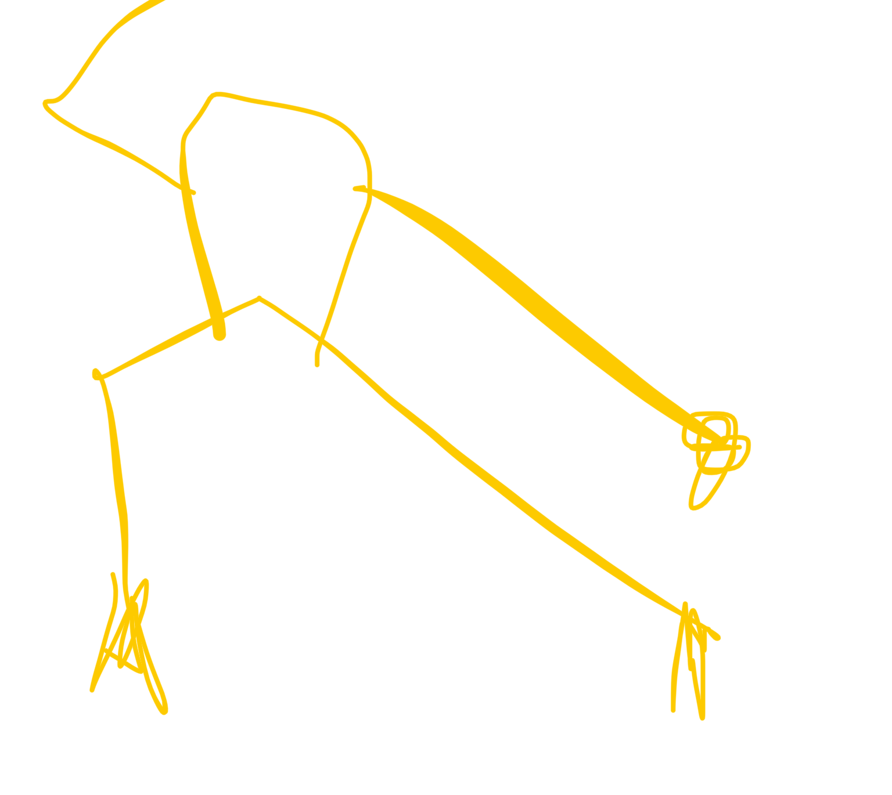

# el higado tuende. estar yan: continuacion forma corta

# 
el higado tuende. estar yan: continuacion forma corta

abrir los homoplatos comonun abanico:
deshaces la lanza hacia delante y pasas de punta a talon la mano que protege va al brazo

y luego adelanrando en konpu la mano que era lanza hac euna linea horizontal hacia atras hasta que los dedoa wuedan judto antes denirse del campo visual

e
cabeza no mueve

vaciar el fuego del higado si se hace bien 
abrir los costillares

elhigado hay posibilidades de qye sufra por exceso de yan y edtancamiento

es el organo que mas sindromes tiene

el higado es ek organo que mas sufre en la sociedad en l que esfamls

madera ayuda a fuego
pero puede subir mucho yan al corazon

en el chaung ton wushu

paea subir a uj alto nivel este arte

hay 8 niveles

el primer nivel ej kujg fu ;extrapoblable a la vida) es **fan song**: aprender a relajarse en la práctica marcial

fansong != tension

todo lo que sea tension en el movimiento arecta gravemente al higado

las arres marciales tensas afectan al higado y la gente que no controla esto genera mucha ira y peleas

tigre mata tu

la tension provoca estancamiento del chi hepatico

y abrir los homoplatos como abanico quita el fuego de higado: la putna de la lengua roja u ojos rojos o mucho picor en el cuerpo: se ve reflejado en dos partes del cuerpo, en los ojos ye n las uñas: ojos rojos y uñas finas hongosas y resquebrajadas

las uñas es el final de los tendones

(no posis pedras al fedge)

el higado odia la represion y ama la libertad: es la madera, el arbol se expande de manera circular

SHCQCH

la forma
despues de girar el mapu al kompu
que levantas los brazos cruzados

recuerda antws de cada paso hacer el giro de la mano

y despues de quedarte en el paso en T, que es despues del 2o golpe post cambio mapu-konpu no hagas mano de bagua sino la mano no se retuerce tanto

Y ENTONCES recuerda levantar el  pie
que vas a mover

y para el siguiente que ws psrecido al yan del corazon
levanras pierna izquierda y cruzas brazos para luego sacarlos 

entonces el brazo derecho hace un circulo para wuedar palma arriba

y recoges en garra

LA DECIMA LINEA
LINEA 10

empiezas con un shippu de derecha y la mano izq con l palma hacia la derecha a la altura de los ojos

pasas a kompu y subes un gancho de la derecha pero que la izquierda te roza el brazo y se queda en garra hacia abajo a la altura del tantien

//importante la verticalidad de los ganchos eh siempre en la vertical cwntral

entonces la izq se pone en forma de garra con el dorso tocando la muñeca de la derecha y se prepara

para que a la vez que giras a como un konpu de detras mirando hacia donde antes era la izquierda el cuerpo subes la garra a la altura de la frenre (sigue siendo una harra no esnun bloqueo) y la derecha baja haciendo el giro desde el codo hacia donde esta lampalma (en este caso counterclockwise) (el reverso de la mano mira hacia donde mira el pecho

y luego vuelves al kompu de delante haciendo un pequeño avanzamienro con el gancho y rozando la izq con la derecha

y haces dos ganchos mas!!

y vuelves a empezar con el primer gancho garra golpe fancho ganchogancho

**para girar** la mano que tienes delante hace un mediocirxulo por abajo y se queda como al inicio ( es la mano contraria a la pata del shippu

 

