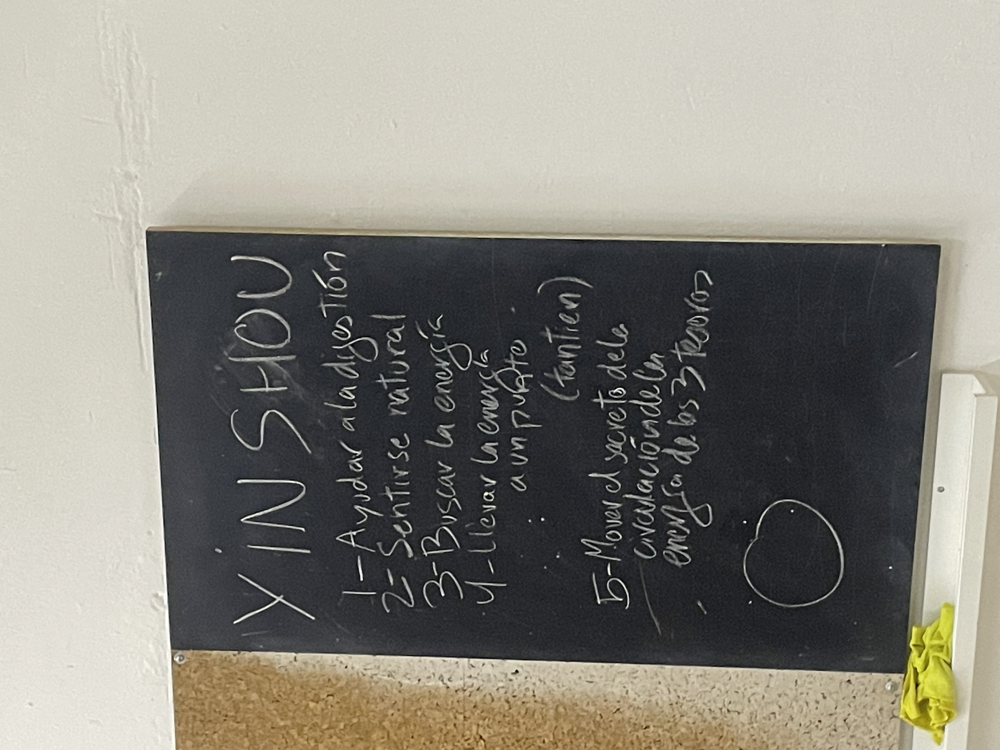

# eushu 25/09/08

la ONCEAVA 11 linea
konpu (empezamos derecha) con el poe girado 45 clockwise y la mano del pie delantero en garra brazo extendido dedos siguiendo la linea del brazo

desde el pie de atras adelantas y mapu y haces una cruz delante de la frente cruzando el brazo en garra que esta delante d ela frente y el que estaba detras ahoea esta encima suya haciendo una cruz

((todo esto es contura: abrws pie y cierras cadera) 

siguiente el brazo cruzado en puño baja y giras el brazo pra que losnkudillos que daban a la frente den hacia atras y bajas mapu

y ahora saltas con los dos pies pfa volver a caer en mapu y chocad el brazo con la garra mientras saltas y cuando caes vuelves a chocarla 

TAICHI

los 5 tipos de respiracion

la natural: la que tienen los bebes cuando vienen a este mundo es la diafragmatica l que mueve la tripa

la invertida: al inhalar el vientre va hacia dentro (sin inflar la caja toracica)

respiracion tao?: nos e mueve nada pra facilitar la ingesta de aire se mueve la cintura. esta respiracion quiere llegar al  tantien. es la que se aplica al jinso (eliminar la maleza del arroz //manos que mueven nubes)

con el pso del tiempo podemos volvwe a la rwspiracion original

recuerda el orden siempre es movimiento rwspiracion energia

seguimiebto de la forma:

despues de la patada de higado y despues de girar patada de corazon: bajas el izq y apoyas solo la punta del derecho y haces patada de corazon y te quedas flamenco con la pierna derecha apoyada en la rodilla izq

la eodilla en medicina china esta relaciinada con los riñones (la funcion yan de los riñones) para hacer pis o caca o para evitar las canas o cuerpo descansado y corazon tranquilo es energia yin de riñones

cuando nos desplazamos apoyamos primero los talones porque produce un eco y fortalece los riñones

cuando haces pulmon lo haces al reves

al caminar hacekos talib centro punta
el centro es para el corsOn

verdura y fruta
proteinas
carbohidratos