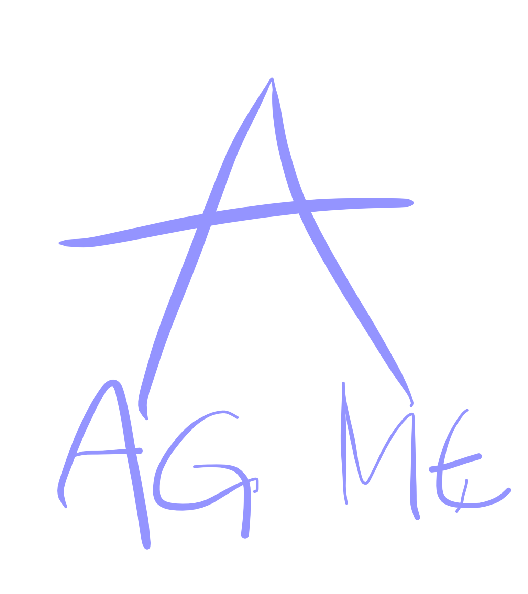
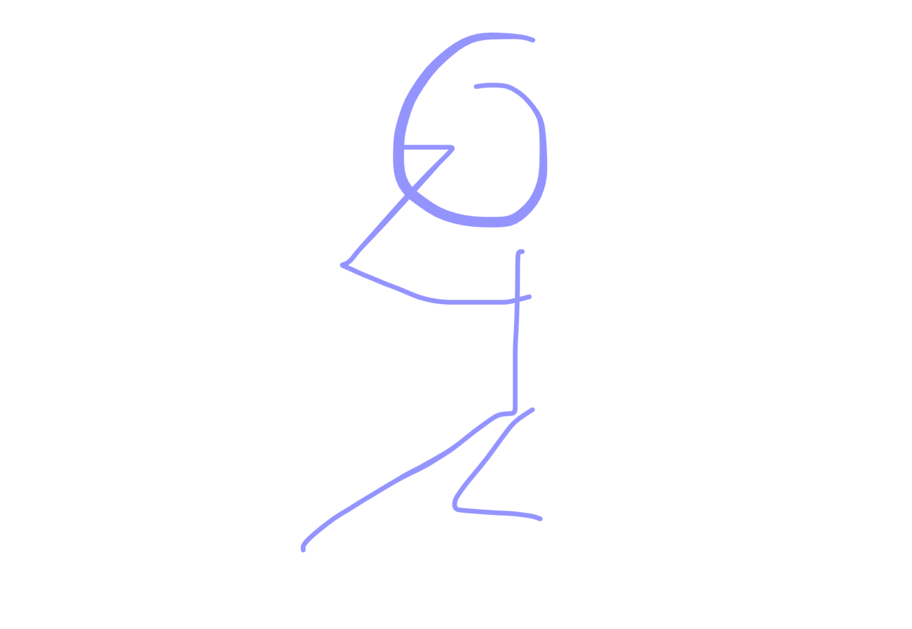

# eushu 29/09/25

pentaposicion

metal es pulmones
estos son los elementos del taoismo
en el taoismo no tiene aure como elemento
como el metal esta antes del agua es la madre del agua

(es un ciclo clockwise)

tanto para el yan como para el yin de pulmones hay que bascular la pelvis

en el yan de pulmones la esoalda tiene que esfar recta y se vascula la pelvis cuando vas ayras

el cuerpo ye queda un poco asi

en los pulmones arreuba hay metal y abajo en los riñones hay agua

tanto cuando tecoges las manos 
como cuando cambis de lado

pensar en los riñones y los pulmones

para el hipo!! (cosas de corazon) si aun no has hecho 3 eapido mano izquierda a la cabeza

y si es mas de 3 pues mano derecha

cosas lan chai en general:

hombros no se elevan porque eso indica que estan tensos y si arriba estan tensos no podemos manejar la energia del tantien

para cambio: espiritu de cochino, un cerdo nunca quiere cambio: 

hombros bajos para manejar la energia del bajovientre

la cabeza en la practica tiene que estar xlnsrantemwnte la coronilla conextada con el hilo que nos cae de arriba

cabeza en el centro porque si no esta en el centro dificilmente podremos cumplir con la mision que tenemos que hacer en la vida

los ojos se mueven para que la cabeza pueda estar siempre en el centro si los ojos no mueben y la cabeza si luego enfermedad de ojo

ejercicios paea mover los ojos:
manos cogidas como para pedir algo oero dedo de higado hacia arriba como un poco algo naruto

y lo pones delante fe los ojos
y mueves hacia arriba y abajo y izq y der
mientras cabwza centrada y fija

en el jinso tambien vas cambiando de foco de lejos y de cerca con las dos manos cuandi cambia el foco de una mano (la que se aleja) a la otra (la que esta cerca, que luego se lleva los ojos y vuelve a cambiar)

5 cosas importanrws en taichi: ojos: para que no se 🤲escape nada. en el combate el secreto esra 
hojob de santohvhhhh? 