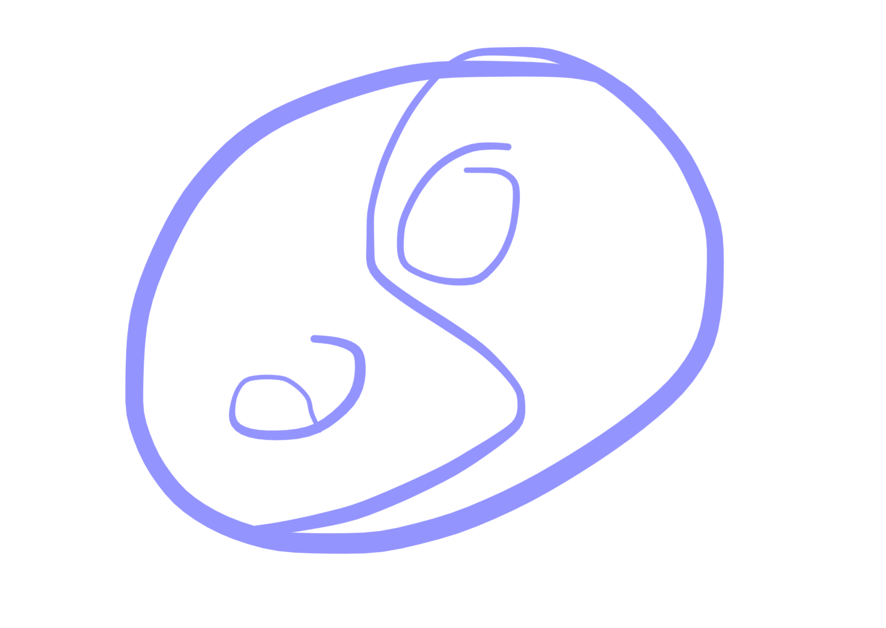

# eushu 3/11/25

taichi

venimos natural al mundo
y tenemos que irnos natural

muerte natural: de viejo, no de enfermo

cuerpo natural para muerte natural

maestro sun lun tang: muere natural con feng sui: misma cama donde murio y le dijo a su discipulo el dia de su muerte

entras por una puerta y te vas por la misma puerta por la que entraste

no hay nada mas especial para llegar a viejo que con taichi

el secreto: saber respirar bien

el movimiento es exacto
para luego incorporar la respiracion
y eventualmente la energia 

el caparazon de la tortuga representa el aspecto yin y yang: la boveda celeste (arriba)  y la tierra abajo (la tierra)

la tortuga y la serpiente: la respiracion

la tortuga es capaz de tomar un aire y es capaz de aguantar en apnea muchisimo tiempo, hasta dias o semanas

la serpiente tambien

el secreto es jacer ejercicios corrextos xon plena consciencia del pensamiento

diferencia entra artes marilaes y gimnasio: las arrws marciales (el wushu) es natural, no necesitamos nada externo

practicar ejercicios lo mas naturales posibles y con plena conciencia del pensamiento

natural es lo que hace la serpiente, **suda de dentro hacia fuera**: cuando se hacen ejercicios donde **el corazon no se acelera** de manera brusca (eso va en detrimento con los años) 

el movimiento y la rwspiracion lo mas natural posible

YAN DE RIÑON: es como un motor de vapor de tren

APUNTESYIN DE CORAZON

lü: tirar o sacudir dando tirones; dar un tiron o ceder ante un tiron

lü: tecnica
li: trigrama

trigrama: arriba en el centro. la raya yin significa que tiene que haver un vacio en el centro: vacío de emociones

el corazon es la morada del shen, el shen es el espiritu, y para que el shen pueda morar requiere de un equilibrio entre la sangre y la energía

si no, el corazon se desubica

a la altura de los pezones en el centro

el fuego es yan porque todo lo que quema es yan. lo yan asciende y lo yin desciende

con la mirada miro la makonque asciende pero en el pensamiento pienso en el pie que esta detras que estira

y el lado izquierdo esta en cruz con el lado dwrwcho: la mano que sube sera de uno y la piernaque estiras sera del otro

altar central

el cuerpo necesita espirales porque la sangre se mueve en espirales, no semueve recto, **sw mueve en espirales como todo lo que hay en este mundo**

binomio sangre y energia
la energía (chi) empuja la sangre (yan)
y la sangre (shue) nutre la energia (yin)

mover la energia a voluntad

la energia se empuja para que las energia se mueva de fuera hacia dentro

la acupuntura se basa wn el movimiento de la wnergia y la sangre

los alimentos producen sangre y energia

al insertar agujas siempre se hacen preguntas primero

cuando algien quiere WMPRENDER el movimiento empieza en el higado (madera) es quien tiene la idea, y el corazon tiene las ganas la decision

por eso en el yin y yan se mueve el vrazo porque semovioiza la energia 

la alegría es de dentro
la felicidad es de fuera

**la alegría viene cuando movemos la sangre** la sangre es yan (aunque sea liquido su esencia es yan, porque donde llega la sangre esta caliente)

YAN DE CORAZON:

no hay nada absoluto todo es relativo
un dia es porque hay dia y noche
no hay nada quieto y todo se mueve relativo a otra cosa

yin abajo yan arriba

quien controla el fuego? el agua

un hombro arriba y uno abajo porque solo el esternon puede producir un masaje al corazon (al pericardio realmente, maestro corszon?)

la sangre si bien el corazon esta a la izquierda

camina la sangre hacia la derecha

por eso tok enpieza por l izquieeda

el yan de corazon quita las depresiones
wl yin limpia las venas y arterias (por eso la idea de estirar el pie de atras en el yin)

si se abre el punto central del corazon la humanidad cambiaría: benevolencia y compasión

el centeo es como una flor de loto: sale del fango y brilla como la flor mas bonita del mundo y eso es el corazon

brillante

cuando ese punto se abre ese punto es solo el centro: el excedete de sangre que se acumula y energia tiene que ir jacia arriba

cuando las personas sse aman se aman con el corazon

no con los ojos ni con los dedos

por es se dice que hay que enamorarse del corazon y dle espiritu

la cabeza jay que involucrarla con el movimiento yan de la cabeza

hay 4 yin y 4 yan

hay un binomio entre el corazon y la cabeza

riñon corazon higado pulmon
peng li chi an
kan lü chen tui

1 ejercicio del xuerpo con uno de espiritu

tantien cabeza columna homoplatos

HIGADO COLUMNA!!!

uno no valdria sin el otro

cuando hay corazon en el yan es importante involucrar la cabeza

y cuando hay cabeza hay que involucrar al esternon (en el yan de cabeza mismo o en la forma larga al gacer el de cabwza)

en el yin de corazon no hay cintura 
y en el riñon si