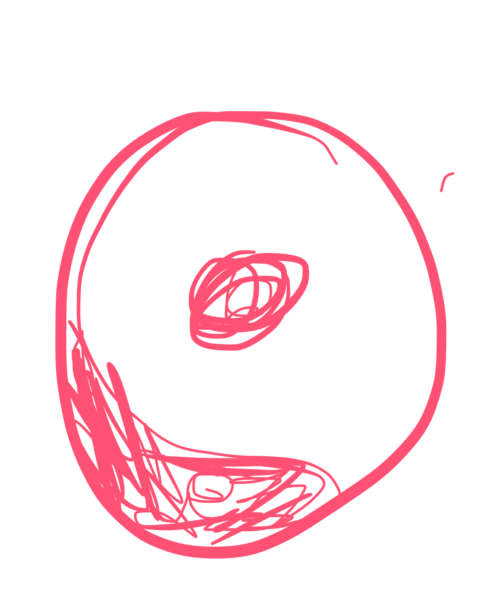

# eushu 5/11/25

instrumental
vocal 
y sonidos de la naturaleza

y el maestro su hablaba de un cuarto

donde recae el peso en las pñantas de los pies cuando se esta wjecutando el movimiento

hay cinco dedos relacionados con sus organos y visceras

en las plantas fe lls pies sucede lo mismo en funcion del movimiento habra que mover el pie de manera determjnda o poner los poes de manera deterinada

ya de riñon; no hay que levantar el talon sino hay uj hundimiento para dar masaje al riñon

por que esta el estudio del corazon en la alquimia?

por que metodos de cultuvo del chikun pra la energia de corazon?: **se estudia porque es el unico órgano capacitado para sentir la energía**

//al maesteo al que mas ha amado el laoshi ha sido a su yu chang

si el corazon esta bloqueado no sentiremos nada, sentir la energía sólo se puede con el corazón

hay un organo que genera la energia (riñones,  yin) y hay otro que la siente (corazon, yan)

siempre se quiere o se ama (a lo que sea) con el corazon

la gente dice "sietno que te amo" y se siente con el corazon, para amar es con el corazon (de ahi vienen los abrazos

((regalo abrazos de los salones manga que??))

su yu chan decia: tu escucha natural de musica (los sonidos de la naturaleza)

que busca el sonido?

natural

((la harmonia que tiene que ver en esto??))

viento las hojas las olas las ondas

SHPCH
cuando haces chuahu su tou chui
la rodilla de delante no puede perder el angulo de 90

SHCPQ tiene dos movimientos princuaples 
chua hou
sou tou chui

cuando queremos reclamar el estilo todos los maesros es chua hu (el sountou chui no lo tienen todos los schqp)

Y LAS MANoñOS

los dedos se abren de maNERA HOMOGENEA Y el laokun se abre (centeo de la mano)