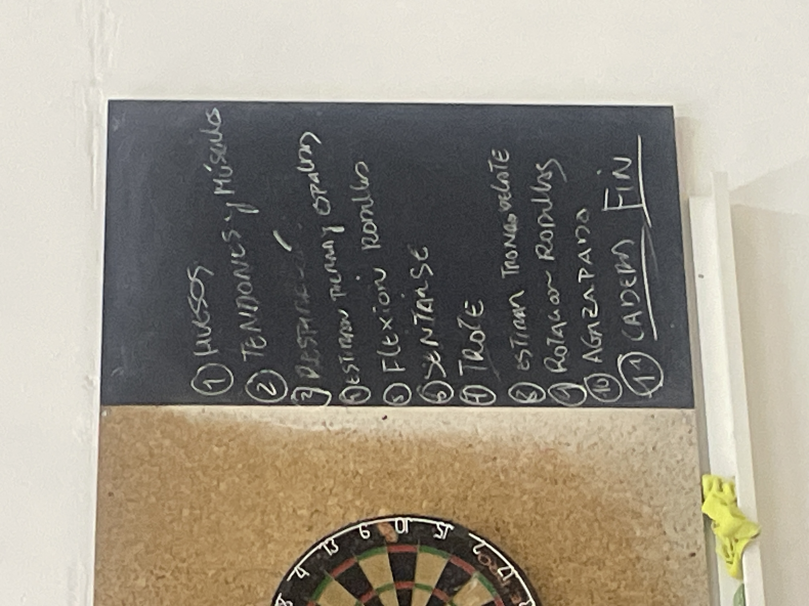

# kung fu 14 05 25

CALISTENIA ORDEN:

1 huesos
2 tendones y músculos
3 respiración
4 estirar pierna y espalda baja
5 flexión rodillas
6 sentarse (sobre pierna la otra estirada)
7 trote 
8 estirar tronco delante
9 rotación rodillas
10 agazapado
11 patadas caderas 

despues de las calistenias empezamos las patadas se hafe 1 patada (li lu?) y la del corazon o la del higado??? al empezar y una al cerrar (pa ren chao)

calistenia - patadas - chikun - descansito de te y palabras

y luego hacemos lanchai o asi, las formas, microformas, l forma corta y la larga

y luego 4o trabajos en pareja

y 5o ejercicios de chikun de los cinco elementos (guardar energia como el de tronco hacia delante y manos tocan del cielo a los pies), y masaje cerebral y de la cabeza y masaje de patpat por todo y pfa acavar el de pizar el pie cruzando la pierna y levantar vrazo de arriba a abajo y arriba abajo y cambiar

y los ejercicios de feng shui

also en el chiso bajar mas lampostura siempre tiene una linea que es bajao la cadera o la cabeza no suben

añadidos yin de los riñones ((como el corszon de lanchai))

yan de higado ((el inicio de la forma corta))

tambien el de estirar pierna y espalda si es con el codo mejor

el de flexion rodillas es para las posturas bajas se intenta no levantar los talones
rodillas juntas

el de avrirse en el suelonconnuna pierna estirada y la otra flexionada y tiras el cuerpo hacia delante hacia el pie y luego hacia el suelo el diagnonal

el trote es especial pada el espiritu sube fuego 

la de sgazapdos tienes la mano que va con el pie flexionado arriba de la cabeza palma hscia la cabeza y la otra hacia abajo en ls cadera enintentas tirar hasta el pie estirado

el de cadera es con los pies juntos y gujandonos de rececionar vien el oie siempre
y hacer cada pierna las 8 veces sinnponer el pie en. el suelo

el de patpat es paea cerrar el flujo de la energia de alguna manera 

#wushu