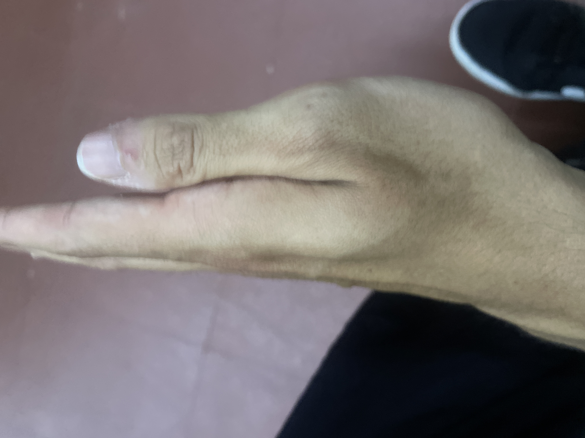
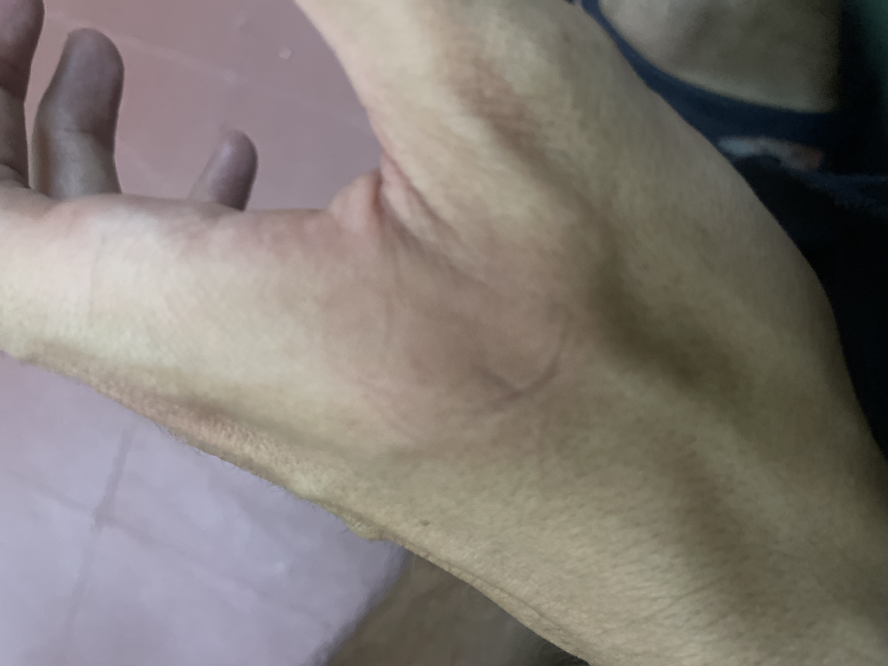

# kung fu 19/05/25

PARA EL BRUXISMO

donde acaba el pliegue
el punto 4 ig

en el monticulo
cuando loa bres
buscas el hueso del infice

5 minutos al dia
adeu vruxismo

el kntws tu no grueso tiene sequedad
y eso da esteñimiento
y ese mismo punto sirve para ese

cuando pinchad el 4 h el 11 ig (intestino grueso)
es para nutrir el intestino hueso

5 minutos 3 vecss ak dia

