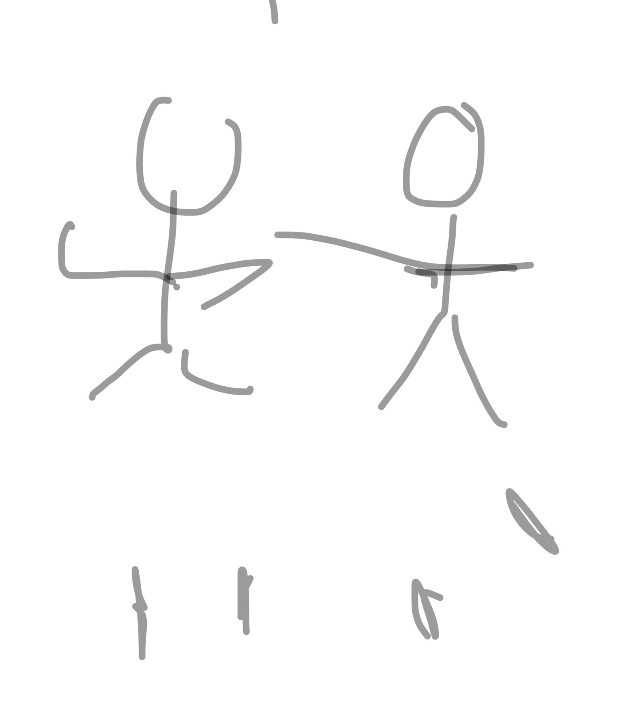
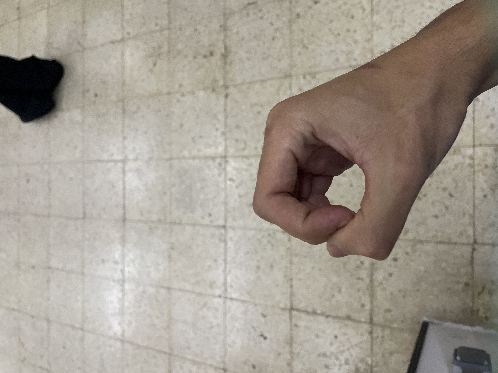
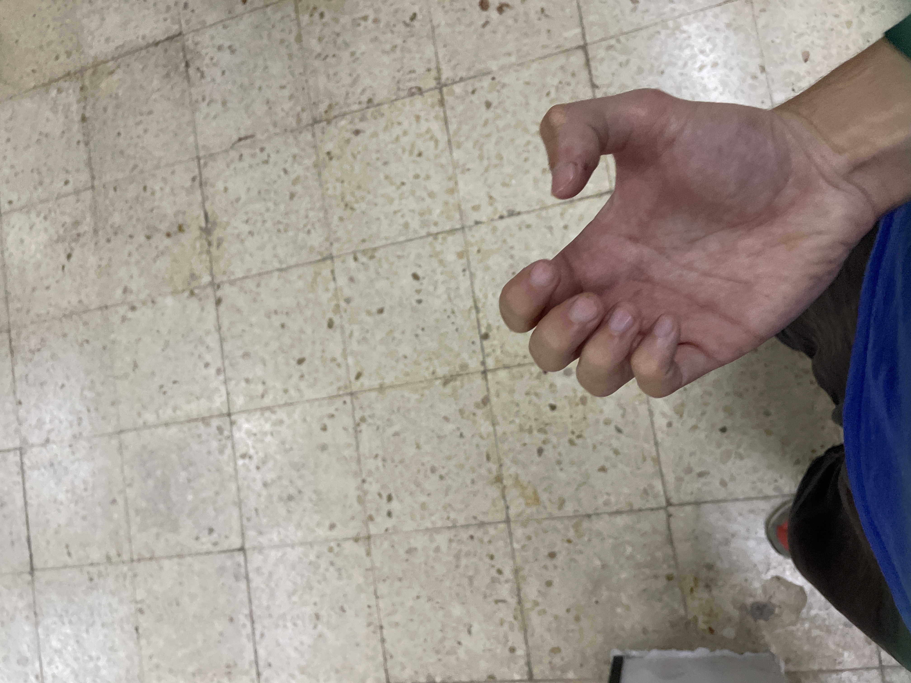

# seminario pachi 2

el 3er ejercicio de la calistenia lo mas importante es el guardar la tespiracion

el verazero secreto de las artes marciales chinas es sabwr que hay puntos en los que hay que aguantar el aire

toma aguanta y sale
es la clave del pachi

ejercicio de nadar mariposa chocando las palmas arriba y cada brazo ej uns entido 
brazo ha de rozar oreja

el cuerpo tiene una mecanica propia que hace naturales

el paso de candil permite girar la cintura

# 5a linea dos golpes espirales violentos
la mano de delanre es la que sera cogida por la otra

//precision y potencia yin y yan

no puedes lanzar un puño sin dar un paso

la 5a linea es para estudiar el movimiento del cuerpo junto con el puño

al avrir es vertical
y luego ya todos son horizontales

los puños se lanzan girados de manera que desde tu POV no ves los nudillos sinlos ves mal

el pie que pisa es el de delante el de atras se queda solo la punta apoyada porque sera con el que vayas hacia delante

esta energia ws pada el estudio de los pulmones!!! los homoplatos son energia de tigre y de oso, el pachi siempre tiene que tener homoplatos: hay que abrir los homoplatos y tirar lls hombros hacia delante

5 - pulmones!!

//si bien todo wl movimiento tiene pakua

solo el necio ws aquel que mira y solo piensa en el puño

pachi es movimienro facil 
buscar energia es dificil

# 6a linea: golpes de palmas cortantes (que cuelgan)

el pikua suaviza el cuerpo
el pachi esmuy duro

el pikua tiene una palma muy especial, la palma que parte (pi chan)

la 5a es pulmon
y la 6a es pulmon

// pero aqui y en todas se mueven muchas otras energias

cuando hacemos movimientos de palmas cortantes estanos moviendo mucho los homoplatos

todo esta en 3 puntos: cadera, cintura y hombros ((cintura con columna))

y asi el cuerpo es como un muelle

//con esta texnica dejo el maestro su al laoshi inconsciente

mqxima de las palmas: cuando mueves las palmas hasta que ko llegue al punto de impacto la palma ha de estar relajada!!

la palma lengua de vaca
antes de llegar al impacto relajado

# 7a linea: puños trasversales a izquierda y derecha

puños que aparecen en muchas escurlas y es algo espeical wn xing yi

es como el henk chuen

es para estudiar la enetgia original de bazo/estomago(yao): si no tienes cintura no tienes nada

tenemos que quedarnos en cruz antes de ñroyexfar en la linea

proyeccion de energia en cruz

cuando haces estomago son horizontales los puños y tiene que ser una postura bien baja

generalmente el piende delante es el que pisa y el de atras es el que queda en punta
para poder ir cambiando el pie que avanza

# 8a linea: paso rozando y palma que sostiene el cielo
cuo bu

energia de corazon!!!

el dedo corazon describe el cirxulo y se alinea ocn la nariz

cuandi quieres mover energia de corazon hemos de mover el esternon

si hace bien y practica eventualmente la wnergia llega

////////////////

en pachi se busca que el movimiento sea como un latigo: si apruetas puño queda tenso h energía coml palo

pachi quiwre abierto para que el mivimeitno sea como un latigazo y es por eso que hasta el puño esta abierto

cuando el movimiento de raiz ws tan twso es muy malo para la cabeza

el pachi no es duro de cuerpo sino fuerte de energía

la idea es que hay el puño de pachi abierto para que fe ñrincipio a fin sea relajado!!!

el puño de verdad relajado es el puño de pachi. antiguamente este puño se llamaba "puño de rastrillo" y por eso se llama ba zin quan 

fan song

sw llama el estilo del oso porque el oso no puede cerrar los piños como el mono

y es puño de oso

y el pachi no es solo oso, sino son dos: ippan ippan

el pachi chuen se divide mitad de oso mitad de tigre, nk uno ni otro solo: el puño es oso, y la palma mediocerrada es tigre

cuando el maestro su empezo a estudiar tien su pa pu deci que wste movimiento ws como un aguila vieja y veterana, sobretodo los movimientos de tijera de la _____ linea

lao yin

todos los esrilos tienen pakua (de filosofia)

al abrir el pachi las palmas hacia arriba se llama "lian yi" 

y el siguiente movimiento de garra y puño en el que miras a un lado y a otro es tigre a la derecha y oso a la izquierda

y se llama "lao hou"

hou y xiao

pachi es tu necesitas mover 8 petes del cuerpo
para a partie de las & partes del cuero mover la energia

mucha gente le lma aal pacji elmpuño de lo 8 extremos

cabwza tou
hombro chie
codo pi
muñeca sho
coxis quae
cadera qua
rodilla pi
pie zi / tzi

tao

//buscar sus nombres en chino

meditacion kung fu es puños delante en vertical y mapu

tragar saliva viene del pachi, viene de la quietud de la meditacion de este ejercicio

estudiar energia del **chi sin tan tien**: la unión de la energia entre los riñones y el tantien

y por eso es importante la posicion del mapu

para trabajar el chi sin tan tien se requiere de mapu y bascular la pelvis, si la peñvis no la basculamos no hay chi sin tan tien

y en el mlmwnto en que somos consciwntes de eso se trabaja el chi sin tan tien: cuando lo hacemos hay un efecto muy especial en los riñones

un secteto es la respiracion

la otra vendra el año que viene

orejas han escuchado
corazon ha aprendido