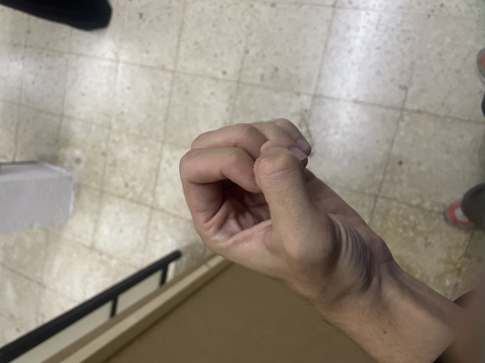
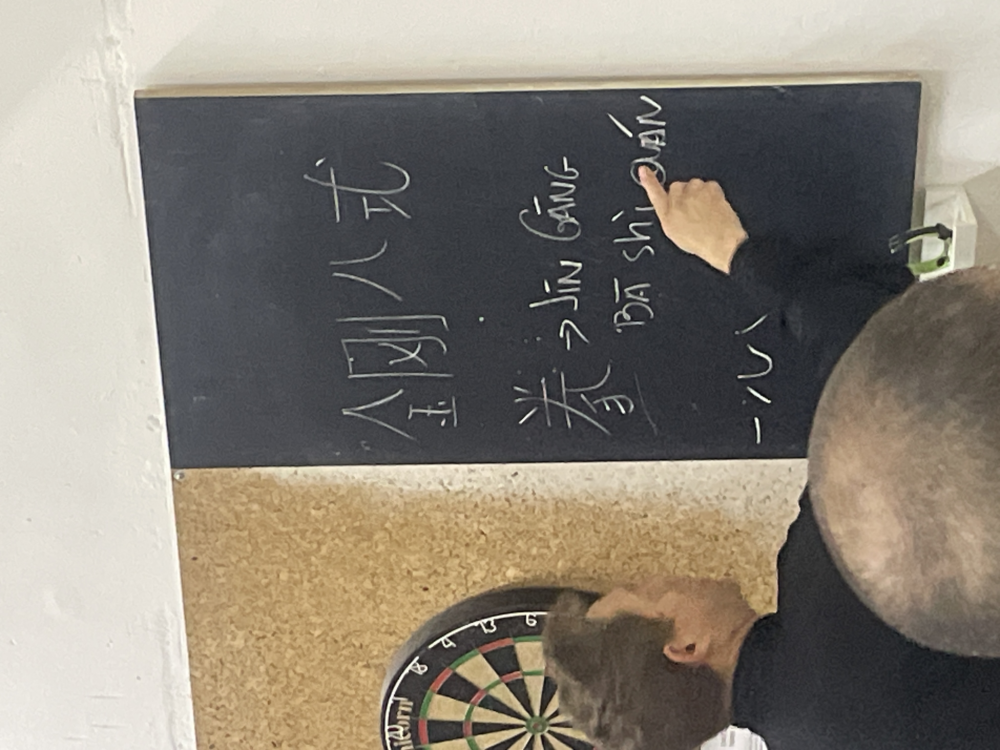
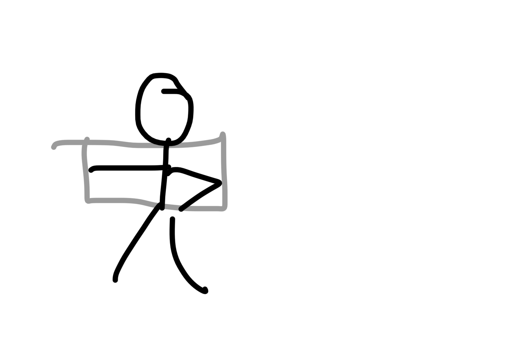
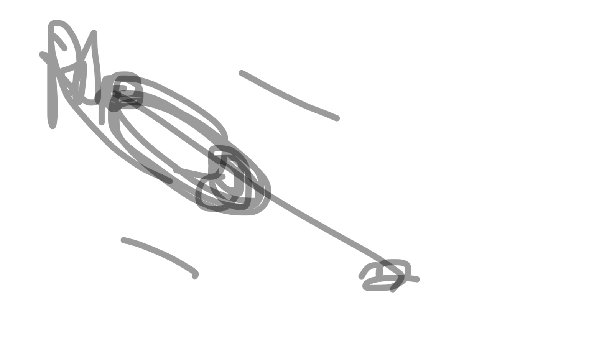
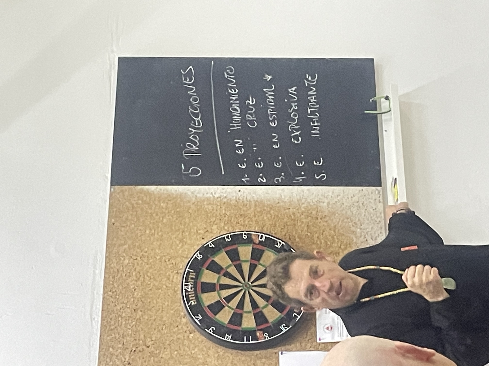
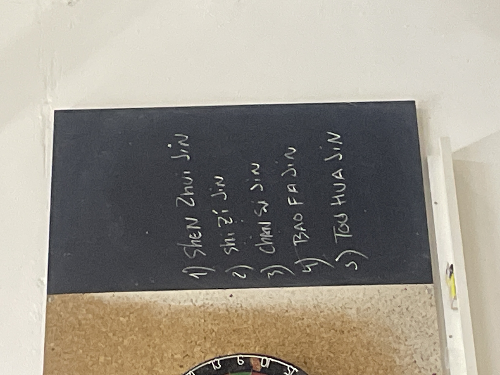

# seminario pachi

linea genealogica

su yu chan
li yun xiao
lo xu roen?

chin kan pa si chuen
chin kan - diamante
8 
si - estilo o posicion
chuen puño

puño de los ocho movimientos diamantinos

**el maestro su yu chan no lo aprendio de li yue chu, el aprendio el tien su pa bu. (la primera forma, los ocho pasos en forma de t), se fue y cuando volvio li yuen chu habia enfermado**

**y entonces fue que fue a li yuen chiao**

**entonces el maestro su fue a estudiar con el maestro li yuen xiao** 

QUE ESTUDIA EL MAESTRO SU YU CHAN CON LI YUEN XIAO

se dice que el tien su pa pu es de las formas smas antiguas que existen

wl tien su papu y el kai men chuen principalmente esta hecho para el desarrollo de 3 delas 5 proyexccionws de energia

## hundimiento
## cruz
## espiral
## explosiva
## infiltrada 

todos los estilos de kung fu tienen forma T, es la norma en kung fu: 3 vectores para genwrar la fuerza, quw se desarrolla con chen sui china? zi ji chin, shang su ching???

y estas 3 pueden dar paso a la 4a: pao fan chin(energia explosiva)

hoy vamos a estudiar principalmente la estructura del cuerpo 

conformw vayamoa desarrollando y practixando pasaremos a desarrollar el pao fa chin (algun dia)

lo superior solo puede nacer de las 3 primeras energía

el pa chi chuen tiene algo que no tiene ningun estilo, desdeque empezamos hay que saber que energia se esta moviendo, que energia se esta desarrollando

si bien las energias no son explicitamente las de los 5 organos, los puños si que estan ligados con los organos

mo pan so, siguiente energia?

pa chi chuen tiene una cosa muy especial: tu necesitas mover 8 partes del cuerpo para hacer una energía, a veces pueden ser menos

8 lados para hacer una energia, y hay otros movimientos que necesita menos

originalmente se creia que el puño era el ouño de rastrillo: genera un hueco

# 

primera energia del chin ka pa si: puño de los 8 movimientos diamantinos
no es largo ni rapido

wu to? bu to? inclinar el puño vertical hacia abajo en el eje de la muñeca, pero tira desde codo y hombro

# PRIMERA LINEA: paso de jinete violento 

que energia original se mueve?? **HIGADO
sin tener el wu shin chi no podemos twner la energía de proyeccion**

cada dedo se corresponde con una energia origial, el indice es elde la energia de higado t cuando yni qyiere matar el puño esta cerrado, el maestro su decia "tu mata con umacto de cuerpo" 

cuando el buti abre el dedo indice es el que guia el movimiento

y por eso esto es higado

# TODOS LOS MOVIMIENTOA DE ATAQUE LA TERALWS SON HIGADO

porque solo se puede abrir el costullar cuando el ataque es lateral

2 para hacer 1 suele ser brazo 

lanzas el puño con un aeco por arriha y luego al recogerlo formas un triangulo equilatero: hou ho, boca de tigre

cuando vamos atras ws yin y cuando vamos alnte son yan

la unica manera deproyextar energia es con puño, codo hombro y hombro codo puño en la misma linea

el puño que tienes delante cuando vuelve y sale el siguiente es como un puño que lanza una flecha

(como el chikun para tener un alinea en el puño y que el codo este en el mismo plano que ambos brazos este en el mismo plano

20/04/91

PASO: xiong bu, paso de oso, energia de hundimiento: cabeza no mueve

((es un poco cono el paso del fambio de energia en el sable de mantis)

si no flexionas eventualmwnte las rodillas sufren y la cabeza se vuelve demente

"patada no al aire"

para el paso has de retorcer primero para salir fuera para coger tecorrido con la cadera

el diamante cuando difracta la luz sale por muchas partes, este movimiento es para hacer que la energia salga por muchas direcciones

[B484ADD8-26F5-46E8-BEBF-A672365BE43B](attachments/B484ADD8-26F5-46E8-BEBF-A672365BE43B.mp4)

# pa chi chuen chin shi

cultura en kung fu es sabee una serie de terminos

pachi pakua y taichi empieza izq siwmpre

los estilos del norte requieren de chanchuan, quedarsequieto

requieren de hundimiento

sin ello no hay filosofia

# SEGUNDA LINEA
hay varios nombres: puño martillo a izq y derecha // bloquear colgando a izq y der // 3er nombre? // 4o nombre?

movimiento de la energia original de higado, el puño lateral no puede serotra cosa y este es higado tambien

para estar equilibrado necesitas que la fuerza yin y la yan sean fuertes
pada no vencerte hacia delante

"el exito del combate se encuentra en la stecnicas de tus pasos"

paso vivo/liebre? : paso de la 2a

este movimiento es energía en cruz
para que surja la energía en cruz necesiramos una cru

y una cruz solo se puede hacer cuando los dos brazos estan alineados

el maestro enseña por cuerpo y por boca
cuando lanzas el puño diagonal necesitas esfale cuerpo alineado 

[6706FED3-FD76-4A21-99B8-CD8D60EB1B0E](attachments/6706FED3-FD76-4A21-99B8-CD8D60EB1B0E.mp4)

y este es wl orden, como es kan li chi an

sinya tenemos wn wl tien su pa pu las 3 primeraspodremos tenee wnertía explosiva y otras formas ya tienen la infoltrante

para entender la infiltrante tienes quw wntender las 4 anteriores

las 5 proyexxiones wn pinyin correxto:

# tercera linea: 
trabaja la 2_ energia
**puño de derrumbe de mil kilos de peso cayendo**

principio de columna elastica

retuerces como en la primera de pakua y lanzas pulo lateral

tras recoger el brazo abres tijera y preparas y lanzas pie antes de lanzar puño

regla memotecnica: el vrazi que coge al itri es por delante u guia hacia delante para no perder la vision del oponente

# 4a linea: el pie que aplasta y puño demolino
pa chinchuen es un estilo sobrio solo tiene 5 patadas

pachi lo importanre es aabwe que movimiento que energia se trabaja en cada linea

si no hay wu shin chi no habran los niceles superiorws

primero buscas la energia original
y luego buscas la proyeccion

la energia que se travaja en la tercera linea es la energia de los riñones, shen??

y ahora en la cuarta tambien son riñones: se genera la energia del higado en la peimera para llegar a la segunda

y de los eiñones en la tercera para llegar a la cuarta

wn pachi con un puño nos preguntamos que energia estoy desarrollando

y luego con este puño como hacer daño al oponente

en higadi necesitamos el girohacia delante desde el dedo indice

los riñones es mas del cuerpo para los riñones de energia, y el giro de la muñeca con la muñeca mirando hacia arriba y el pulgar parece que señala hacia delante

el uso marcial no tecae en el antebrazo, porque si glmpeas con el antevrazo te lo revientas

si golpeas con el dorso te rompes la muñeca casi swguro

cuando haces la forma tienes que pensar donde impactas en el oponente

el impacto es con los nudillos a la frente al taiyang, asi concentrastoda la energia del brazo en los nudillos

para qye llegue corazon se necesita primero el higado

el pachin se consigue estirando todo el cuerpo, se aprieta y luego se suelta

las patadas en kung fu es con todo el cyerpo, para que no sea una patada de taekwondo o karate

para que haya corazon en la patada se becesuta higado t el hugado necesita que se estire too

cuando estira higado
cuando llega arriba corazon

la patada va al menton
o al corazon

en pachi solo hay 3 codos

pelicula del venezolano que quedo 5 veces campeon del mundo en bozeo tailandes: ____ matute

cuando el codo sube o vaja necesita espiral, si no yiene espiral (chan si jin): el retoricimienti qye hace el coso quebhaxe el hombro yq ue hage la muñeca