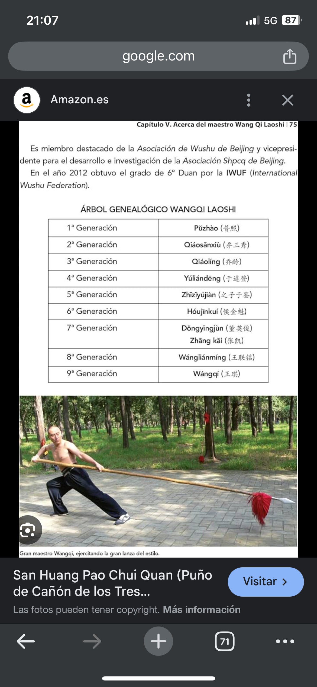

# taichi 02042025

yin de los riñones
como corazon en el ajustar la camisa a la cadera pero luegonlo srrastras hasta la otra rodilla y lo vuelves a llevar

la idea comienza en el hugado
y la voluntad en el riñon

yin de cabeza es en el qye hace sla cruz y te vas a un lado y luego giras la cabeza y la recoges
y el yan es el de empujar el aire bacia delante la otra mako jacia atras girar y hacer un circulo

acariciar la crin de un caballo
YAN de higado
-------------
FORMA CORTA (empieza con yan de higado)

es inicias como el lanchai pero abriendo a la derecha ypero haces CHONGPU (paso del centro, que no MAPU, paso de caballo, las piernas estan abiertas como el hombro) 

subes las manos y pones las piernas rectas y luego llevas la mano ziquerda a la cadera derecha mientras la otra se queda en el hombro ozq

((es como en el ejercicio este de bagua de retorcer la de abajo mira arriba  y la del uombro mira abajo

adelantas pie izq hacia la izq quedando en diagonal

y sin subir, por abajo, cruzas los antebrazos por delante a como 2-3 puños del plexo solar hasta quedar con el brazo izq como un abrazo formando triangulo equilatero con hombro coso y pulgar y el otro queda mirando hacia abajo a la altura del obligo y en el mismo plano que este a un puño de diatancia

y luego lanchai 

yin de higado es algo del dragon verde
haces fruz palmas hacia abajoy giras hqcia un lqdo bajas codos u giras palmas hacia arriba llegas a 90 grados de giro o mas aguantas y vuelves a girar para mirar adelante y al otro lado

SAN GUAN PAO CHUI

y de la linea de san hung pao chui
cuando abres despues de abrir hacia abajo y far los fos pasos asi como en digonaln y metiendo el pie izq en la rodilla detras del derecho y haces un mapu to wapo

para irlos hacia arriba primero los relajas hacia abajo y luego los giras hasta quedar en cruz 

luego los recoges hasta que los meñiques toquen casi el obligo

subes plmas tocandose el reverso hasta esternon
 y empujas soltando energia de pulmon

corazon humilde y sincero
honesto
etimologia fake news 
una mentira muy reprida es la berdad
hagamoslo

hoensro viene de whole
es ser sincero con la totalidad es tanras cosas

#wushu