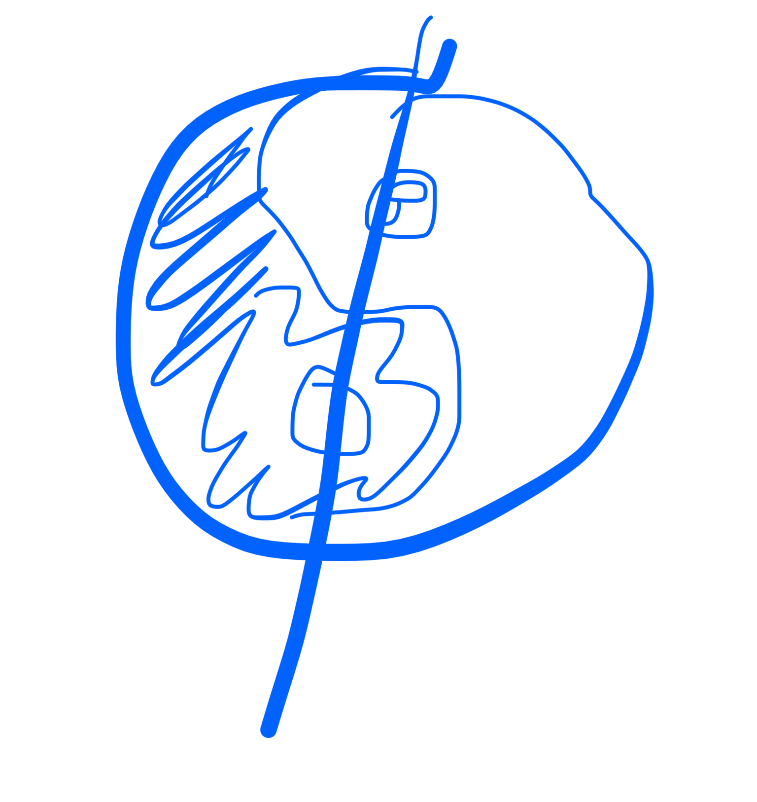
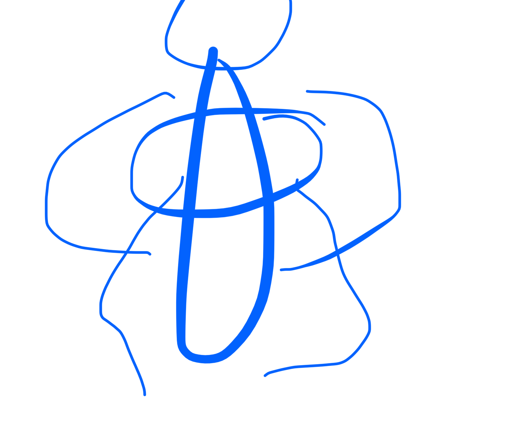

# taichi 14/3

linea es la columna (deberia ser ceryical)

zhan chuan

yi lou (一**道）**

**video mi peimer discipulo del maestro**

**nuestro linaje**

**1 pu zhao
2 qiao sha xiu
3 xiu hou xiao li
4 julian den - xiao mai lu
5 jiu xia (el de la foto de la izq)
6 hon cin qui
7 
8** 

**comprar lubro san juan pao chui

blogspot san juan pao chui chuen**

bagua
apertura
abrir piernas
brazos abrir palma abajo hasta cruz
palma arriba subir brazos hasta casi palmada
palma atrás bajar brazos desde codo cuando codo supera hombros comenzar a bajar caderas basculando pelvis
cuando palma pasa la cara comienzas a girar hacia abajo por dentro y te quedas a la altura del tantien