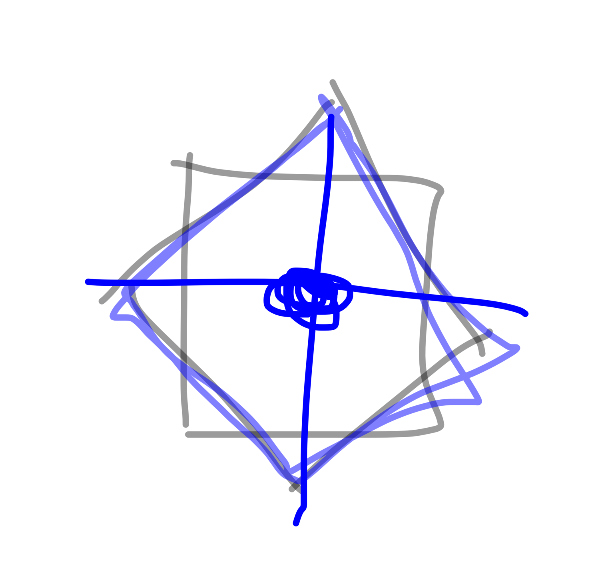
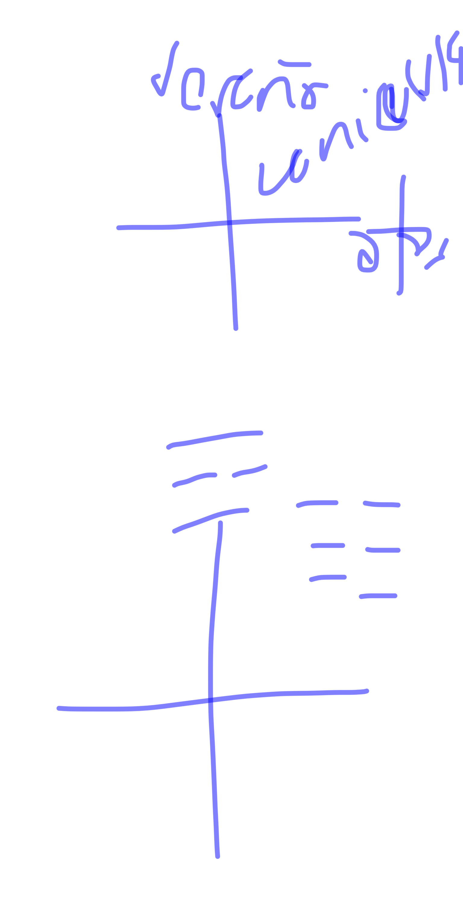
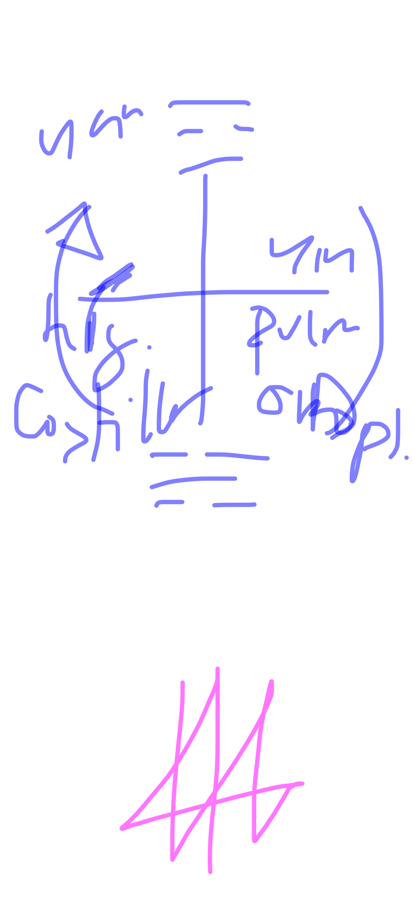
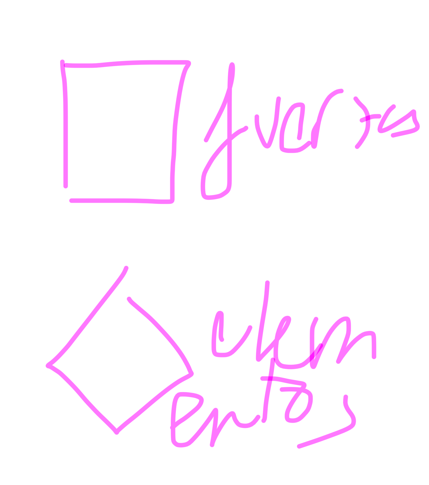

# taichi 5/1/26

los 4 principios yin del pakua son elementos (los de los organos estudian la esencia)
los 4 principios yan son fuerzas naturales
(los de las visceras estudian el espiritu)

cuando se une el cuerpo sano y mente sana (refran latino hehe)

los 4 elementos se entrecruzan en el lanchai (**lanzhai**: kan li chen tui o peng li chi an; **cristalización de energía de esencia**. 

el centro es bazo/estomago: el 5o elemento

y el centro aparece cuando nos cortan el cordón umbilical: empezamos a llorar (pulmones) y el hígado empieza a funcionar cuando el centro xoge su posición original

y se encuentra entre corazon y pulmon: en verano final en canicula

los 3 tesoros: 
espiritu
energia
esencia

canicula es estomago?? pero si el trigrama ws el dw tantien??? **es tantien no es tierra!!! pero tiene que bajar a tierra**

bueno

el pakua no natural: huo tien pakua
el natural: shin tien pakua

el pakua del tachi empieza por agua y acaba por viento: de ahi el fengshui!!!

yin son organos, ssencia
yan son partes extensas del cuerpo, espiritu

higado es madera
colimna es viento:
el viento participa en la reproduccion de los arboles

los movimientos yan son partes mas extensas del cuerpo que permiten que se movilicen la energía que generan los 4 organos

para mover la energia de pulmon necesitamos mobilizar los omoplatos

para limpiar la energia de izq a derecha se hace con la columna y los costillares

TAOISMO
primero existio el taoismo esoterico mistico
pero en el s. XI cambió a taoismo religioso y su propulsor fue chan tao lin, y ahi paso a ser una linea religiosa

nuestro taoismo es el mistico

y fue chan tao lin que lo elevo a lo religioso

el taoismo religioso chupa del budismo y el confucionismo

//tambien hay una religion confuciana

ahora un pensamiento en el taoismo no sabes si era budismo o confucionismo, porque se integraron en el 1300

nosotros venimos a estudiar el taoismo alquimico interno para cambiar

maneja la energia para estar saludable, no twner enfermedadws, prolongar la vida y alcanzar la inmortalidad

hay el taoismo tambien chamanico: invocar wnergias para que te cambie la vida 

los yin: interior
el riñon es el mas interior, y va de interior a ezterior: y acabamos con columna que es el maximo de afuera. de yin a yan, de cuerpo a espiritu

estamos en la practica para que con estos ejercicios pueda swr proyectado el espiritu fuera del cuerpo (como los stands de jojo (ahi se ve su funcion marcial) o los viajes astrales)

fengshui
vientoagua
columnariñon

cuando se consume el yin del riñon son las personas que son muy delgadas, psoriasis eninsomnio, drogas,...

al consumir el yin (agua) nadie controla el yan del corazon (fuego)

si en el yan de columna bo miras el puño sino mas alla del puño tu espiritu ya fuera

siempre damos vuelta a la energía
no hacer cambiar no ver lo que no es

un cuerpo en movimiento es energia, y si solo vemos el cuerpo estamos viendo lo que no es, una apariencia

cuerpo
energia
y espiritu

mente es yi
espiritu es shen

mente es la accion que quiero hacer
y espiritu es con lo que quiero sentir

el espiritu shen es muy grande y cuando conectas con entes superiores es con el shen con el espiritu

padre cuerpo
del hijo energia
y del espiritu

