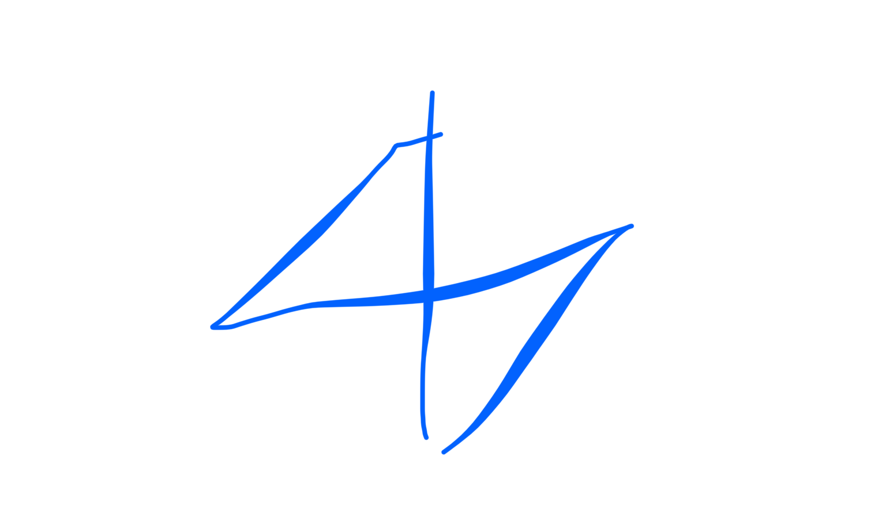

# taichi

tu ri su
ave rapaz buscando a su presa en el vielo
agachas y levantas el talon del pie que vas al evantar (el otro talon esta en el sielo€
u luego abres los brazos haciendo un cieculo pro encima de la caveza y delante

y vuelves a llevar las manos hacia abajo de las rodillas agachadas con el ortro talon levantado listo psra dar la siguiente patada y volver a hacer otro circuo

recuerda que las makos siempre hacen circulo arriba y abajo

jinso manejas diafragma
es el de hacer los dos cirxulos uno a cada lado siguiendo la mano es el diafragma el que se retuerce

el lanchai

en el yan del corazon el codo ha de estar por arriba de la cabeza y entonces sube la mano

bajamos los homoplaros para que la energia del pilmon llegue hasta los pilmones

bajo homoplato  con la mano que baja y abro el costillar con la mano que sube

mover los brazos como un pollo
y colo jnpollo para delante y detras abriendo y cerrando homoplatos y girando lentamentenla columna a un lado y a otro 

#wushu