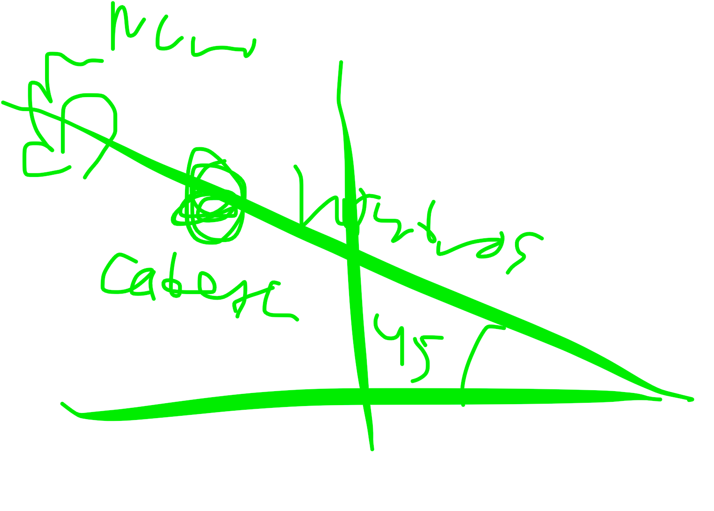

# wushu 1/12/25

la respiracion normal es yin tonifica
la respiracion normal es yan dispersa

la espuma en el pis indica frio en la vegiga: cistitis

la resiracion taoista: primero kormal y luego invertida: cuando normallos brazos suben y llegan a la vegiga, haces movimientos dederecha a izq ascendente y descendente y luego suben los brazos chocan los codos y luego lasmanos se van mirando la palma hacia abajo mientras inspirasknvertidamenre

y luego vuelves

relajarse: 
promero hombros
luego fuera (fan song)
y luego dentro 

relajarse adentro hasta la medula

el higado controla los estados de animo
y sobretodo el estres

mucha sangre arriba es jipertesion: insomnio y tda
poca sabgre arriva tendremos somnolencia e insomnio tambien
un desajusto yin y yan

al hacer la patada del calentamiento
es importante hacerla como la hace borja y asegurarse de que sube el pie arriba, se gira y se recoge

para poder avrir la cadera

viejas enfermedades y nuevas enfermedades: segun si son pre o post bombilla

meditar en la imagen del maestro (...) permite al alumno el camino anhelado por todos

CURSO CHIKUN

el movimiento ha de ser asi para el yin de cabeza

y losnhombros han de seguir paralelos al suelo

el yan dw cabeza cuando llega a ese ñunto te enseña que todos los movimientos tienen una o variasideas: todo tiene idea

cuando hay un novimiebto hay 8 puertas: un movimiento tiene todo, 4 organos y 4 visceras, y puedes ver como todo tiene idea en todos lso movimientos

en un movimiebto tiene que saber donde estan los 8 circulos 

el paicui esta en el punto donde no se ha cerrado la fontanella en los bebes y por ahi entran los 5 espiritus naturales entran por la fontanella

ahi hay un hilo que conecta con el cielo y por eso es natural

cuando haces el yan de cabeza los pies tienen que mirar hacia delante y paralelos no en disgonal si estan en diagonal el gluteo esta cerrado

tienes que tener en cuenra esto para el yan de cabeza 

los 4 yin son union con los 4 yan
la cabeza se junta con el corazon

un yin corazon con yan de cabeza
un yin de riñon con yan de tantien

no es organo y viscera (eos es chikun de 5 elementos)

es el pakua del tachi: no hay higado sin madera y cuando se hace madera se favorece el higado

no hay viento sin madera
corazon con cabeza

cuando hacemos yan de corazon involucramis cabeza 

y cuando hacemos cabeza el corazon tiene que estar en silencio 

la morada del shen es el corazon
si el corazon no esta tranquilonno se puede empezar a pensar en espiritu y noseque y cuando eso esta tranquilo el chinpuede subir arriba