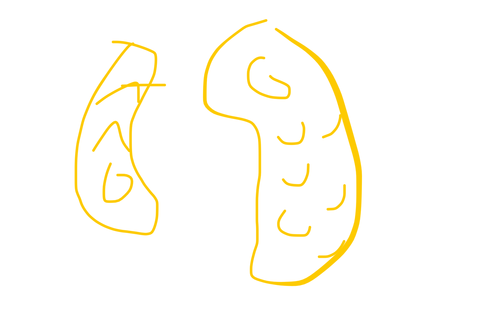
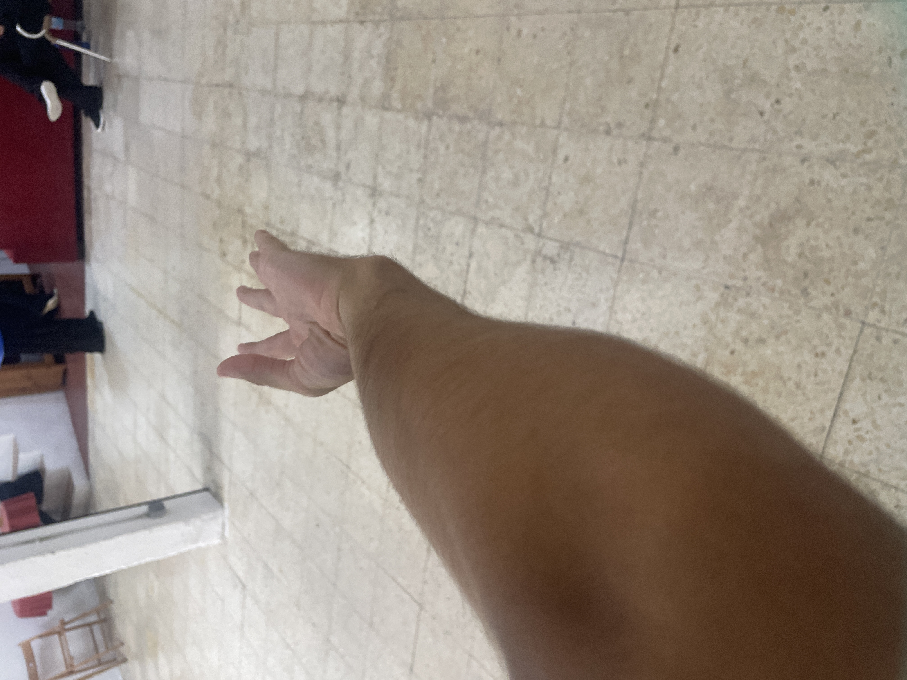

# wushu 18/07/25

despues de eliminar el fuego del higado (con abrir los homoplatos como abanico)

giras pie izq y cabeza hacia atras 
mueves la pierna derecha unnpoco hacia su derecha

y la mano izq prece tecoger yna bandeja y la derecha hace como un golpe de yronco qye cae

inportant homolatos relajados
y manos a la algura del honvro 

este puño es peng chuen (puño de rebote o de denolicion)

este movimiento es un movimiento exaxto para que no haya preponderancia entre yin y yan, permite que esten en equilibrio y harmonia el yin y el yang

tienes que poder coger una lanza muy fuerte con jna mano y con la otra escribir en ma pizzarra

correccion de paso adelante trasladar y golpear los pies es chi shin pu - han chinpu - pa mapu - kompu

NO es homoplatos porque homoplatos siempre necesita moverse, en el peng chuen implicamos los homoplatos

cuando hacemos un movimiento hay que implicar todo el cuerpo pero hay uno que es el capirab

si no moviemos los homoplatos corrextamente no podemos manejar la energia de los riñones

cuando se mueve el cuerpo mueves todo el infinito del cuerpo 

en el montaña (tantien y riñon + yan de riñon) de la forma ayuda la montaña al agua

ahora agua ayuda a montaña

si el homoplato esta arriba no hay riñones

el chikun de los cinco elementos, relacionado con las cicno energias, esta hecho para sentir y dominar la energía original del cuerpo

el chikun de los cincoe lementos esta hecho para que jna peesona sepa el tercer nivel de los 8 niveles que hay dentro del individuo

fan song
sen chin p ku
shin chi

"este compendio de movimientos ayuda a desbloquear la energía y a sentir cada una de ellas"

para que la energia de los riñones pueda manejarse es importante que los homoplatos vayan de areiba a abajo

el chikun del taichi es pea el estudio del bsgua (peng li chi an...) del taichi //=! chikun de los cinco elementos

por que es tan importante el estudio de la wnergia de los omoplatos??? 

si en l mente hay confusion el movimiento estara confuso

para que sirve el movimento de la energia de los homoplatos? epende de si es la energia yin o yan

yin de homoplatos: para que la energia vaya a un punto completo
yan: pra que vaya a todo el cuerpo

y se basa en la energia en cruz

si no se mjeve con rigor los homoplatos no se podra mover

y entonces hacemos una analogia entre el trigrama gen (montaña) y el cuerpo

vacio delante lleno detras
yin yin yan

en jung fu tenemos 5  de energias
energia infiltrante (movimientos cortos)
energia en cruz
hundimiento
espiral
explosiva

hasta ahora hemos habladod e terapeutica
pero no de filosofia!!!

taichi: yin y yan en consyante movimiento, equilibrio, armonia, yin y yan en constante movimiento y circular

el yin y yan originalmente eran 2 peces (referencia avatar)

aquello que no tiene nonbre es el ORIGEN del cielo y la tierra 
aquello que tiene nombre es la madre de todas las vosas

esto esta en el tao te king 

es mas importante el respirar qye el comer 

"si el hombre supiera respirar mejor y comer menos muchas de las enfermedades desaparecerían"

hay gente que no se sacia
ejercicios pra esto:

SHPCQ
si yienes dolor o tendinitis en el hombro
cuando hagas el chua hu sou tou chii
no girar el puño
no forzar

ESTIRAMIENTO DOLOR HOMBRO

estiras el brazo con el pulgar hacia arriba y lo giras poco a poco. para estirar los tendones

hasta que duela!! cuando duela pras

BAGUA
el ejercicio de la mano con l columna es 
el brazo de la pierna de delante esta en la misma linea hacia la columna

[B83FCD19-6CB2-423A-9EF0-785D62D4179D](attachments/B83FCD19-6CB2-423A-9EF0-785D62D4179D.mp4)

como te quedas clavado en la 3a con la mano que tienes delante en konpu

pasas lampierna por detras

y sin mover la mano tienes que girar el cuerpo
(moveras la mano para atriba yabira bajando)

y se te queda la mano asi

y clavas 2 manos adelante
y luego sacas la siguiente mano y pones la otra pierna por detras y repites