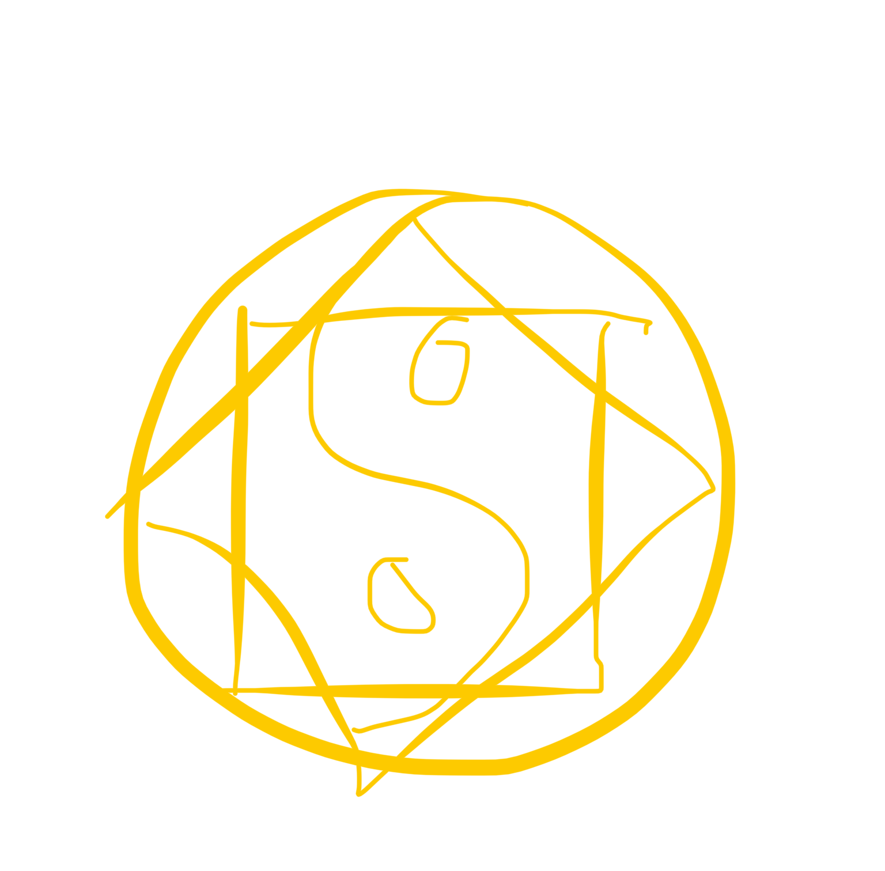
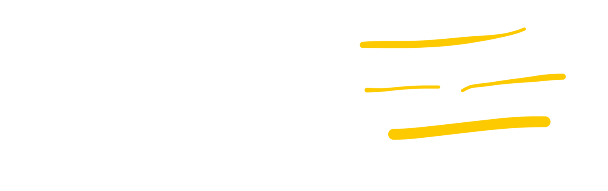
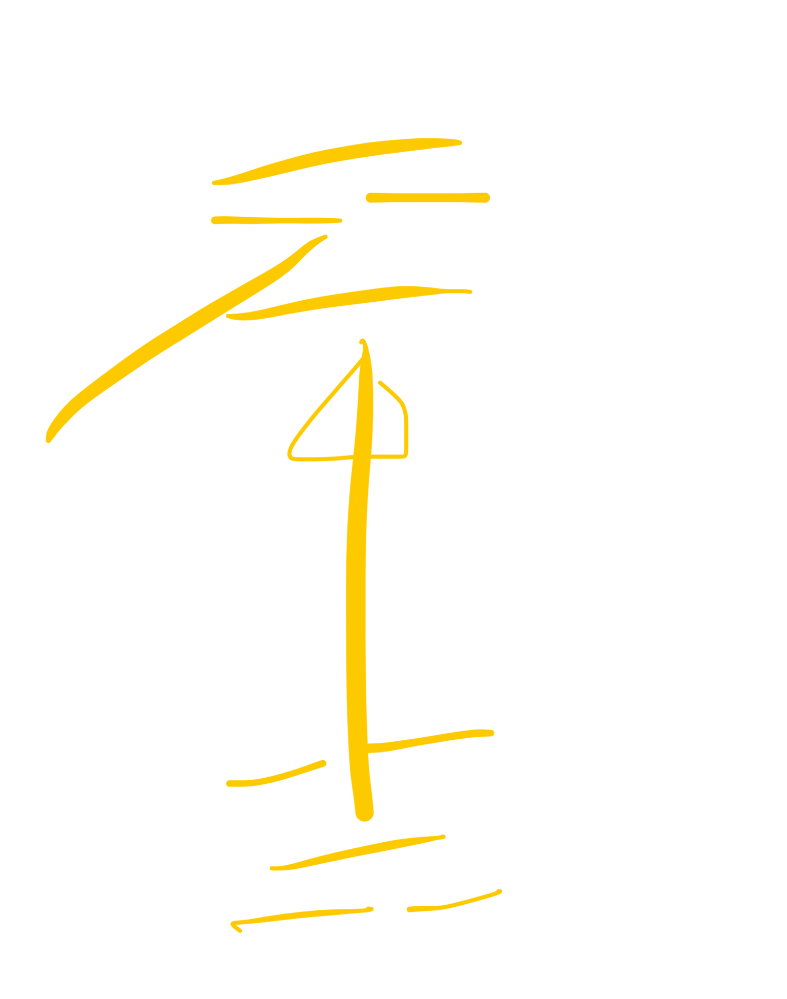
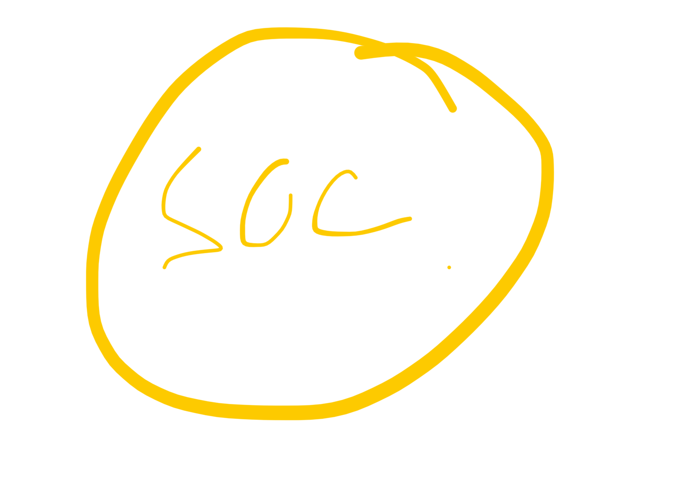
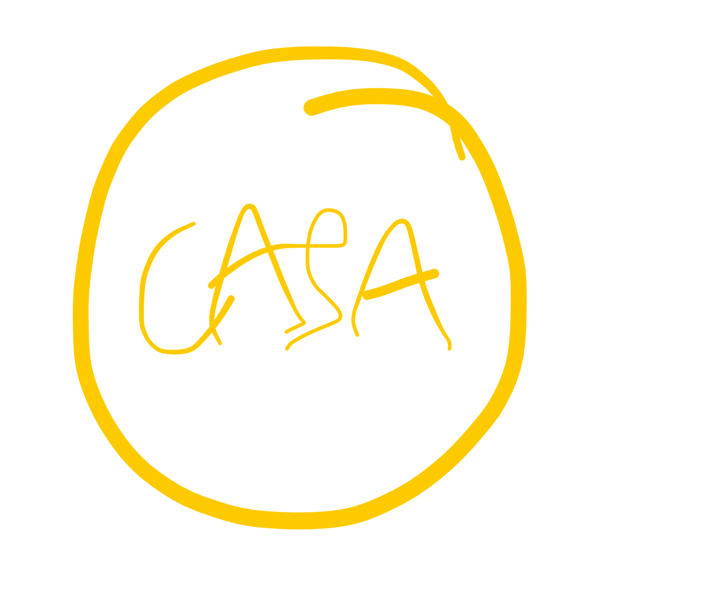

# wushu 25 06 25

太
taichi alude a los dos principios yin y yan (antes el taichi se llamaba puño supremo o puño de algodón)

el iching
yi jing

el bagua natural y el no natural
la filosofia del taichi es el iching y el tao te qing (o algo asi)

antes del yin y yang viene el wuchi

necesito movimientos que ayuden a mover la energia yin y la energia yang

la energia yin del corazon es pra sentir (la energia) (y se siente cuando estas en amor o follando, eyaculando)

la energía viene de los riñones
y se siente con el corazon, con la funcion yin del corazon

y el movimiento yang del corazon es la capacidad y accion de ir adelante

el yang del corazon es para sacar esa energia, si no tienes yang del corazon no eres empatico, por eso tenemos el saludo de quanyin, para que salga la energia

y el ying para sentirla

el corazon es la cabeza el pensamiento el espiritu
todo el mundo tiene energia y esa energia se tiene porque estamos vivos y normalmente se mueve en union con la sangre por una serie de canales

la energia empuja la sangre (yan)
y la sangre nutre la energía (yin)

yin es cuerpo 
yang es la energia

ese movimiento de sangre y wnergía es un movimiento natural, porque tu no tienes que pensar como mover esa sangre o esa energia

hasta que das con un maestro que te ayuda a mover esa energia

lo que  hacemos con el ying del coeazon es calmarlo para que pueda sentir el flujo de energia

como mantenemos el corazon tranquilo?
- [ ] tranquilo
- [ ] alegre
- [ ] y pocos deseos

cuando hay muchos deseos el shen que mora en el corazon se desenraiza

una cancion tiene uin y yang
dentro del movimiento hay ambas
sin ambas no hay cancion

en este mundo todo tiene agua
pero jo es lo mismo que beberse una cerveza que beberse una copa de vino

en comun: agua
en no comun: sabor y color

cuando hacemos el movimiento yin del corazon el corazon tiene un trigrama que es el lí, la tecnica es lü

la raya que esta en vacío de en medio es ying. el movimiento inferior y superior es yang pero el central es ying

cuando hacemos eso, el corazon tiene que estar vacío

cuando nos hacemos mayores los riñones y el pericardio se debilitan y sube el fuego

y para meditar es muy importante el estado ying

el movimiento li primero es lleno, de kan psa a li, cuando estiras los brazos el corazon se vacía de chi y del suelo

cuando sale el brazo hacia arriba tiene que moverse la energia se mueve desde el centro al extremo de la pierna y el extremo del brazo, **los pies y los brazos se llenan de sangre y energía**

primero lo vaciarás para luego llenarlo de manera equilibrada

y por eso el trigrama lu es yan yin yan

y cuando haces el yan del corazon primero estas vacio en el centro y los dos brazos se llenan

la energía se mueve en espiral hacia las manos (yan) y la sangre con el peso se va hacia las piernas (yin) y entonces en el centro queda vacío

al primcipio sentiras calor en las manos 

y cuando giras y vuelves a cambiar los brazos el centro se vuelve a llenar y se vuelve a mover

la preponderancia es mala pra el corazon es necesario en vacio, si no podemos tener falta de atencion, de memoria, porque tenemos exceso

sintomas graves del yan del corazon:
el bolo histerico, mucho bostezar, la tartamudez (porque el corazon esta relacionado con el habla, para hablar hay que mover la lengua)

por eso el ictus lo primero que se nota es el habl, porque afecta al corazon

(mola que flipas esto)

objetivo: mover segun la ley de los trigramas

el maestro del maestro estudio el iching. un nivel oracular

SHQCH

budismo y taoismo
nonhablamos de religion sino de filosofia
(maestro su: religion no meditacion si)

esto es un mundo un espacio y tiempo

en este espacio y tiempo hay muchas personas, muchas personas son una sociedad

esta sociedad es barcelona

//marcelona???

y hay tambien casa

dicen que xuando uno se consagra monje budista y quiere ayudar a la gente, ese monje se integra en la sociedad

a traves del budismo para ayudar a la sociedad

pero cuando se quiere ir en soledad vas con taoismo? a tu casa? (wn este caso a la montaña)

espiritu budista: ciudad
espiritu taoista: casa

el taoista se aleja de la visa mundana para recluirse en lo mas profundod e la naturaleza, es uno con el todo, uno con l naturaleza

budismo: yo voy a la gente
taoismo: gente viene a mí

si no hay un desapego total no se avanza

yin y yang
taoismo y budismo
(filosofia, religion espiritualidad son 1)

el camino del tao solo hay una manera
un pwrsonaje que habia escuchado hablar de los rextos antiguis del taoismo

el se lo tomo al extremo y abandono a su familia

y asi tiene los 7 espiritus sucios

en el budismo hay confucionismo hay familia
en el taoismo hay lo natural

el camino del tao es lo natural
el primer paso es el desapego

vivir en lo natural no necesitas nada, eres tu con lo natural

saber cual es tu camino

hay 3 cosas que no te puedes morir
ni pobre
ni sucio
ni de hambre

porque te mueres connlos 7 espiritus heredados

y cuando mueres se elevan con los 5 naturales

12 espiritus son del taoismo

vivir solo vs vivir en soledad

el verdadero secreto para alargar la vida (longevidad) es dormir solo

el anciano de 80 años que tomaba una píldora: llevaba mas de 60 durmiendo solo

el sueño es fundamental para que los riñones descansen, tonificae los eiñones su funcion yin es el descanso

los principios de xiang long: no podias hablar ni enfadarte cuando estabas en la cama con la cabeza en la almohada, hablar tumbado en la cama tampoco

xuando comes masaje y luego mil pasos

feng sui de la cama
que necesidad hay de ponerle trabas al sueño cuando ya es dificil dormir solo

el equilibrio pra que una familia viva durante muchos años segun el taoismo, para un esuilibrio verdadero prtes de que cada uno tiene que dormir enmuna cama direferente que no hayan dialogos aue te impidan concilir el sueño

el enfado de pie y de dia

y hay un equilibrio

el camino del tao solo lo puedes atravesar cuando cuerpo energia y espiritu estan naturales

eso solo es en el utero materno

y todo se sstropea cuando vienes al mundo