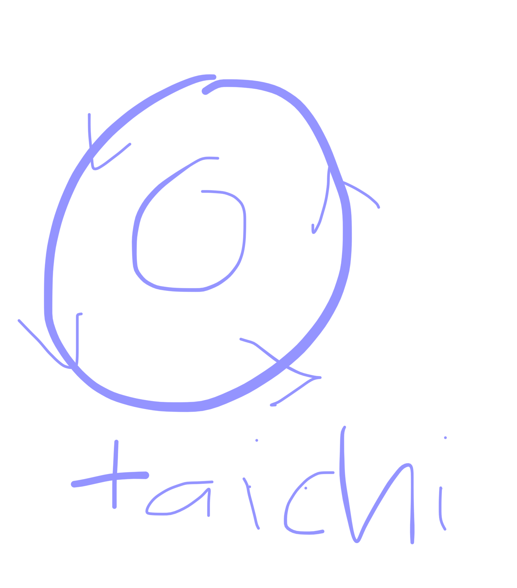

# wushu 25/09/12

TAICHI
chen taichi el estilo original

taichi chuan tiene varias familias: unos personajes que genwran unos wstilos

nosotros hacemos el estilo "yan", de la familia yan que lo creo yan lu chan

hay una familia anterior a la yan, que fue creada por un general retirado chen wo chi (entre la dinastia --- y ming?) 

hizo el original taichi chuan

el origen chen taichi chuan

el de chen wo tin es wl mas antiguo

durante muchos años este solo sw pracrico en la familia de los cjen

hasta que aparecio yan lu chan, entro como sirviente entreno a escondidas y cuando se reto a la familia con lo que habia aprendido a escondidas, yan lu chan pudo ganar al retador

cuando llwgo al jefe de los chen, yan lu chan fue entregado todo los conocimientos

y se fue a beijin hy estuvo enseñando esto y tuvo ranta popularidad que hasta la corte impwrial quiso aprender

este estulo era tan duro que el quiso suavizarlo entonces asi se origino del chen taichi el yan taichi 

se conocen solo 5 estilos tradicionales de taichi

a quien hay que sscuchar sobre esto es de los pwriodistas que fueron a investigar 

original: chen wo tin ñuego surge el yan y luego surgen los 3 estilos (sun, bastante reciente de sun wu tan, el estilo wu, de wu chen jio, y el estilo hao)

las diferencias:
el chen es explosivo 
el yan no es explosivo

//el taichi se centra en absorver la energia del oponente con 5 metodos de generacion de energia. con la forma uno no puede luchar y por eso se tienen ejercicios auxiliares

YAN LU CHAN

yi lui xiao? es quien enseña al marstro del maestro

CUANTOS PEINCIPIOS SE ESTUDIAN EN EL VAGUA DEL TAICHI: son 8 principios fundamenrales

peng li chi yan (...)

google dice: Los "8 principios fundamentales" del tai chi pueden referirse a dos conceptos distintos: las Ocho Fuerzas (Bafa) (Peng, Lu, Ji, An, Cai, Lie, Zhou, Kao),

fisica cuantica:

stephen hawking demostro que los agujeros negros sw evaporaban y lo explcia mucho

BAGUA

## **linea de bagua**
dong hai chuan/chuen
yin fu 
tom pao tien
yu lun chiu
su yu chan
laoshi carlos garcia

el linaje da seriedad

a tom hai chuan se le venera y respeta se cree que alcanzo un nivel muy superior

se dice que cuando se murio fueron a levantar el ataud y no podian levantar el ataud del suelo

y se oye la voz de fondo "ya os dije que no habeis aprendido ni una cuarta de lo que se" e hizo una repsiracion y ya se pudo levantar

el bagua zhang su origen esfa en el iching

quien fue el peimero que creo el ordenador?:

el nombre que ñe pusieron al promer ordenador: fu xi, el padre de la geomancia china 

dong hai chuan tenia un nivel tan elevado 

el bagua es esto: entender y entrar en otra dimension

tuvo muchos discipulos (cuando sale de la corte imperial) pero tuvo el primer disxipulo que fue yin fu, pero hay un segundo discipulo: chen tai quo (el gafotas, regentaba una tienda de gafas)

laoshi es discipulo de chen tai quo

dong hai chuan exigia siempre un estilo antws de enseñar bagua: luo huan shaoling

[https://www.ecured.cu/Dong_Hai_Chuan](https://www.ecured.cu/Dong_Hai_Chuan)

los ordenadores de basaban en wl cosigo binario vasado en el iching

el iching es binario al final

en la cuarta linea la manonno esturada sujeta la otra

el bagua es muy supwrior por como esta confeccionado el movimiento por la parte esqueletico muscular pra llegar hasta la medula

el movimiento de retorcimiento de la columna

si el maestro es sincero el alumno empezara connel pa sing chan: los 8 caracteres del bagua y te permiten entender gran parte d elo que ws la base del agua

el primer movimiento es donde se estudian los 4 basicos de cintura

bagua no natueal: linea
bagua natural: cieculo

el movimiento de serpiente hay que retorcer todo lo que se pueda siempre por debajo de la cadera

la energia en espiral que hay en el interior del cuero

bagua la diferencia cin taichi: tu en este mundo que quieres? mas allq del combate

TAICHI:
en el taichi todo se mueve en direccion donde se mueve el mundo. taichi quiere que camines en el sentido del mundo y formes parte de la energia universal. en la noche has de estar en un estado yin, porque I no, estas a contraflujo. y por la mañana estaras en un estado yan (aunque hoy en dia en la sociedad hemos dejado de estar en consonancia con la naturaleza. hay un antes y un despues y es el momento en el que se crea **la primera bombilla**: pasamos a no ajustarnos a las leyes del universo, podemos saltarnos la oscuridad y ((dejamos de ver el cielo)) cuando no hay luz tienes que estar yin). en verano nos acostamos mas tarde y hablamos mas fuerte, en invierno no emprendemos nuevos negocios sino estamos en quietud y meditar. eso es estar en equilibrio: yin y yan en constante movimiento y circulo forman taichi. el circulo no tiene ni principio ni fin y eso es la vida. cuando un ser querido se va forma parte del ciclo. cuando por la noche el cuerpo muere y siempre hay un despertar que da la vida (el tema de homestuck cuando los matan en sueño doblemueren y renacen como godsona???) 

energia yin y yan bagua y cinco elementos. en taichi eres uno mas

BAGUA: yo aqui tengo el poder de que todo lo que esta a mi lado mueva alrededor mio: yo soy el eje de todas las cosas, un chaman que domina los 5 elementos. en bagua lo que quieres es todo mueve entorno a tu eje y cuando esramos en corxulo y hemos dominado el circulo y buscamos un efecto chamanico y entramos en trance y una vez que entranos en trance somos conscientes de que todo lo que hay mueve altededor mio (y mueve en sentido contrario)

por eso el bagua es superior porque busca burlar a la muerte, y solo el estudio del bagua puede con la practica

el reloj siempre tiene un movimiento: clockwise, y nosotros queremos ir counter clockwise

el bagua sienore empieza de uzqyuerda a derecha

por eso en china mucha genre se tira mucho tiempo andando hacia atras

FILOSOFIA: uno es mas pequeñi que el otro por la filosofia: es la filosofia que nos permite vivir en estw mundo. los que estan en este mundo y entiendne hay 2 niveles: estar en harmonia y manwjar esta harmonia

