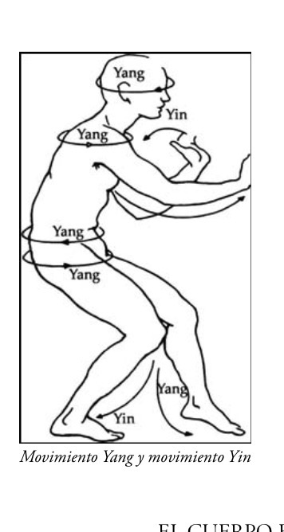

# wushu 27/10/25

2a parte MANTIS SALE DE LA CUEVA 2

se abre y se cierra como la parte 1

wl orden es:

8

1 
(lv 2: manos van ambas al costado del que ssaldran)

10

9

12

TAICHI REPASO DEL UÑTIMO CACHO DELA FORMA LARGA

el ying y el yang tiene una simbología (☯️)

hay ying y por otro yang y cuando se ponen en constante movimiento y de manera circular forman el taichi

## yin y yan unidos y en constante movimiento h de forma cirxular forman el taichi

el taichi es equilibrio; estan siempre en constante intercambio y dominancia y hay que mantener un equilibrio entre las fuerzas omnipresentes y omnimarcadoras? yin y yang

tienen tendencia a desequilibrarse

el yin es cuerpo
y el yan es espiritu

hay energia de esencia
y energia de espiritu

y por eso el taichi empieza por el riñon, particularmente por el yinnde riñon

el yin de riñon nutre el cerebro

el cuero humano suele tener 2 desequilibrios segun afecten al cuerpo o al espiritu

la relacion del yin y yan es la relacion entre los riñones y el corazon: riñones y corazon fuertes maravilloso

el origen del yin y yang son 2 peces con escamas: el yin y yang inspira un circulo, y en el **taichi todos los movimientos han de ser circulares**

y **una dinamica de lentitud**

el silencio se consigue cuando estamos en movimiento circular y en condtante movimiento

el circulo no tiene ni principio ni fin: una energia vieja se une con una energia joven y eso es el taichi

en el taichi desde que empezamos a terminamos es un circulo

cuando hacemos taichi se ve silencio y circulo y misma energia

en taichi cuando se estab movimento se dice que se mueven 8 circulos 

**cuando se mueven los 8 circulos se produce magia**

un dia es un dia porque tiene dia y noche

los nacimientos vienen por la union de un hombre y una mujer

los riñones nunca sufren de exceso de yang (ni el corazon po esceso de yin?)

todo esta conectado mediante la microorbita: todos los meridianos yin estan conextados y cada 2hs es un meridiano

y hay horarios de actividad y de descanso

el insomnio es mucho fuego en el higado???
y es el organo que mas sufre

para dormir no podemos leer un libro porque los ojos son la cavidad del cuerpo que mas sangre gasta y para que se mueva la sangre se necesita de movimiento yan de higado: si lees un libro a la 1am robas el descanso al higado

todas las "enfermedades modernas" llegan desde el momento en que se inventa labombilla: cuando conquistamos la noche y rompemos el equilibrio

| Hora solar (local)                                                | Meridiano                                                         | Nombre chino (拼音)                                                 | Elemento                                                          | Órgano asociado                                                   | Función principal                                                 |
|-------------------------------------------------------------------|-------------------------------------------------------------------|-------------------------------------------------------------------|-------------------------------------------------------------------|-------------------------------------------------------------------|-------------------------------------------------------------------|
| 3:00 – 5:00                                                       | Pulmón                                                            | 手太阴肺经 (Shou Tai Yin Fei Jing)                                     | Metal                                                             | Pulmón                                                            | Respira el Qi, distribuye la energía, tristeza, despertar natural |
| 5:00 – 7:00                                                       | Intestino grueso                                                  | 手阳明大肠经 (Shou Yang Ming Da Chang Jing)                             | Metal                                                             | Colon                                                             | Eliminación, decisión de soltar lo que no sirve                   |
| 7:00 – 9:00                                                       | Estómago                                                          | 足阳明胃经 (Zu Yang Ming Wei Jing)                                     | Tierra                                                            | Estómago                                                          | Digestión física y emocional, apetito                             |
| 9:00 – 11:00                                                      | Bazo / Páncreas                                                   | 足太阴脾经 (Zu Tai Yin Pi Jing)                                        | Tierra                                                            | Bazo                                                              | Transformación de nutrientes, energía mental, reflexión           |
| 11:00 – 13:00                                                     | Corazón                                                           | 手少阴心经 (Shou Shao Yin Xin Jing)                                    | Fuego                                                             | Corazón                                                           | Circulación, conciencia, alegría, comunicación                    |
| 13:00 – 15:00                                                     | Intestino delgado                                                 | 手太阳小肠经 (Shou Tai Yang Xiao Chang Jing)                            | Fuego                                                             | Intestino delgado                                                 | Asimilación, discernimiento entre puro e impuro                   |
| 15:00 – 17:00                                                     | Vejiga                                                            | 足太阳膀胱经 (Zu Tai Yang Pang Guang Jing)                              | Agua                                                              | Vejiga                                                            | Eliminación de líquidos, energía física y muscular                |
| 17:00 – 19:00                                                     | Riñón                                                             | 足少阴肾经 (Zu Shao Yin Shen Jing)                                     | Agua                                                              | Riñones                                                           | Vitalidad, esencia, miedo, voluntad, longevidad                   |
| 19:00 – 21:00                                                     | Pericardio                                                        | 手厥阴心包经 (Shou Jue Yin Xin Bao Jing)                                | Fuego                                                             | Pericardio                                                        | Protección del corazón, vínculos afectivos                        |
| 21:00 – 23:00                                                     | Triple Recalentador (San Jiao)                                    | 手少阳三焦经 (Shou Shao Yang San Jiao Jing)                             | Fuego                                                             | Sistema hormonal/metabólico                                       | Equilibrio térmico y hormonal                                     |
| 23:00 – 1:00                                                      | Vesícula biliar                                                   | 足少阳胆经 (Zu Shao Yang Dan Jing)                                     | Madera                                                            | Vesícula biliar                                                   | Decisión, coraje, acción planificada                              |
| 1:00 – 3:00                                                       | Hígado                                                            | 足厥阴肝经 (Zu Jue Yin Gan Jing)                                       | Madera                                                            | Hígado                                                            | Almacenamiento de sangre, flujo del Qi, gestión emocional         |

tratamiento 3 agujas para dormir