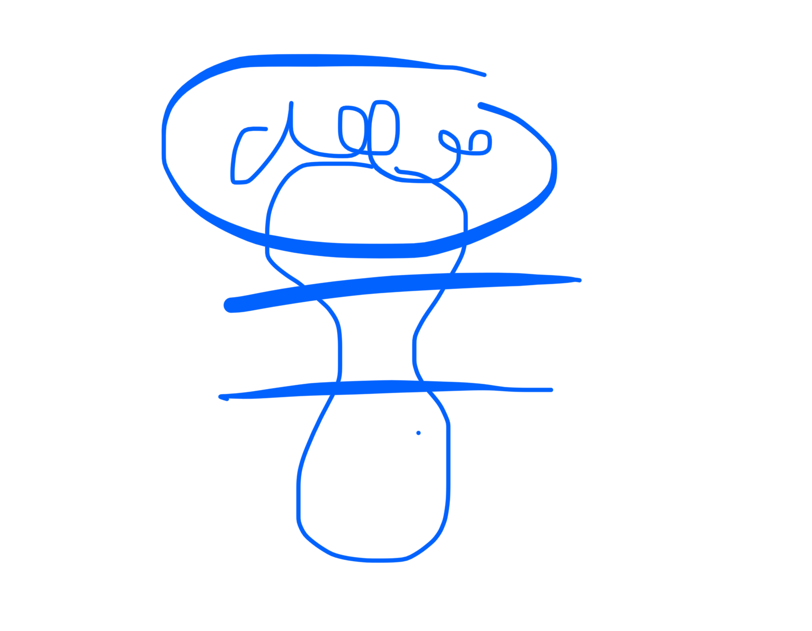
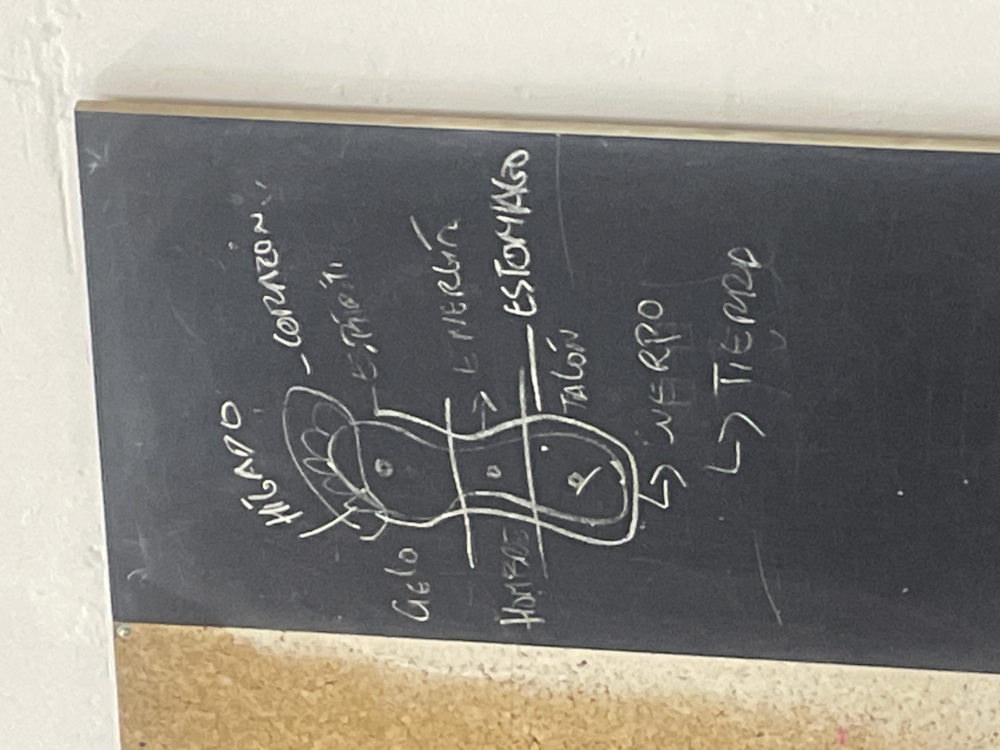

# wushu 28/05/25

MANTIS DE LAS SIEte esteellas
ji shin pu y lu huang pu
se llama asi porque siempre una pierna tiene 4 puntos de apoyo y otra tiene 3

LAS POSICIONES BASICAS
mapu: bloqueas con un brazo de donde vas a ir y luego el contrario que se queda arriba y lanzas el puño con el mapu
luego la mano que protege se va a la cadera y hanpu(como el shippu pero los dos pies casi juntos) MANTEN LA LINEA DE LA CADERA DE ALTURA
luego lanzas puño connla pierna de su mismo lado y konpu
luego puño contrario y puño del lado

para el ji shin pu la pierna de atras se pone peroendicylar a la de alante 
el codo de atras esta como en el ckou
y la otra esta en la cadera abierta y hacia arriba
los pies tienen que estar de manera que si bajas el peso la rodillade atras del pie que esta recto tiene que estar a un puño del pie perpendicular que esta delante 
y luego cuando lanzas el brazo lo lanzas ya como agarre y el otro agarre que estaba en kou como que estira hacia el pecho
y la pierna hace como zancadilla ligeramente hacia el lado

para el luhanpu la pierna de delante se recoge en rodilla y no toca el suelo la mano de delante va a la cafera de nuevo palma arriva y la otra palma abajo encima de la caneza
y te puedes quedar ahi
al bajar la de la cabezase queda a un puño de l rodilla de delante palma hacia abajo como cubriendo 
el pie de detras avanza un poquitin sigueindo la fuerza
y la mano que es como tronco que cae es la misma que la rodilla que esta delante

LAS LINEAS REPASO PUÑOS 
horizontal vs vertixal
1a: horizontal y puño de tronco que cae
2a: horizontal
3a: horizontal
4a: horizontal
5a: horizontal, horizontal y puño tronco cae
5a GIRO es como la 3a!!!
6a: horizontal horizontal vertical

//hoy el maestro ha shippeado el manu x bruno diciendo que manu corazon yin y bruno guerrero yan mola e

taichi: 
desplazamiento diagonal hacia delante es 4 pasos 
desplazamiento diagonal hacia detras es con el de yan cabeza este de lanzar l palma hacia delante tocando todos los dedos unos con otros

caminar hacia delante es yan es fortalezwr cuerpo
el de yub es para fortalecer sspiritu

el yan de cabeza la mejor manera es ir hacia detras

en taichi la planta fe los pies es yna cosa muy terapeutica
el talon es para rl fortalecimiento fe cuerpo y la tierra y el riñon???
el medio del pie es pada la energia y el hombre el ser humano
y la parte de delante que NO los dedos es para el espiritu el cielo

el taichi chuen tiene mucha importancia el apoyo: apoyar el talon da un masaje a los riñones, coml al apoyar normalmente los talones cuando caminanos

la energia electromagnetica deknmudno con el apoyo correxto de la planta de los pies en el suelo es muy importante

el punto fe arieba en el talib es estomago
y depende de como apoyes los pues sera corazon o hugado

como cuandobhaces el yan de corazon en la forma larga apoyas los dedos pero no pones peso y esto calma el corazon

el yan de cabeza hacia atras invita a la muerte, el sentido contrario de las agujas del reloj

y el equilibrio es fundamental

encontrar el centro
se estudia chung ting
el centro es la quietud
para poder contemplar pra poder ser pea poder percibir lo que hay alrededor

la fé se consigue cuando uni tiene centeo
cuando no tienes centeo todo es mentira

ausencia de duda al empezar
ausencia de duda al terminar

cuando alguien transmite uno tiene que tener fé

la diferencia entre visitar y habitar
el hambre turista por tener una vida que no se tiene paea huir de la propia

por eso se visita

porque jo se habita

la practica se guarda en el corazon
y se practica con el cuerpo

5 principios de espiritu
el rpimero eL centor chung ti

para caminar atras con yan de cabeza
han chi pu
apoyas dedos
lanzas hacia delantem manoncin la pierna contraria hacia detras
llevas peso atras
y recuperas pierna de delante sin peso pero apoyando todo el pie
y luego al jacer el han chi pu ya te pones en la siguiente diafonal
y sigueis

para girar como se hace???

-----------

el taichi lo llamamos taichi chuan
el chuan o quan es entender el uso marcial de las formas

es por eso que se llama arte marcial

tiene la forma
el tui shou (rrsbajos de tui sou) (aqui estab las formas en pareja)
y las aplicaciones de combate

tui sou:
peimero tansou tui (una mano)
luego s dos manos

y luego la estructura del taichi traidxional
peng(tomdo empieza aqui) 
lü
shi
an

pen shou tue (texnixa de empujar manos)
luego viene lu luego s

taichichuan: uñtimonouño supremo