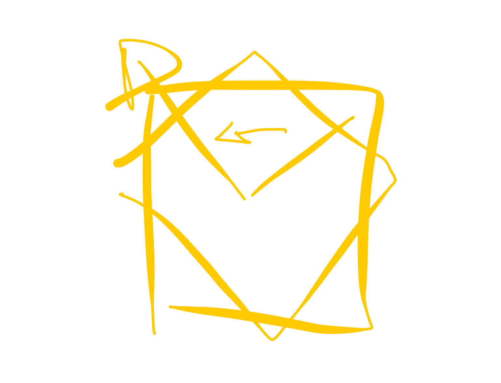

# wushu 4/07/25

continuacion taichi
despues de la palma esa hacia arriba post el girado de cabeza
calculas 90º hasta la izq y apuntas con la mano que tenias felante la otra se va al sobaco

retuerces hacia donde mirabas antes girando el codo alrededor de tu eje y la mano del sobaco a la cintura y bajas la postura

y lanzas la mano de la cintura empujando hacia delante y la otra que te cubria se desenvuelve hacia arriba arriba de la frente

y avanzas con paso de mono (no kompu, sino avanzas pie y luego te quedas en una especie de bamapu pero mas corto

BAGUA
meditar en la imagen del maestro permite controlar el caracter y la energia

puño de los ocho caracteres del bagua
ocho lineas para infundir el caracter del bagua al cuerpo
para hacer cuerpo de bagua

ba sing chan chuan

## dictado por el maestro:
"aquel alumno que un día podrá convertirse en maestro es aquel que mira al maestro con ojos de zen"

"es la única manera de poder obtener la energía propia del maestro"

### ojos de zen:
si la enseñanza es igual por que algunos se quedan atras y otros alante?

son aquellos que tienen la capacidad de ver, que estan preparados para a través de sus ojos

si quieres realizarte como tal tus ojos tienen que ser aquellos que captan la energía del maestro

cuando ve al maestro y como expresa esa energía y entonces tu puedes expresar esa energía

aprender a observar

el mundo pone un corazon
un corazon tiene yon y yan
el corazons e relaciona con el sjen (espiritu)
el shen tambien tiene una psrte yin y yan (como todo)

pero ahora separas el corazon por la mitad
y el corazon de manu tiene una mitsd de corazon bueno y otro de disperso, lleno de terminas

por los ojos se ve el corazon de las personas

y separa mas las energias
el bagua es alegre (como los airbenders) es rapido 

un budista quiere alcanzar el estado de budeidad, muy parecido al vacio

ellos quieren es escapar de la rueda de este mundo

"tu vuelves porque tienes algonque limpiar"

al templo de shaoilin se le reconoce por el pirnxipe hindu que estuvo 9 años en la cueva de la parte alta de la montaña

por que lo hizo??? porque cuando el visito por primera cez veia que muchos monjes enfermaban y pregunto que por que no hacian ejercicio, qyw el cuerpo es un vehiculo y que si el cuerpo se sstropea...

en los textos antiguos en sanscrito "una vez muerto el cuero pellejudo se queda en este mundo y lo qye se eleva es el espiritu"

y dijo que si pero que si no cuidas el cuero pellejudo que esteopeas el vehiculo...

cunado salio trajo los fos tratados ichinchin y shuchinchin h ahi dentro esta el shi pao lo hang kun (luo han kun) y luego a partir de este se creo el shu painlo

tiene el proceso de estudio del lavado de la medula y el desarrollo de la apertura de los tendones

con el shi pao lo han kun si se empeiza dw jocen siempre joven

ejercicio para el retorcimiento del disfeagma

meditacion en mantis???
la meditacion no se crea en el lung fu
suni que estan fuera y se adoptan

la mediracion no tiene que pasar poe quietud, hay muchos tipos de meditacion, la vida es una completa mediracion

cuando en la vida aprender unas pautas... ya wso es una meditacion

pero el shi pao lo han kun es tan superior porque los ultimos wjercicios son puras meditaciones: hay 18 meditaciones

antes fe estar quieto siendo joven primero mueve y limpia medula

si miramos rodo lo que tiene vida porque todo tiene circulo

el gran circulo al que esramos conectados (sarazanmai)

mas alla del circulo hablamos del movimiento

el constante dinamica del yin y el yan

"cuando vienes aqui vienes con el movimiento y cuando te vas te vas con el espirtu"

## que debe aprender un joven del maestro
los padres te dan enseñanza y educacion
maestro te da formacion

pero un maestro de kung fu o de alquimia

"un joven debe de buscar del maestro herramientas para saber vivir": como tu manejas la energia de este mundo, el aspecto yin y yan

un joven que busca un maestro para saber vivir o un viejo que sabe que le quedan pocos años de vida

un joven busca maestro para saber vivir
y un viejo busca maestro para saber morir

sabiendo wue al final todo es un circulo

wuchi
