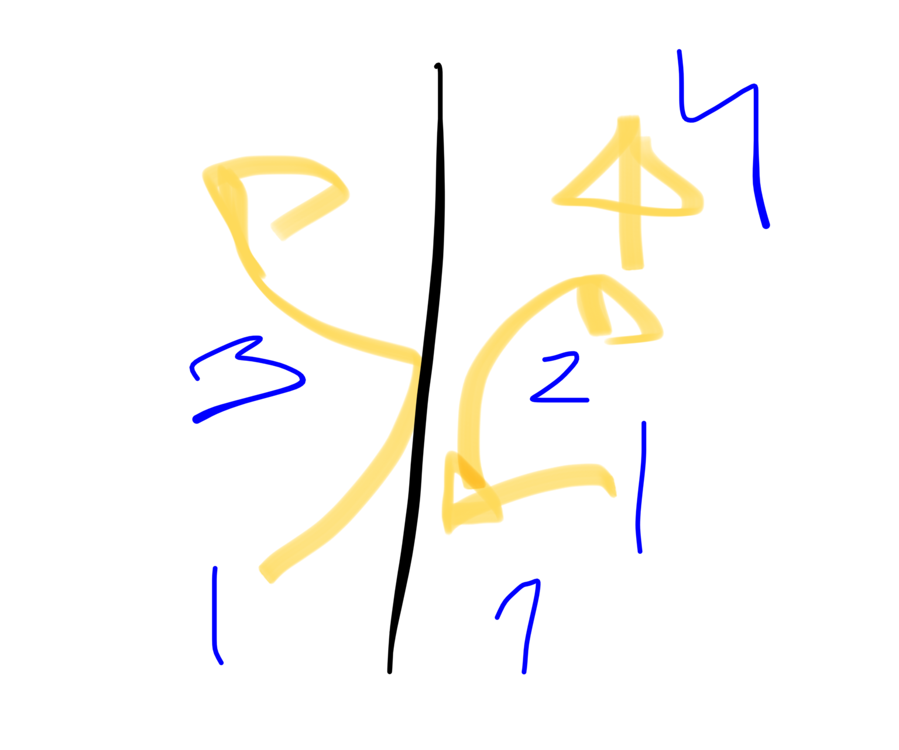

# wushu 6/6/25

#wushu 
continuacion lanchai
despues de la cruz
recoges puño derecho y palma izq bajo el ombligo y pesi a la derecha
luego peso a la izq 

preparas rodilla puño ferecho meñique tocando menton y palma izquierda tocando codo

NUEVO
entonces caes con el pie de delante perpendicular y la rodilla izq esta a un puño fel suelo

y giras hombros y recoges el codohasta el costado con lanpalma izq en el antebrazo
y entonces adelantas la palma izq rozando hasta quedarlo felante

y ahora hanchi pu pones pie puntillas izq y manos a las 6 (abajo)

y entonces pa mapu y manno a las 3 (siempre vuscando la circularidad

y luego konpu y lanzas puño derecho alienando el codo derecho con la rodilla izq que ese brazo este como a 80 

SHQCH

el shqch el mov mas importante qye representa el estilo es el zhua hu 

1 quietud
2 movimiento y llegar con quietud
3 movimiento 

cuando no se hace chanchuan(quierud) se nota que no hay quietudnla energia no fluye y esto se consigue quedandose en la postura

esto es asi para todos los estilos

chanchuan practicar 3 respiracions en quierud

los cimientos son la quietud
eso son las catas pornlas que encima va el hormigon

y encima de ello van los pilares
y las plantas son los esquemas

los basicos de SHQCH
(hay un tutorial y el libro)

la base es el xhan zhuan )quierud)

BAGUA

no olvidar es respeto al maestro
maestro dice que me lo enseñara todo
que le gusta mi caracter
asi quw esperare

no olvidar es respeto al maestro

el maestro su decia que el venera a quanyin
que es como la virgen maria para los chinos, la diossa de la conpasion, porque es la unica diosa que cuando estas delanre y le pones 3 incienso le puedes pedir cualquier cosa, a otros santos no puedes, pero a quanyin mientras te inclines u pongas incienso puedes edir lo que quieras

se representa con mil ojos y mil manos
(como atlas???)

en taichi el paohoulichuisan??? representa esta diosa

hoy enndia el budismo y el taoismo se han fusionado y ya son una cosa ya casi nos e distingue

el maestro su decia que el como quanyin en lung fu que todo lo tiene 

el maestro su decia que todos sus discipulos tienen que esrudiaelo rodo pero no quiere decir que r eguste todo pero tiwne sla obligacion de esrudiaelo rodo y aprendee y recoedarlos rodos

pero tu puedes decidir con cual llegar al final o con cual quieres morir

ella es la que cuando hay un naufragio rescata a la gente que lo necesita

en china hay w energias que se adoran
quanyin?para hombres
buda para mujeres

al maestro se le respeta con no olvidar
si olvidas es falta de respeto al maestro
prohibido olvidar

ver el ultimo video del maestro (hoy es 6 de junio)

BAGUA cuando haces la primera
en la basica los pies estan hacia delante
y cuando lo giras ko haces tampoco pie de bagua sino que estas con el poe casi recto (es mentira el laoshi dice que se pueden ambas)

linea 2:
cuando cas a empezar haces konpu (el beazo siempre esta en la misma linea horizontal y no bajas ni subes

LINEA 3
chi luo pae quo

estando pie izq delante es
lanzar pue derecho -45 (izq)
clavar en el suelo
recoger mirando haciadelante
y golpear con pie 45 (der)

entonces es 
lanzar el pie rozando el suelo con el talon
y pa mapu?
eecoger pie levantando rodilla
lanzar pie hacia el otro lado y repetie

SHQCH 2
asi se mueve el zhua hu
linea central es blanca
pies son azul

MANTIS
el puño horizontal esta un poco curvado hacia abajo
y el piño certical tambien
porque la energia tiene que dluir por arriba del brazo

fu yu chuen
pi chuen

cuando es peng chue el puño de tronco que cae
la energia circula por abajo
entonces ralbien giras  ligeramente la muñeca pada permitir ese flujo

#wushu