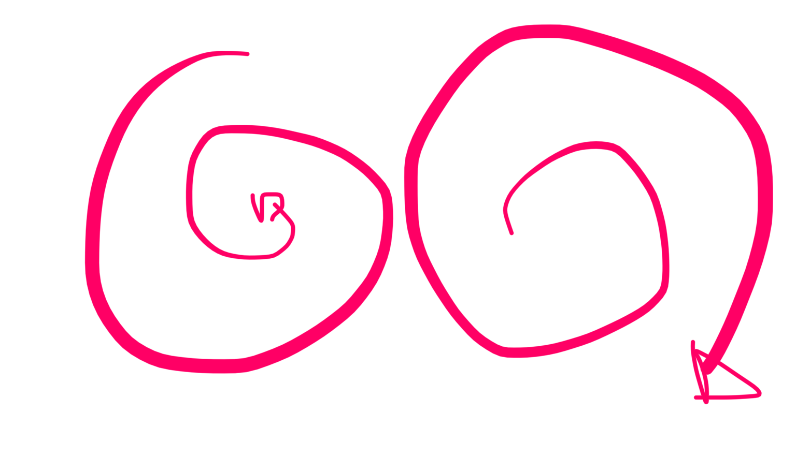

# wushu

## taichi
el yan de cabeza en movimiento hacua atras y sea correcto es muy importwnte no se porque

chilun hay estaticos y en movimiento
sin movimiento no hay bagua del taichi

y el yan de cabeza en movimiento toca la idea, toca la energia del 3er ojo del yintan

y eventualmente toxa la energia de espiritu

por eso es tan importante

y tocamos este punto con la cabeza de leon la energia yan pura (trigrama cielo, yan puro)

articulo los 3 sabios en algun blog de taichi del laoshi, cada energia se siente de una energia diferente

hay 3 maneras de sentir: calor luz e iman (mola)

y el qua de cada persona camina a uno de ellos

en tesumen si hacemos el yan de cabeza y has llegado a entenderlo lo que aparece es la claridad mental

maestro su le llamaba la idea y la memoria

cuando uno se aparta del maestro uno tiene que tener clarodad mental para que apareCa todo lo que sw quiere

ver con ojos de zen

que el alumno tenga la esencia del movimiento del maestro
c
[F87EB292-E202-4F40-9248-E9EF6CFBC3ED](attachments/F87EB292-E202-4F40-9248-E9EF6CFBC3ED.mp4)
 ontinuacion de forma de taichi

subes mano
abres brazos y miras atras
recoges brazos en tantien y recoges la izq en un han chi pu

bajas el peso mientra ssubes las manos
patada de taichi
y giras

sobretodo cuando vajas preparando la patada el coxis para dentro y la espalda recta

ya llegara flexibilidad del empeine

BAGUA
wn el sinbolo del yinyan
la S del centro representa la columna
si lanzamis puños sin mover la columna solo llevamos hacia delante un posiblw 50%

si no mueves la comumna solo sacas como 
uchi la mitad de roso lo que podrias

solo moviendo la columna se puede mover por el cueepo la energia qye sw genera en el tantien

la tecnica del gun chuan chen guo (la segunda linea) cuando lanzas la mano giras la columna para estar con el ombligo hacia el lado. y al recogerlo se queda igual el
ombligo ahi y recoges las manos con el giro

sen chin pa kun (estirar los hombros como la idea de SCHQPC y la extremidad se alarga)

## que es el kung fu?
**un camino de estudio**
no solamwnte el movimiento del cuerpo sino filosofia terapeutica

si no hay camino de estudio el movimiento no estara cultivado

(los animes de cultivation chinos)

el camino del estudio requiere de un **análisis**

ba sin chan
en bagua chua hu su tou chui se halla en el ba sin chen

en bagua somos alumnos de yin fu 
y en la linea de yin fu se comienza desde la linea

primero linea luego circulo

cuando el movimiento en linea ralla la perfeccion psamos al circulo

bagua no natural: linea
bagua natueal: circulo

cuando el movimiento esta correcto en la linea buscas conectar con lo natural en el circulo

en la primera linea (ganso silvestre sale de la manada) se eequieren los 4 principios de cintura: **retorcer girar dar vueltas y caminar** nin su sou chuan? (esta en el libro de bagua)

retorcer hasta el maximo y la fuerza sale desde la cintura

las 4 proyecciones de energia de la cintura

cuando alguien aplica la dilosofia al movimiento se ve la idea desarrollandose en la 

hay 8 puertas pero solo se abre 1
y tu tienes que investigar una

es mejor entender un movimiento y sentir la energia

la primera linea trabaja el estomago/vazo desde el retorcimiento de diafragma

y la tespiracion invertida!!! para la primera linea

el estomago tiene 3 tipos
el diafragma lleno es movimiento yin, encia sangre al estomago, es la respiracion natueal

cuando tomas aire en respiracion incettida el diafragma se aprieta y retuerce

por eso en la linea 1 DE BAGUA SE RESPIRA INVERTIDO

la energia original de estomago los mejorws son los rumiantes. matar una vaca o toro por el estomago es muy dificil porque tienen inos nudos muy grandes por eso los toreros nunca intentan matar por el vientre

el movimiento este de la respiracion si inaginamos que wl pulmon es una toalla llena de agua caeria el agua y eso es lo que hace la energia de estomago, absorve nutrientes y lo innecesario se desecha

((para adelgazar se ve que va muy bien))

con el estomago adentro puedes retorcer mas

# este ejercicio (la primera linea) trabaja la energia centripeta y centrifuga
y eso es la base todo empieza aqui

chen taichi empieza con peng

y esa misma idea esta en este bagua

((comida))
dinastia zhou

confucii dijo una vez:
 una palabra establece el cielo y la tierra
una espada nivela el mundo entero

((lo que con la plabra no se puede llevar... tienes que tener la espada))

mantis new (me suena que eran 4 movimientos es la parte de arriba de la linea 11)
[604C813A-3F92-4EF5-B55A-AB6F811FEC4A](attachments/604C813A-3F92-4EF5-B55A-AB6F811FEC4A.mp4)

importante cabeza quieta 