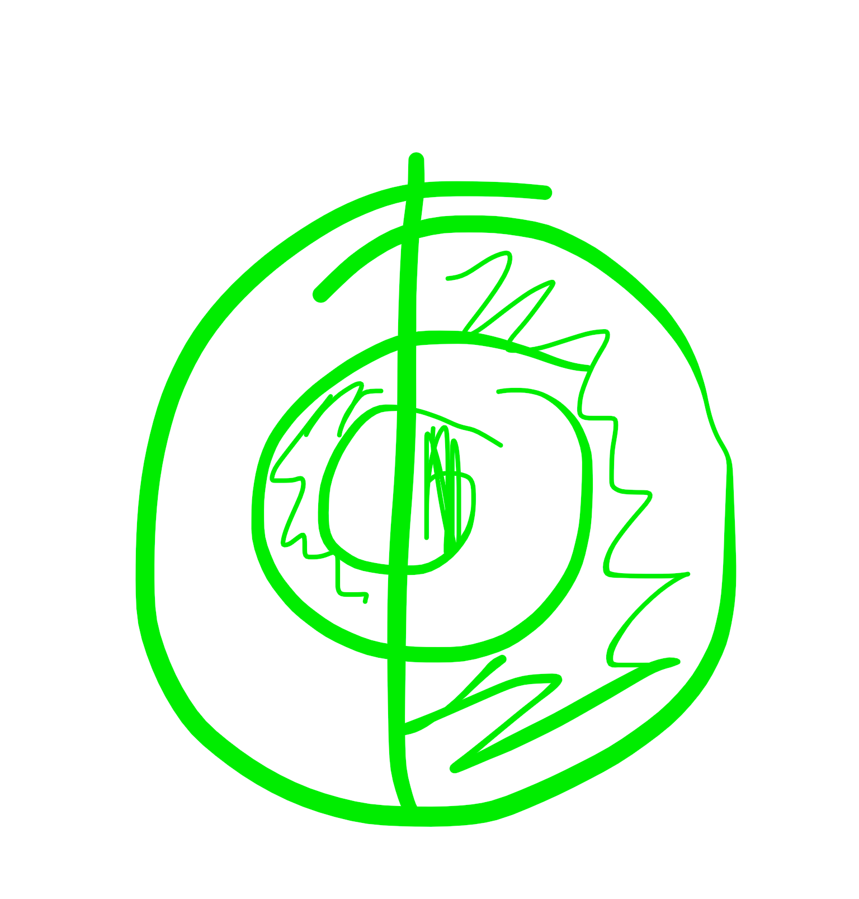

# wushu

el tin yan antiguo en los circulos arcanos se tepresengaba el yinyan asi

la idea de concentrico trabaja la memoria y la idea: un masaje al cerebro se produce desde la circularidad

la vida nos axostunbra a pensar el movimiento de lo brazos en 2 ejes solo vertical t horizontal 

los circulos!!

# taichi

el exceso de fuego en el estomago se quita sacando aire po la boca: provoca ulceras en el estomago y alitosis

y por eso cuando bos xalentamis la manos con el aliento lo hacemos saxando aire por la boca

y cuanto mas abajo entra el aire mejor

se hace el aire fuerte xuando tomas, aguantas, contienes (como que comprimes suavemente a travws dl cuerpo el diafragma) (y asi haces fuerye el aire para que el chi se vuelva fuerte y suba

hay que hacer fuerte la energía para que luego pueda subir y llegue a la cabeza

como un petardo: comprimir el aire con ejercicio para qye llegue todo luego a la cqbeza

CUALQUIER movimiento producido por em cuerpo provoca un chi y una energia

lo que no provoca nada es quedarme quieto

cuando se practica y sw suda de dentro hacia afuera se suda natural

cuando no es natural? cuando coges peso subes una montaña etc etc

las formas de mantis la que mas dura puede ser uj minuto nada mas, porque ir a tope en el corazon y el corazon no puede ur a tope muchos minutos

y cuanto mas bajo trabajas mas yrabaja el corazon

cuando wl movimiento es largo y no se siente calmada la respiracion es cuestion de swguir praxtixando 

silencio relajadoby natural

ultima parte de la forma corta de taichi:

[DF05E132-67AE-48C8-A25D-27FD8E6D37D9](attachments/DF05E132-67AE-48C8-A25D-27FD8E6D37D9.mp4)
